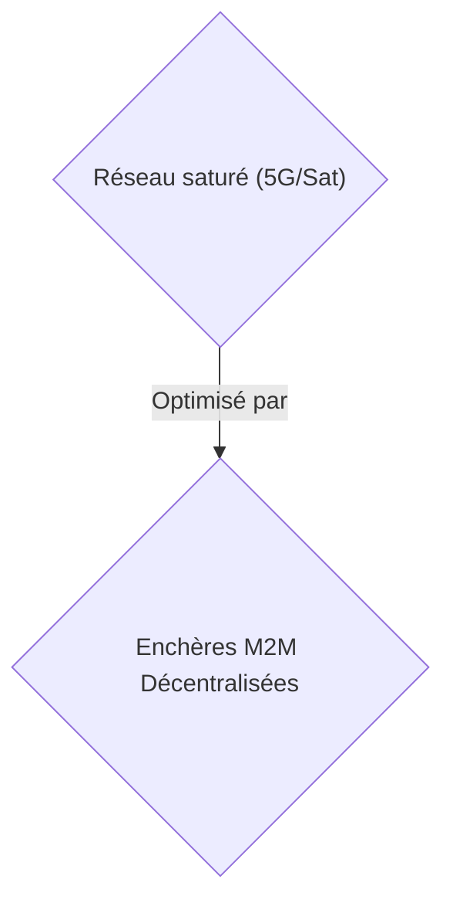
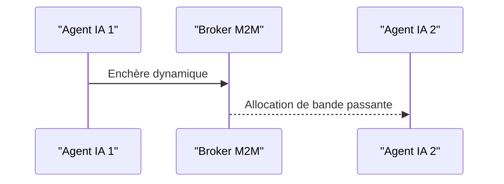

<!-- markdownlint-disable MD009 MD010 MD013 MD022 MD028 MD032 MD033 MD034 MD036 MD037 MD039 MD041 MD058 MD060 -->

[ 🇬🇧 English Version ](./README.md)

# M2M Bandwidth Broker

> **Résumé exécutif :** Un protocole M2M décentralisé permettant aux flottes de drones d'enchérir sur la bande passante et le calcul Edge pour éviter la saturation réseau.

---

## 1. Aperçu visuel & Effet Wahou

## 2. La thèse contrariante (Peter Thiel Style)

- **La croyance populaire :** Les API standards et l'augmentation de la bande passante suffiront pour l'IoT.
- **La vérité cachée :** Les API REST ou MQTT sont trop bavards et centralisés pour des flottes déconnectées (Edge). Nécessite une orchestration de réseau ad-hoc, du peer-to-peer, et une tarification algorithmique à la milliseconde que le cloud ne peut gérer.

## 3. Le problème & La cible

- **Modèle économique :** M2M
- **Cible précise :** Flottes de drones autonomes, véhicules autonomes, réseaux IoT industriels (VP of Operations, Fleet Managers).
- **La douleur urgente :** Avec la prolifération d'agents IA embarqués fonctionnant en essaim, les réseaux de communication (5G, satellite) sont saturés par des échanges de données brutes, entraînant des latences qui paralysent la prise de décision collective en temps réel.

## 4. Architecture technique & Plomberie

Un protocole de marché décentralisé M2M opérant au niveau de la couche réseau (Layer 3/4) où les agents IA "enchérissent" dynamiquement pour la bande passante et le temps de calcul Edge, en compressant sémantiquement les informations critiques via des représentations latentes.

## 5. Modèle économique & Viabilité financière

| Métrique                    | Valeur                  |
| --------------------------- | ----------------------- |
| Structure de prix           | Micro-commissions M2M   |
| Objectif 12 mois            | 100k agents actifs      |
| Calcul du CA (Target 100k€) | 100k \* 1€/mois = 100k€ |
| Marge brute estimée         | 90%                     |

## 6. Moteur de distribution & Fossé défensif (Moat)

- **Stratégie d'acquisition :** Adhésion des développeurs M2M et fabricants matériels.
- **Moat (Barrière à l'entrée) :** Les API REST ou MQTT sont trop bavards et centralisés. L'orchestration peer-to-peer algorithmique est extrêmement complexe à répliquer.

## 7. Grille d'évaluation détaillée

| Critère                           | Score VC (/100) | Score Terrain (/100) |
| --------------------------------- | --------------- | -------------------- |
| Thèse & Monopole / Urgence        | -- / 25         | -- / 25              |
| Moat / Résistance aux LLM natifs  | -- / 25         | -- / 25              |
| Scalability / Friction d'adoption | -- / 25         | -- / 25              |
| Unit Economics / ROI direct       | -- / 25         | -- / 25              |
| TOTAL                             | -- / 100        | -- / 100             |

> **Verdict VC :** En attente d'évaluation.
> **Verdict Terrain :** En attente d'évaluation.
