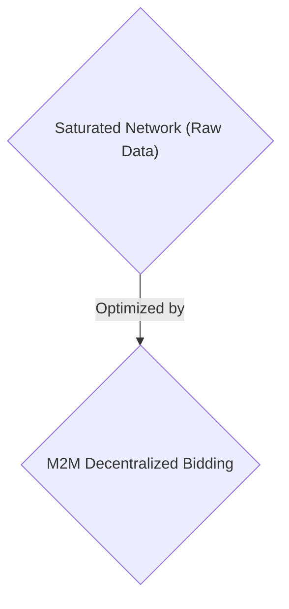
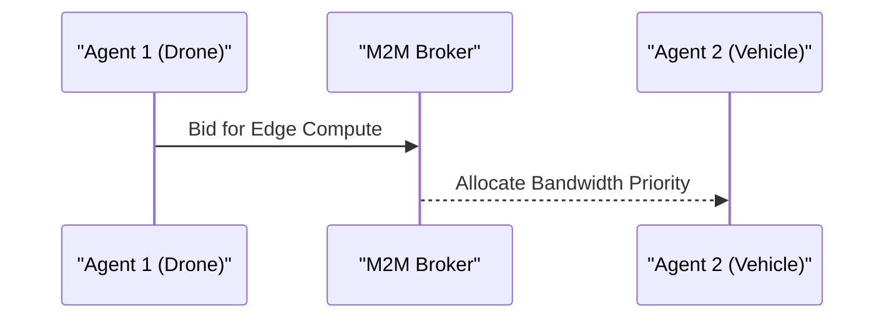

<!-- markdownlint-disable MD009 MD010 MD013 MD022 MD028 MD032 MD033 MD034 MD036 MD037 MD039 MD041 MD058 MD060 -->

[ 🇫🇷 Version Française ](./README.fr.md)

# M2M Bandwidth Broker

> **Executive Summary:** An M2M decentralized market protocol targeting autonomous drone/vehicle fleets to solve network saturation via latent semantic compression and edge computing bandwidth bidding.

---

## 1. Visual Overview & Wow Effect

## 2. Contrarian Thesis (Peter Thiel Style)

- **Popular Belief:** Cloud APIs like REST/MQTT and simple 5G are enough for autonomous fleets.
- **Hidden Truth:** REST or MQTT APIs are too verbose and centralized for disconnected edge fleets. It requires ad-hoc network orchestration, peer-to-peer communication, and millisecond-level algorithmic pricing that the cloud cannot handle.

## 3. Problem & Target Market

- **Business Model:** M2M
- **Target Audience:** Autonomous drone fleets, autonomous vehicles, industrial IoT networks (VP of Operations, Fleet Managers).
- **Urgent Pain Point:** With the proliferation of embedded AI swarm agents, communication networks (5G, satellite) are saturated by raw data exchanges, causing latencies that paralyze collective real-time decision-making.

## 4. Technical Architecture & Infrastructure

A decentralized M2M market protocol operating at the network layer (Layer 3/4) where AI agents dynamically "bid" for bandwidth and edge compute time, semantically compressing critical information via latent representations.

## 5. Business Model & Financial Viability

| Metric                 | Value                         |
| ---------------------- | ----------------------------- |
| Pricing Structure      | Micro-commissions on M2M Bids |
| 12-Month Target        | 100k active agents            |
| Revenue Formula        | 100k \* 1€/month = 100k€      |
| Estimated Gross Margin | 90%                           |

## 6. Distribution Engine & Moat

- **Acquisition Strategy:** M2M developer adoption and hardware integrations.
- **Moat (Defensibility):** REST or MQTT APIs are too verbose and centralized. It requires ad-hoc network orchestration, peer-to-peer communication, and millisecond-level algorithmic pricing that the cloud cannot handle.

## 7. Detailed Evaluation Grid

| Criterion                   | VC Score (/100) | Market Score (/100) |
| --------------------------- | --------------- | ------------------- |
| Thesis & Monopoly / Urgency | -- / 25         | -- / 25             |
| Moat / LLM Immunity         | -- / 25         | -- / 25             |
| Scalability / UX Friction   | -- / 25         | -- / 25             |
| Unit Economics / ROI        | -- / 25         | -- / 25             |
| TOTAL                       | -- / 100        | -- / 100            |

> **VC Verdict:** Pending evaluation.
> **Market Verdict:** Pending evaluation.
