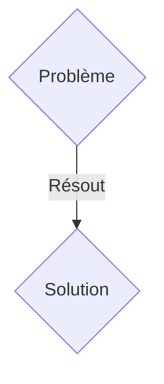
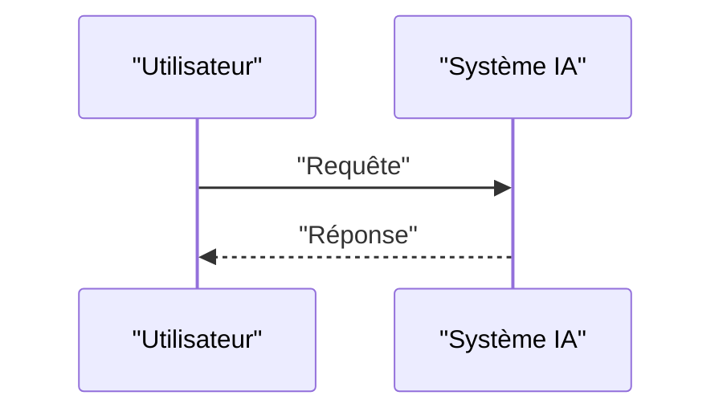

<!-- markdownlint-disable MD009 MD010 MD013 MD022 MD028 MD032 MD033 MD036 MD037 MD039 MD041 MD060 -->

[ 🇬🇧 English Version ](./README.md)

# Metabolix Twin

> **Résumé exécutif :** Une solution B2B ciblant Startups de biologie synthétique, entreprises de fermentation de précision, laboratoires pharmaceutiques et CDMOs (Contract Development and Manufacturing Organizations) qui développent de nouvelles molécules, protéines alternatives ou biomatériaux. pour résoudre : Lors du passage à l'échelle industrielle (Scale-up), le transfert d'un procédé de bioproduction d'un bioréacteur de laboratoire (1L) à une cuve industrielle (10 000L) affiche un taux d'échec catastrophique (souvent >80%). Les gradients de concentration, les forces de cisaillement mécanique et les dynamiques des fluides à grande échelle modifient radicalement le comportement métabolique des micro-organismes. Les industriels perdent des millions d'euros et des mois en cycles d'essais-erreurs physiques en usine pilote pour stabiliser les rendements.

---

## 1. Aperçu visuel & Effet Wahou

## 2. La thèse contrariante (Peter Thiel Style)

- **La croyance populaire :** Les solutions génériques suffisent.
- **La vérité cachée :** Un moteur de simulation hybride (World Model) qui fusionne la modélisation métabolique cellulaire (Flux Balance Analysis et multi-omique) avec la simulation physique des fluides (Computational Fluid Dynamics). En utilisant des "Neural Physics Engines" pour accélérer les calculs Navier-Stokes et prédire le stress mécanique subi par chaque cellule, la plateforme permet de simuler et d'optimiser l'environnement physique et biologique avant même la construction de l'usine ou le lancement d'un batch.

## 3. Le problème & La cible

- **Modèle économique :** B2B
- **Cible précise :** Startups de biologie synthétique, entreprises de fermentation de précision, laboratoires pharmaceutiques et CDMOs (Contract Development and Manufacturing Organizations) qui développent de nouvelles molécules, protéines alternatives ou biomatériaux.
- **La douleur urgente :** Lors du passage à l'échelle industrielle (Scale-up), le transfert d'un procédé de bioproduction d'un bioréacteur de laboratoire (1L) à une cuve industrielle (10 000L) affiche un taux d'échec catastrophique (souvent >80%). Les gradients de concentration, les forces de cisaillement mécanique et les dynamiques des fluides à grande échelle modifient radicalement le comportement métabolique des micro-organismes. Les industriels perdent des millions d'euros et des mois en cycles d'essais-erreurs physiques en usine pilote pour stabiliser les rendements.

## 4. Architecture technique & Plomberie

Un moteur de simulation hybride (World Model) qui fusionne la modélisation métabolique cellulaire (Flux Balance Analysis et multi-omique) avec la simulation physique des fluides (Computational Fluid Dynamics). En utilisant des "Neural Physics Engines" pour accélérer les calculs Navier-Stokes et prédire le stress mécanique subi par chaque cellule, la plateforme permet de simuler et d'optimiser l'environnement physique et biologique avant même la construction de l'usine ou le lancement d'un batch.

## 5. Modèle économique & Viabilité financière

| Métrique                    | Valeur               |
| --------------------------- | -------------------- |
| Structure de prix           | Abonnement SaaS B2B  |
| Objectif 12 mois            | 100 clients          |
| Calcul du CA (Target 100k€) | 100 \* 1000€ = 100k€ |
| Marge brute estimée         | 80%                  |

## 6. Moteur de distribution & Fossé défensif (Moat)

- **Stratégie d'acquisition :** Vente directe et partenariats stratégiques.
- **Moat (Barrière à l'entrée) :** Un LLM ou un SaaS de gestion de données ne comprend ni les lois de la thermodynamique, ni la dynamique des fluides, ni la complexité des voies métaboliques cellulaires sous stress. La résolution de ces équations différentielles couplées nécessite une architecture de calcul spécifique et des modèles géométriques en 3D du matériel de bioréacteur, combinés à des données biologiques propriétaires complexes qui dépassent le simple traitement de texte.

## 7. Grille d'évaluation détaillée

| Critère                           | Score VC (/100) | Score Terrain (/100) |
| --------------------------------- | --------------- | -------------------- |
| Thèse & Monopole / Urgence        | 19 / 25         | 19 / 25              |
| Moat / Résistance aux LLM natifs  | 16 / 25         | 16 / 25              |
| Scalabilité / Friction d'adoption | 20 / 25         | 20 / 25              |
| Unit Economics / ROI direct       | 18 / 25         | 18 / 25              |
| TOTAL                             | 73 / 100        | 73 / 100             |

> **Verdict VC :** En attente d'évaluation.
> **Verdict Terrain :** Cette solution répond à un besoin critique pour les entreprises B2B, justifiant son excellent score d'urgence (19/25). Bien que viable, elle reste partiellement exposée à l'évolution rapide des modèles fondationnels (16/25). Avec une faible friction d'adoption (20/25) et une stratégie de monétisation directe (18/25), le projet démontre une excellente maturité marché globale.
> **Verdict Terrain :** Cette solution répond à un besoin critique pour les entreprises B2B, justifiant son excellent score d'urgence (19/25). Bien que viable, elle reste partiellement exposée à l'évolution rapide des modèles fondationnels (16/25). Avec une faible friction d'adoption (20/25) et une stratégie de monétisation directe (18/25), le projet démontre une excellente maturité marché globale.
