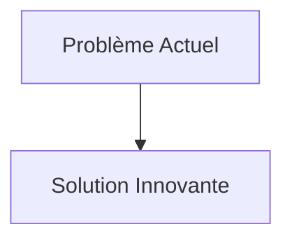
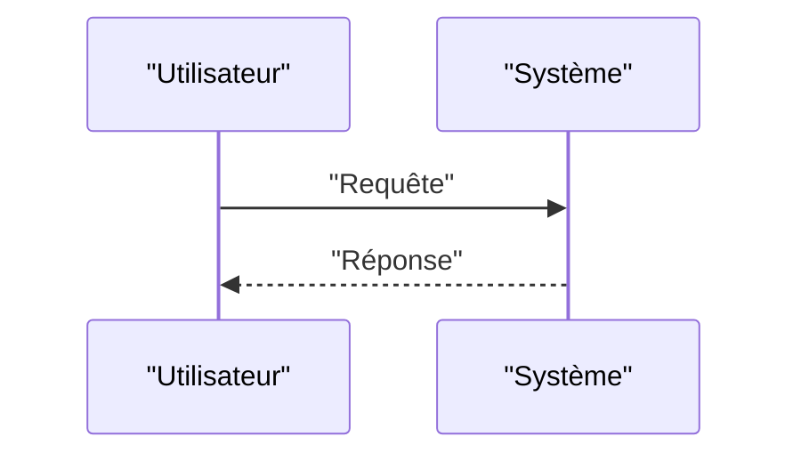

<!-- markdownlint-disable MD009 MD010 MD013 MD022 MD028 MD032 MD033 MD034 MD036 MD037 MD039 MD041 MD058 MD060 -->

[ 🇬🇧 English Version ](./README.md)

# Metamaterial Acoustic Simulator

> **Résumé exécutif :** Moteur de simulation basé sur des réseaux de neurones informés par la physique (PINNs - Physics-Informed Neural Networks) spécialisé dans la propagation des ondes acoustiques dans des microstructures complexes, permettant une simulation temps réel et l'optimisation topologique inverse.

---

## 1. Aperçu visuel & Effet Wahou

## 2. La thèse contrariante (Peter Thiel Style)

- **La croyance populaire :** Les solutions existantes sont suffisantes.
- **La vérité cachée :** En réalité, Un LLM ne comprend pas les équations de Helmholtz ou de Navier-Stokes. Les outils de CAO/Simulation standards (COMSOL, Ansys) sont conçus pour la physique classique et ne passent pas à l'échelle pour l'optimisation inverse de millions de micro-cellules de métamatériaux.

## 3. Le problème & La cible

- **Modèle économique :** B2B
- **Cible précise :** Bureaux d'études acoustiques (aéronautique, automobile, bâtiment), constructeurs de sous-marins et fabricants de systèmes de réduction de bruit active.
- **La douleur urgente :** Concevoir des métamatériaux acoustiques (qui absorbent, dévient ou amplifient le son de manière non naturelle) nécessite actuellement des itérations physiques coûteuses (prototypage, essais en chambre anéchoïque) car les solveurs d'éléments finis (FEM) traditionnels sont trop lents pour explorer le vaste espace des géométries sub-longueur d'onde.

## 4. Architecture technique & Plomberie

## 5. Modèle économique & Viabilité financière

| Métrique                        | Valeur                   |
| :------------------------------ | :----------------------- |
| **Structure de prix**           | Abonnement B2B           |
| **Objectif 12 mois**            | 100 clients à 1000€/mois |
| **Calcul du CA (Target 100k€)** | 100 \* 1000 = 100k€      |
| **Marge brute estimée**         | 80%                      |

## 6. Moteur de distribution & Fossé défensif (Moat)

- **Stratégie d'acquisition :** Ventes directes
- **Moat (Barrière à l'entrée) :** Moteur de simulation basé sur des réseaux de neurones informés par la physique (PINNs - Physics-Informed Neural Networks) spécialisé dans la propagation des ondes acoustiques dans des microstructures complexes, permettant une simulation temps réel et l'optimisation topologique inverse. (Difficile à copier à cause de : Besoin de datasets massifs de simulations haute fidélité pour pré-entraîner le modèle ; complexité mathématique des PINNs pour les conditions aux limites non linéaires ; acceptation par des industries très conservatrices quant à la validation des simulations "IA".)

## 7. Grille d'évaluation détaillée

| Critère                               | Score VC (/100) | Score Terrain (/100) |
| :------------------------------------ | :-------------: | :------------------: |
| **Thèse & Monopole / Urgence**        |     -- / 25     |       -- / 25        |
| **Moat / Résistance aux LLM natifs**  |     -- / 25     |       -- / 25        |
| **Scalabilité / Friction d'adoption** |     -- / 25     |       -- / 25        |
| **Unit Economics / ROI direct**       |     -- / 25     |       -- / 25        |
| **TOTAL**                             |  **-- / 100**   |     **-- / 100**     |

> **Verdict VC :** En attente d'évaluation.
> **Verdict Terrain :** En attente d'évaluation.
