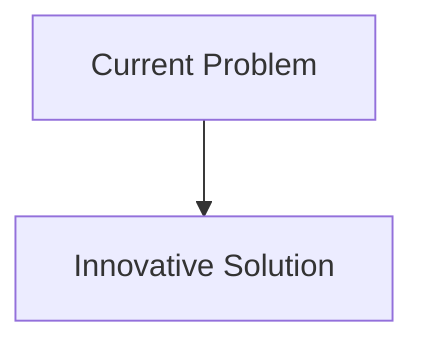
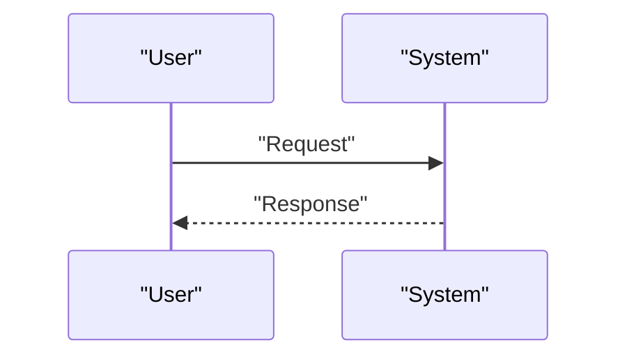

<!-- markdownlint-disable MD009 MD010 MD013 MD022 MD028 MD032 MD033 MD034 MD036 MD037 MD039 MD041 MD058 MD060 -->

[ 🇫🇷 Version Française ](./README.fr.md)

# Metamaterial Acoustic Simulator

> **Executive Summary:** Simulation engine based on Physics-Informed Neural Networks (PINNs) specialized in the propagation of acoustic waves in complex microstructures, allowing real-time simulation and inverse topology optimization.

---

## 1. Visual Overview & Wow Effect

## 2. Contrarian Thesis (Peter Thiel Style)

- **Popular Belief:** Existing solutions are sufficient.
- **Hidden Truth:** In reality, An LLM does not include the Helmholtz or Navier-Stokes equations. Standard CAD/Simulation tools (COMSOL, Ansys) are designed for classical physics and do not scale for the inverse optimization of millions of metamaterial micro-cells.

## 3. Problem & Target Market

- **Business Model:** B2B
- **Target Audience:** Acoustic design offices (aeronautics, automobiles, construction), submarine builders and manufacturers of active noise reduction systems.
- **Urgent Pain Point:** Designing acoustic metamaterials (which absorb, deflect or amplify sound in unnatural ways) currently requires expensive physical iterations (prototyping, anechoic chamber testing) because traditional finite element (FEM) solvers are too slow to explore the vast space of sub-wavelength geometries.

## 4. Technical Architecture & Infrastructure

## 5. Business Model & Financial Viability

| Metric                     | Value                        |
| :------------------------- | :--------------------------- |
| **Pricing Structure**      | B2B Subscription             |
| **12-Month Target**        | 100 customers at 1000€/month |
| **Revenue Formula**        | 100 \* 1000 = 100k€          |
| **Estimated Gross Margin** | 80%                          |

## 6. Distribution Engine & Moat

- **Acquisition Strategy:** Direct Sales
- **Moat (Defensibility):** Simulation engine based on Physics-Informed Neural Networks (PINNs) specialized in the propagation of acoustic waves in complex microstructures, allowing real-time simulation and inverse topology optimization.(Difficult to copy because of: Need for massive datasets of high fidelity simulations to pre-train the model; mathematical complexity of PINNs for non-linear boundary conditions; acceptance by industries which are very conservative regarding the validation of "AI" simulations.)

## 7. Detailed Evaluation Grid

| Criterion                       | VC Score (/100) | Market Score (/100) |
| :------------------------------ | :-------------: | :-----------------: |
| **Thesis & Monopoly / Urgency** |     -- / 25     |       -- / 25       |
| **Moat / LLM Immunity**         |     -- / 25     |       -- / 25       |
| **Scalability / UX Friction**   |     -- / 25     |       -- / 25       |
| **Unit Economics / ROI**        |     -- / 25     |       -- / 25       |
| **TOTAL**                       |  **-- / 100**   |    **-- / 100**     |

> **VC Verdict:** Pending evaluation.
> **Market Verdict:** Pending evaluation.
