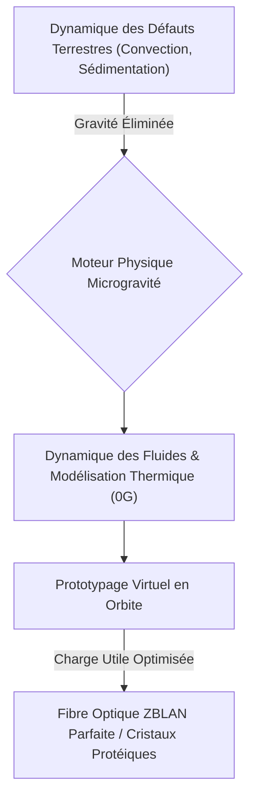
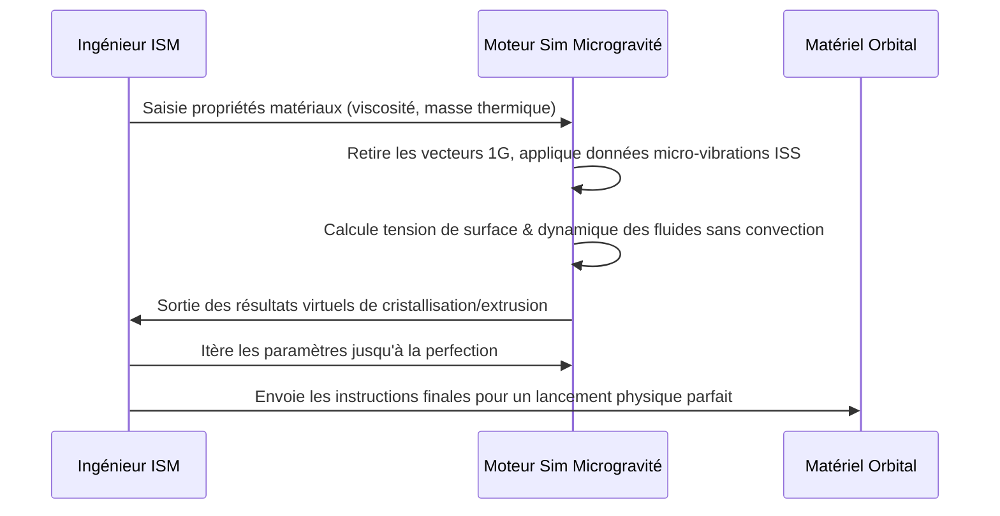

<!-- markdownlint-disable MD009 MD010 MD013 MD022 MD028 MD032 MD033 MD034 MD036 MD037 MD039 MD041 MD058 MD060 -->

[ 🇬🇧 English Version ](./README.md)

# Microgravity Manufacturing Sim

> **Résumé exécutif :** Un moteur de simulation multiphysique spécialisé conçu pour prototyper et optimiser virtuellement des processus de fabrication complexes en microgravité, réduisant drastiquement le coût des expériences en orbite.

---

## 1. Aperçu visuel & Effet Wahou

## 2. La thèse contrariante (Peter Thiel Style)

**La croyance populaire :** Le développement de processus de fabrication spatiale nécessite des dizaines de lancements de fusées physiques coûteux et itératifs pour comprendre comment les matériaux se comportent en orbite.
**La vérité cachée :** Bien que la gravité soit absente, les micro-vibrations et la tension superficielle dominent ; en construisant un moteur multiphysique 0G dédié, nous pouvons émuler parfaitement la dynamique des fluides et thermique orbitale par le calcul, transformant des lancements d'essais-erreurs à plusieurs millions de dollars en itérations numériques rapides et bon marché.

## 3. Le problème & La cible

**Modèle économique :** B2B
**Cible précise :** Agences spatiales (NASA, ESA), startups spatiales de fabrication en orbite (In-Space Manufacturing - ISM), entreprises biopharmaceutiques et fabricants de semi-conducteurs.
**La douleur urgente :** La fabrication de certains produits critiques (fibres optiques parfaites ZBLAN, cristallisation de protéines pour médicaments, semi-conducteurs sans défauts) est entravée par la gravité terrestre (convection, sédimentation). Fabriquer en orbite est la solution, mais chaque essai physique dans l'espace coûte des millions de dollars par lancement, rendant la R&D prohibitive.

## 4. Architecture technique & Plomberie

## 5. Modèle économique & Viabilité financière

| Métrique                    | Valeur                                                                                |
| --------------------------- | ------------------------------------------------------------------------------------- |
| Structure de prix           | SaaS à plusieurs niveaux basé sur les heures de calcul pour les simulations complexes |
| Objectif 12 mois            | 4 contrats avec des startups/agences ISM (à 25 000€/an)                               |
| Calcul du CA (Target 100k€) | 4 \* 25 000€ = 100 000€ de revenus annuels récurrents                                 |
| Marge brute estimée         | 85%                                                                                   |

## 6. Moteur de distribution & Fossé défensif (Moat)

**Stratégie d'acquisition :** Ventes directes au sein de l'écosystème très soudé du New Space et partenariats stratégiques avec les développeurs de stations spatiales commerciales (ex: Axiom, Blue Origin).
**Moat (Barrière à l'entrée) :** Les logiciels de CAO/physique standards (ANSYS, COMSOL) sont profondément codés en dur avec des hypothèses constantes de gravité terrestre 1G. Modéliser dynamiquement la mécanique des fluides 0G et les micro-vibrations spécifiques des vaisseaux spatiaux nécessite une réécriture fondamentale des solveurs de Navier-Stokes, créant une barrière à l'entrée massive.

## 7. Grille d'évaluation détaillée

| Critère                           | Score VC (/100) | Score Terrain (/100) |
| --------------------------------- | --------------- | -------------------- |
| Thèse & Monopole / Urgence        | -- / 25         | -- / 25              |
| Moat / Résistance aux LLM natifs  | -- / 25         | -- / 25              |
| Scalabilité / Friction d'adoption | -- / 25         | -- / 25              |
| Unit Economics / ROI direct       | -- / 25         | -- / 25              |
| **TOTAL**                         | **-- / 100**    | **-- / 100**         |

> **Verdict VC :** En attente d'évaluation.
> **Verdict Terrain :** En attente d'évaluation.
