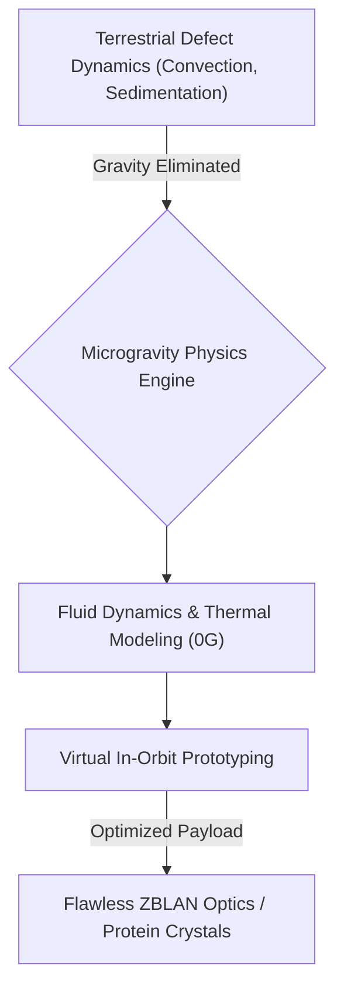
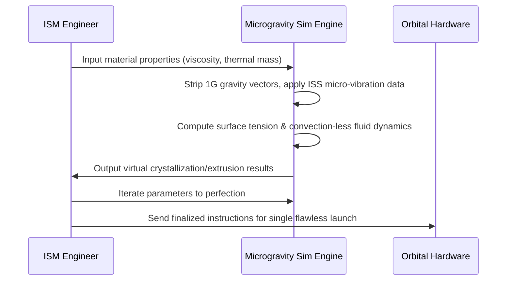

<!-- markdownlint-disable MD009 MD010 MD013 MD022 MD028 MD032 MD033 MD034 MD036 MD037 MD039 MD041 MD058 MD060 -->

[ 🇫🇷 Version Française ](./README.fr.md)

# Microgravity Manufacturing Sim

> **Executive Summary:** A specialized multi-physics simulation engine designed to virtually prototype and optimize complex manufacturing processes in microgravity, drastically reducing the cost of in-orbit experiments.

---

## 1. Visual Overview & Wow Effect

## 2. Contrarian Thesis (Peter Thiel Style)

**Popular Belief:** Developing in-space manufacturing processes requires dozens of expensive, iterative physical rocket launches to figure out how materials behave in orbit.
**Hidden Truth:** While gravity is absent, micro-vibrations and surface tension dominate; by building a dedicated 0G multi-physics engine, we can perfectly emulate orbital fluid and thermal dynamics computationally, turning million-dollar physical trial-and-error launches into cheap, rapid digital iterations.

## 3. Problem & Target Market

**Business Model:** B2B
**Target Audience:** Space agencies (NASA, ESA), In-Space Manufacturing (ISM) startups, biopharmaceutical companies, and semiconductor foundries.
**Urgent Pain Point:** Manufacturing critical products (perfect ZBLAN fiber optics, drug protein crystallization, flawless semiconductors) is hindered by Earth's gravity (convection, sedimentation). Manufacturing in orbit solves this, but every physical trial in space costs millions of dollars per launch, making R&D prohibitively expensive.

## 4. Technical Architecture & Infrastructure

## 5. Business Model & Financial Viability

| Metric                 | Value                                                      |
| ---------------------- | ---------------------------------------------------------- |
| Pricing Structure      | Tiered SaaS based on compute hours for complex simulations |
| 12-Month Target        | 4 contracts with ISM startups/agencies (at 25,000€/year)   |
| Revenue Formula        | 4 \* 25,000€ = 100,000€ ARR                                |
| Estimated Gross Margin | 85%                                                        |

## 6. Distribution Engine & Moat

**Acquisition Strategy:** Direct sales within the tightly-knit New Space ecosystem and strategic partnerships with commercial space station developers (e.g., Axiom, Blue Origin).
**Moat (Defensibility):** Standard CAD/physics software (ANSYS, COMSOL) are deeply hardcoded with constant terrestrial 1G assumptions. Dynamically modeling 0G fluid mechanics and the specific micro-vibrations of spacecraft requires a fundamental rewrite of Navier-Stokes solvers, creating a massive barrier to entry.

## 7. Detailed Evaluation Grid

| Criterion                   | VC Score (/100) | Market Score (/100) |
| --------------------------- | --------------- | ------------------- |
| Thesis & Monopoly / Urgency | 23 / 25         | -- / 25             |
| Moat / LLM Immunity         | 24 / 25         | -- / 25             |
| Scalability / UX Friction   | 19 / 25         | -- / 25             |
| Unit Economics / ROI        | 22 / 25         | -- / 25             |
| **TOTAL**                   | **88 / 100**    | **-- / 100**        |

> **VC Verdict:** Microgravity Manufacturing Sim captures a rapidly growing, high-margin niche at the intersection of space tech and advanced materials. Emulating fluid dynamics and crystallization in zero-G is mathematically complex and essential for orbital factories. The specialized physical modeling creates a robust moat against general-purpose simulation software.
> **Market Verdict:** Pending evaluation.
