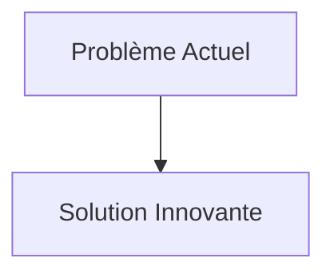
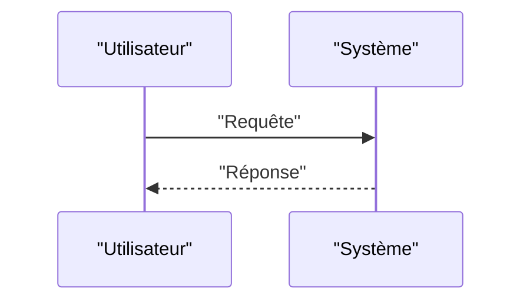

<!-- markdownlint-disable MD009 MD010 MD013 MD022 MD028 MD032 MD033 MD034 MD036 MD037 MD039 MD041 MD058 MD060 -->

[ 🇬🇧 English Version ](./README.md)

# Microgravity Robotic Assembly

> **Résumé exécutif :** Une flotte de petits robots autonomes "araignées" équipés de bras manipulateurs haptiques haute précision, capables de coordonner leurs mouvements (essaim/swarm intelligence) pour assembler, souder (par faisceau d'électrons ou laser) et vérifier des treillis structurels directement en orbite à partir de matières premières ou de poutres standardisées acheminées en vrac.

---

## 1. Aperçu visuel & Effet Wahou

## 2. La thèse contrariante (Peter Thiel Style)

- **La croyance populaire :** Les solutions existantes sont suffisantes.
- **La vérité cachée :** En réalité, La cinématique et le contrôle moteur dans un environnement en micropesanteur, soumis à des variations thermiques extrêmes et aux radiations, ne peuvent pas être gérés par une IA générative ou un simple système IoT industriel. Cela exige une boucle de rétroaction sensorimotrice matérielle très spécifique.

## 3. Le problème & La cible

- **Modèle économique :** B2B / B2G
- **Cible précise :** Agences spatiales (NASA, ESA), opérateurs de constellations de satellites, entreprises de fabrication spatiale (In-Space Manufacturing).
- **La douleur urgente :** Construire de grandes structures dans l'espace (antennes géantes, stations spatiales modulaires, panneaux solaires massifs) est actuellement limité par la taille de la coiffe des lanceurs terrestres. Déployer des structures pliées complexes est mécaniquement risqué (points de défaillance multiples).

## 4. Architecture technique & Plomberie

## 5. Modèle économique & Viabilité financière

| Métrique                        | Valeur                   |
| :------------------------------ | :----------------------- |
| **Structure de prix**           | Abonnement B2B           |
| **Objectif 12 mois**            | 100 clients à 1000€/mois |
| **Calcul du CA (Target 100k€)** | 100 \* 1000 = 100k€      |
| **Marge brute estimée**         | 80%                      |

## 6. Moteur de distribution & Fossé défensif (Moat)

- **Stratégie d'acquisition :** Ventes directes
- **Moat (Barrière à l'entrée) :** Une flotte de petits robots autonomes "araignées" équipés de bras manipulateurs haptiques haute précision, capables de coordonner leurs mouvements (essaim/swarm intelligence) pour assembler, souder (par faisceau d'électrons ou laser) et vérifier des treillis structurels directement en orbite à partir de matières premières ou de poutres standardisées acheminées en vrac. (Difficile à copier à cause de : Environnement radiatif détruisant l'électronique de contrôle ; difficulté de simulation de la micropesanteur sur Terre pour l'entraînement physique ; coûts de lancement des prototypes.)

## 7. Grille d'évaluation détaillée

| Critère                               | Score VC (/100) | Score Terrain (/100) |
| :------------------------------------ | :-------------: | :------------------: |
| **Thèse & Monopole / Urgence**        |     -- / 25     |       -- / 25        |
| **Moat / Résistance aux LLM natifs**  |     -- / 25     |       -- / 25        |
| **Scalabilité / Friction d'adoption** |     -- / 25     |       -- / 25        |
| **Unit Economics / ROI direct**       |     -- / 25     |       -- / 25        |
| **TOTAL**                             |  **-- / 100**   |     **-- / 100**     |

> **Verdict VC :** En attente d'évaluation.
> **Verdict Terrain :** En attente d'évaluation.
