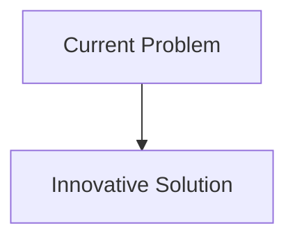
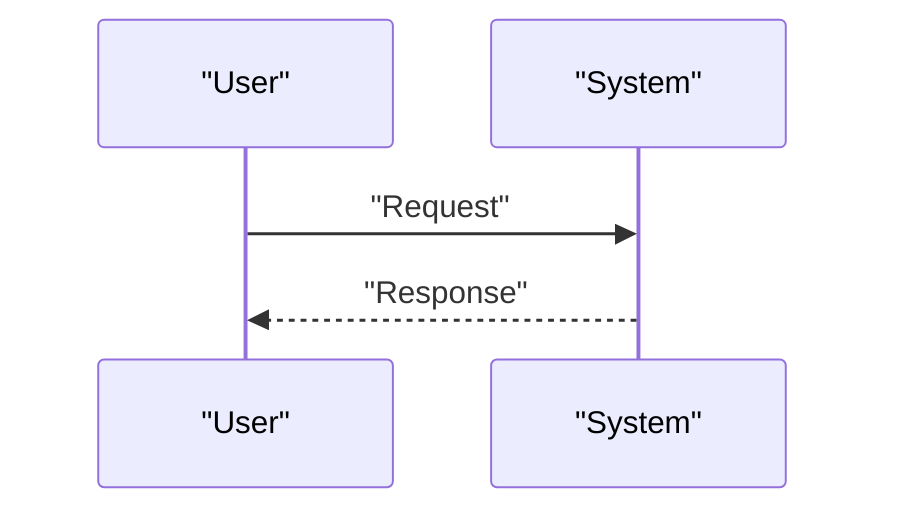

<!-- markdownlint-disable MD009 MD010 MD013 MD022 MD028 MD032 MD033 MD034 MD036 MD037 MD039 MD041 MD058 MD060 -->

[ 🇫🇷 Version Française ](./README.fr.md)

# Microgravity Robotic Assembly

> **Executive Summary:** A fleet of small autonomous “spider” robots equipped with high-precision haptic manipulator arms, capable of coordinating their movements (swarm/swarm intelligence) to assemble, weld (by electron beam or laser) and check structural lattices directly in orbit from raw materials or standardized beams transported in bulk.

---

## 1. Visual Overview & Wow Effect

## 2. Contrarian Thesis (Peter Thiel Style)

- **Popular Belief:** Existing solutions are sufficient.
- **Hidden Truth:** In reality, kinematics and motor control in a microgravity environment, subject to extreme thermal variations and radiation, cannot be managed by a generative AI or a simple industrial IoT system. This requires a very specific hardware sensorimotor feedback loop.

## 3. Problem & Target Market

- **Business Model:** B2B / B2G
- **Target Audience:** Space agencies (NASA, ESA), satellite constellation operators, space manufacturing companies (In-Space Manufacturing).
- **Urgent Pain Point:** Building large structures in space (giant antennas, modular space stations, massive solar panels) is currently limited by the size of the fairing of terrestrial launchers. Deploying complex folded structures is mechanically risky (multiple points of failure).

## 4. Technical Architecture & Infrastructure

## 5. Business Model & Financial Viability

| Metric                     | Value                        |
| :------------------------- | :--------------------------- |
| **Pricing Structure**      | B2B Subscription             |
| **12-Month Target**        | 100 customers at 1000€/month |
| **Revenue Formula**        | 100 \* 1000 = 100k€          |
| **Estimated Gross Margin** | 80%                          |

## 6. Distribution Engine & Moat

- **Acquisition Strategy:** Direct Sales
- **Moat (Defensibility):** A fleet of small autonomous “spider” robots equipped with high-precision haptic manipulator arms, capable of coordinating their movements (swarm/swarm intelligence) to assemble, weld (by electron beam or laser) and check structural lattices directly in orbit from raw materials or standardized beams transported in bulk.(Difficult to copy because of: Radiative environment destroying control electronics; difficulty simulating microgravity on Earth for physical training; prototype launch costs.)

## 7. Detailed Evaluation Grid

| Criterion                       | VC Score (/100) | Market Score (/100) |
| :------------------------------ | :-------------: | :-----------------: |
| **Thesis & Monopoly / Urgency** |     -- / 25     |       -- / 25       |
| **Moat / LLM Immunity**         |     -- / 25     |       -- / 25       |
| **Scalability / UX Friction**   |     -- / 25     |       -- / 25       |
| **Unit Economics / ROI**        |     -- / 25     |       -- / 25       |
| **TOTAL**                       |  **-- / 100**   |    **-- / 100**     |

> **VC Verdict:** Pending evaluation.
> **Market Verdict:** Pending evaluation.
