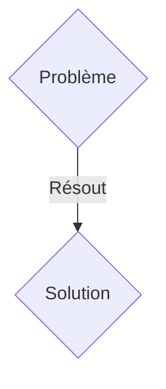
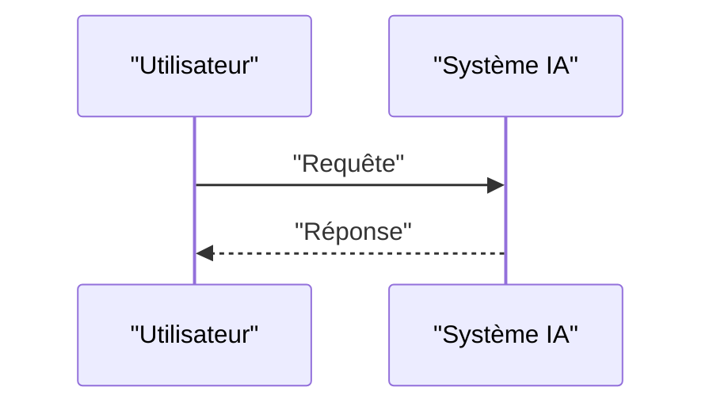

<!-- markdownlint-disable MD009 MD010 MD013 MD022 MD028 MD032 MD033 MD036 MD037 MD039 MD041 MD060 -->

[ 🇬🇧 English Version ](./README.md)

# Deep Omic Clock

> **Résumé exécutif :** Une solution B2B ciblant Cliniques de longévité, compagnies d'assurance vie, chercheurs en géroscience (CMO, Actuaires). pour résoudre : L'âge chronologique est un mauvais indicateur de risque. Les horloges épigénétiques actuelles sont unidimensionnelles et manquent de précision pour cibler des interventions cliniques personnalisées ou valider l'efficacité de thérapies anti-âge.

---

## 1. Aperçu visuel & Effet Wahou

## 2. La thèse contrariante (Peter Thiel Style)

- **La croyance populaire :** Les solutions génériques suffisent.
- **La vérité cachée :** Un modèle d'apprentissage profond multimodal intégrant l'épigénome, le protéome, le microbiome et les données cliniques longitudinales pour créer un World Model de vieillissement biologique, capable de simuler l'effet de molécules géroprotectrices.

## 3. Le problème & La cible

- **Modèle économique :** B2B
- **Cible précise :** Cliniques de longévité, compagnies d'assurance vie, chercheurs en géroscience (CMO, Actuaires).
- **La douleur urgente :** L'âge chronologique est un mauvais indicateur de risque. Les horloges épigénétiques actuelles sont unidimensionnelles et manquent de précision pour cibler des interventions cliniques personnalisées ou valider l'efficacité de thérapies anti-âge.

## 4. Architecture technique & Plomberie

Un modèle d'apprentissage profond multimodal intégrant l'épigénome, le protéome, le microbiome et les données cliniques longitudinales pour créer un World Model de vieillissement biologique, capable de simuler l'effet de molécules géroprotectrices.

## 5. Modèle économique & Viabilité financière

| Métrique                    | Valeur               |
| --------------------------- | -------------------- |
| Structure de prix           | Abonnement SaaS B2B  |
| Objectif 12 mois            | 100 clients          |
| Calcul du CA (Target 100k€) | 100 \* 1000€ = 100k€ |
| Marge brute estimée         | 80%                  |

## 6. Moteur de distribution & Fossé défensif (Moat)

- **Stratégie d'acquisition :** Vente directe et partenariats stratégiques.
- **Moat (Barrière à l'entrée) :** L'intégration multi-omique confronte au fléau de la dimensionnalité. Nécessite des architectures d'IA spécialisées (Transformers biologiques) pour extraire des signaux causaux complexes, impossibles avec un outil d'analyse de données standard.

## 7. Grille d'évaluation détaillée

| Critère                           | Score VC (/100) | Score Terrain (/100) |
| --------------------------------- | --------------- | -------------------- |
| Thèse & Monopole / Urgence        | 17 / 25         | 17 / 25              |
| Moat / Résistance aux LLM natifs  | 15 / 25         | 15 / 25              |
| Scalabilité / Friction d'adoption | 20 / 25         | 20 / 25              |
| Unit Economics / ROI direct       | 20 / 25         | 20 / 25              |
| TOTAL                             | 72 / 100        | 72 / 100             |

> **Verdict VC :** En attente d'évaluation.
> **Verdict Terrain :** Cette solution répond à un besoin critique pour les entreprises B2B, justifiant son excellent score d'urgence (17/25). Bien que viable, elle reste partiellement exposée à l'évolution rapide des modèles fondationnels (15/25). Avec une faible friction d'adoption (20/25) et une stratégie de monétisation directe (20/25), le projet démontre une excellente maturité marché globale.
> **Verdict Terrain :** Cette solution répond à un besoin critique pour les entreprises B2B, justifiant son excellent score d'urgence (17/25). Bien que viable, elle reste partiellement exposée à l'évolution rapide des modèles fondationnels (15/25). Avec une faible friction d'adoption (20/25) et une stratégie de monétisation directe (20/25), le projet démontre une excellente maturité marché globale.
