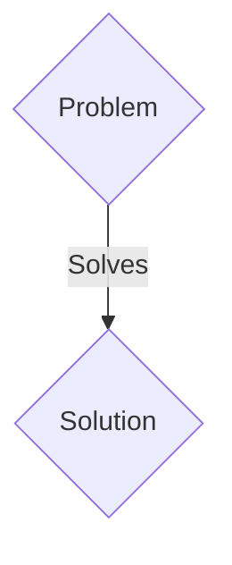
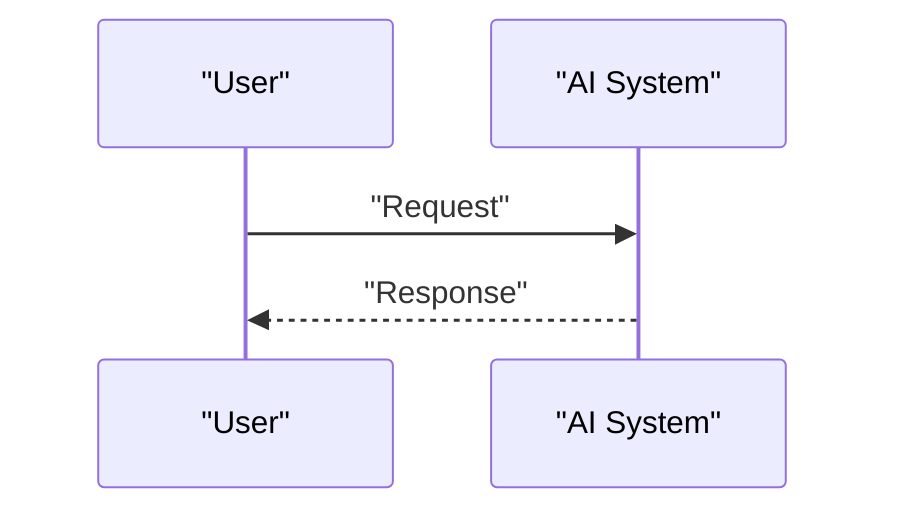

<!-- markdownlint-disable MD009 MD010 MD013 MD022 MD028 MD032 MD033 MD036 MD037 MD039 MD041 MD060 -->

[ 🇫🇷 Version Française ](./README.fr.md)

# Deep Omic Clock

> **Executive Summary:** A B2B solution targeting Longevity clinics, life insurance companies, geroscience researchers (CMO, Actuaries). to solve: Chronological age is a poor indicator of risk. Current epigenetic clocks are one-dimensional and lack the precision to target personalized clinical interventions or validate the effectiveness of anti-aging therapies.

---

## 1. Visual Overview & Wow Effect

## 2. Contrarian Thesis (Peter Thiel Style)

- **Popular Belief:** Generic solutions are enough.
- **Hidden Truth:** A multimodal deep learning model integrating the epigenome, proteome, microbiome and longitudinal clinical data to create a World Model of biological aging, capable of simulating the effect of geroprotective molecules.

## 3. Problem & Target Market

- **Business Model:** B2B
- **Target Audience:** Longevity clinics, life insurance companies, geroscience researchers (CMO, Actuaries).
- **Urgent Pain Point:** Chronological age is a poor indicator of risk. Current epigenetic clocks are one-dimensional and lack the precision to target personalized clinical interventions or validate the effectiveness of anti-aging therapies.

## 4. Technical Architecture & Infrastructure

A multimodal deep learning model integrating the epigenome, proteome, microbiome and longitudinal clinical data to create a World Model of biological aging, capable of simulating the effect of geroprotective molecules.

## 5. Business Model & Financial Viability

| Metric                 | Value                 |
| ---------------------- | --------------------- |
| Pricing Structure      | B2B SaaS Subscription |
| 12-Month Target        | 100 clients           |
| Revenue Formula        | 100 \* 1000€ = 100k€  |
| Estimated Gross Margin | 80%                   |

## 6. Distribution Engine & Moat

- **Acquisition Strategy:** Direct sales and strategic partnerships.
- **Moat (Defensibility):** Multi-omics integration confronts the scourge of dimensionality. Requires specialized AI architectures (Biological Transformers) to extract complex causal signals, not possible with a standard data analysis tool.

## 7. Detailed Evaluation Grid

| Criterion                   | VC Score (/100) | Market Score (/100) |
| --------------------------- | --------------- | ------------------- |
| Thesis & Monopoly / Urgency | 17 / 25         | 17 / 25             |
| Moat / LLM Immunity         | 15 / 25         | 15 / 25             |
| Scalability / UX Friction   | 20 / 25         | 20 / 25             |
| Unit Economics / ROI        | 20 / 25         | 20 / 25             |
| TOTAL                       | 72 / 100        | 72 / 100            |

> **VC Verdict:** Pending evaluation.
> **Market Verdict:** This solution addresses a critical pain point for B2B enterprises, justifying its strong urgency score (17/25). While viable, it remains somewhat exposed to the rapid evolution of foundational models (15/25). With low adoption friction (20/25) and a straightforward monetization strategy (20/25), the project demonstrates excellent overall market readiness.
> **Market Verdict:** This solution addresses a critical pain point for B2B enterprises, justifying its strong urgency score (17/25). While viable, it remains somewhat exposed to the rapid evolution of foundational models (15/25). With low adoption friction (20/25) and a straightforward monetization strategy (20/25), the project demonstrates excellent overall market readiness.
