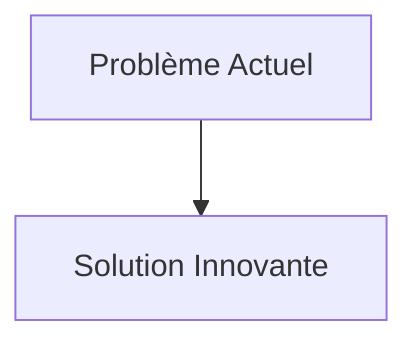
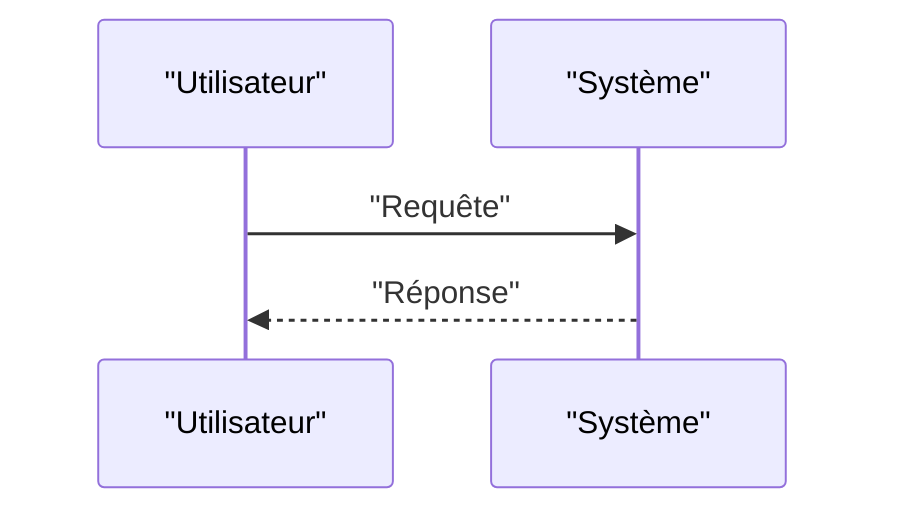

<!-- markdownlint-disable MD009 MD010 MD013 MD022 MD028 MD032 MD033 MD034 MD036 MD037 MD039 MD041 MD058 MD060 -->

[ 🇬🇧 English Version ](./README.md)

# Mycelium Biomaterial OS

> **Résumé exécutif :** Un "système d'exploitation" pour bioréacteurs à mycélium en phase solide. Il combine des capteurs multi-spectraux, des nez électroniques (CO2/VOC) et un modèle prédictif d'IA pour piloter dynamiquement et avec précision les paramètres environnementaux (humidité, température, oxygénation, spectre lumineux).

---

## 1. Aperçu visuel & Effet Wahou

## 2. La thèse contrariante (Peter Thiel Style)

- **La croyance populaire :** Les solutions existantes sont suffisantes.
- **La vérité cachée :** En réalité, C'est un problème de contrôle de processus biocybernétique (fermentation de précision). Un simple tableau de bord IoT ne suffit pas ; il faut un algorithme capable de comprendre la biologie non linéaire de la croissance fongique et d'agir sur des vannes matérielles (wet-lab au niveau usine).

## 3. Le problème & La cible

- **Modèle économique :** B2B
- **Cible précise :** Industries de l'emballage, de la construction, du textile, fabricants de biomatériaux.
- **La douleur urgente :** Remplacer les plastiques pétrosourcés et les matériaux de construction émetteurs de carbone (béton) par des matériaux durables est vital. Le mycélium (racines de champignons) offre une alternative solide et biodégradable, mais sa croissance (bio-fabrication) est notoirement imprévisible, sensible aux contaminations et difficile à mettre à l'échelle industrielle avec des propriétés mécaniques constantes.

## 4. Architecture technique & Plomberie

## 5. Modèle économique & Viabilité financière

| Métrique                        | Valeur                   |
| :------------------------------ | :----------------------- |
| **Structure de prix**           | Abonnement B2B           |
| **Objectif 12 mois**            | 100 clients à 1000€/mois |
| **Calcul du CA (Target 100k€)** | 100 \* 1000 = 100k€      |
| **Marge brute estimée**         | 80%                      |

## 6. Moteur de distribution & Fossé défensif (Moat)

- **Stratégie d'acquisition :** Ventes directes
- **Moat (Barrière à l'entrée) :** Un "système d'exploitation" pour bioréacteurs à mycélium en phase solide. Il combine des capteurs multi-spectraux, des nez électroniques (CO2/VOC) et un modèle prédictif d'IA pour piloter dynamiquement et avec précision les paramètres environnementaux (humidité, température, oxygénation, spectre lumineux). Le système optimise l'expression génétique phénotypique du mycélium en temps réel pour garantir une densité, une résistance à la traction et une texture standardisées (grade industriel). (Difficile à copier à cause de : Contamination biologique massive ruinant des lots entiers ; variabilité génétique des souches fongiques ; acceptation par le marché de matériaux aux propriétés hétérogènes comparées aux plastiques moulés.)

## 7. Grille d'évaluation détaillée

| Critère                               | Score VC (/100) | Score Terrain (/100) |
| :------------------------------------ | :-------------: | :------------------: |
| **Thèse & Monopole / Urgence**        |     -- / 25     |       -- / 25        |
| **Moat / Résistance aux LLM natifs**  |     -- / 25     |       -- / 25        |
| **Scalabilité / Friction d'adoption** |     -- / 25     |       -- / 25        |
| **Unit Economics / ROI direct**       |     -- / 25     |       -- / 25        |
| **TOTAL**                             |  **-- / 100**   |     **-- / 100**     |

> **Verdict VC :** En attente d'évaluation.
> **Verdict Terrain :** En attente d'évaluation.
