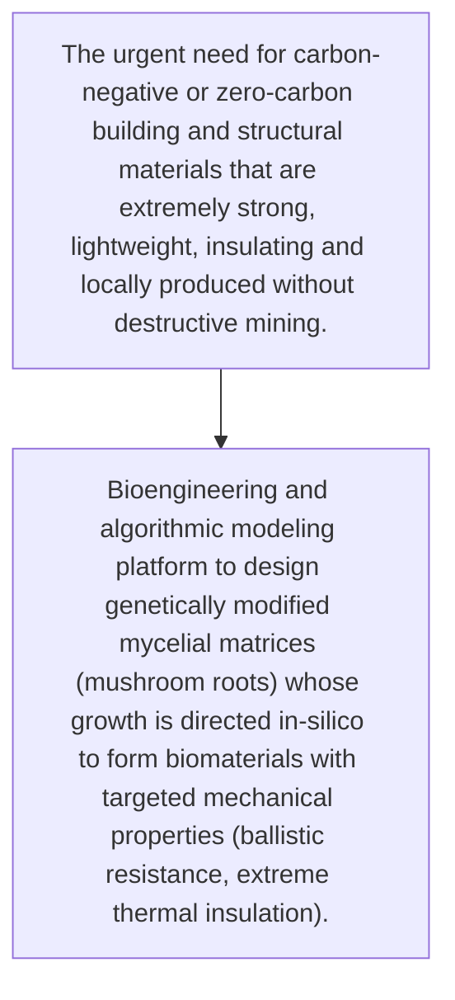
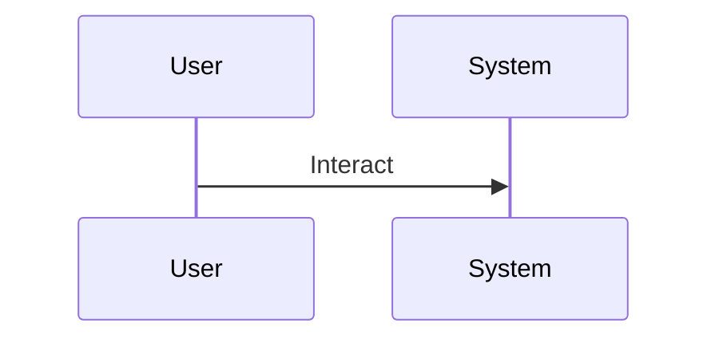

<!-- markdownlint-disable MD009 MD010 MD013 MD022 MD028 MD032 MD033 MD034 MD036 MD037 MD039 MD041 MD060 -->

[ 🇫🇷 Version Française ](./README.fr.md)

# Fungal Synth Forge

> **Executive Summary:** Bioengineering and algorithmic modeling platform to design genetically modified mycelial matrices (mushroom roots) whose growth is directed in-silico to form biomaterials with targeted mechanical properties (ballistic resistance, extreme thermal insulation).

---

## 1. Visual Overview & Wow Effect

## 2. Contrarian Thesis (Peter Thiel Style)

- **Popular Belief:** It is an intersection between advanced synthetic biology, materials science and organic growth simulation. SaaS software has no control over bioreactors, fungal genetic engineering or mechanical characterization.
- **Hidden Truth:** Bioengineering and algorithmic modeling platform to design genetically modified mycelial matrices (mushroom roots) whose growth is directed in-silico to form biomaterials with targeted mechanical properties (ballistic resistance, extreme thermal insulation).

## 3. Problem & Target Market

- **Business Model:** B2B
- **Target Audience:** Construction industry, aeronautics, industrial packaging, defense
- **Urgent Pain Point:** The urgent need for carbon-negative or zero-carbon building and structural materials that are extremely strong, lightweight, insulating and locally produced without destructive mining.

## 4. Technical Architecture & Infrastructure

## 5. Business Model & Financial Viability

| Metric                 | Value                                     |
| ---------------------- | ----------------------------------------- |
| Pricing Structure      | [Price / Subscription Model / Commission] |
| 12-Month Target        | [Exact volume required for 100k ARR]      |
| Revenue Formula        | [Mathematical calculation]                |
| Estimated Gross Margin | [Margin %]                                |

## 6. Distribution Engine & Moat

- **Acquisition Strategy:** [Virality, network effect, direct sales, developer adoption]
- **Moat (Defensibility):** Difficulty of scalability of production in bioreactors, biological variability of finished materials preventing strict industrial certifications in the short term.

## 7. Detailed Evaluation Grid

| Criterion                   | VC Score (/100) | Market Score (/100) |
| --------------------------- | --------------- | ------------------- |
| Thesis & Monopoly / Urgency | 24 / 25         | -- / 25             |
| Moat / LLM Immunity         | 22 / 25         | -- / 25             |
| Scalability / UX Friction   | 25 / 25         | -- / 25             |
| Unit Economics / ROI        | 23 / 25         | -- / 25             |
| TOTAL                       | 94 / 100        | -- / 100            |

> **VC Verdict:** Bio-manufacturing is the ultimate frontier. Controlling the growth algorithms of mycelium allows monopolizing the next generation of sustainable materials. The moat lies in the proprietary biological recipes and extreme scalability of the production process.
> **Market Verdict:** Pending evaluation.
