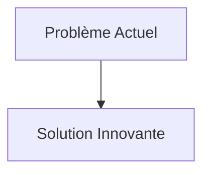
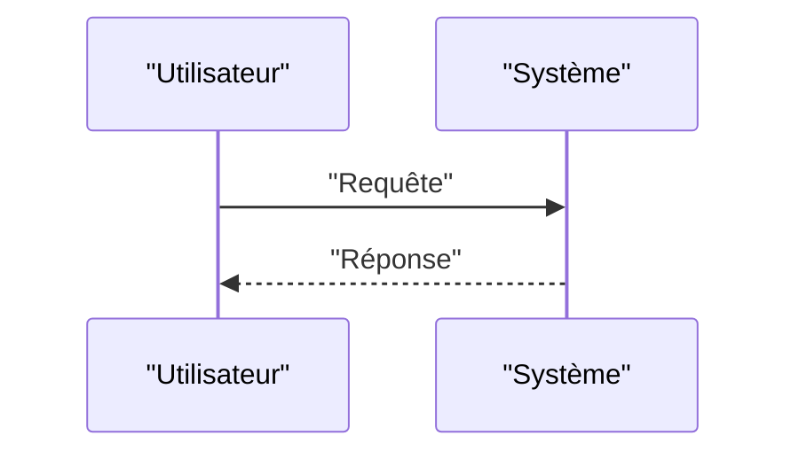

<!-- markdownlint-disable MD009 MD010 MD013 MD022 MD028 MD032 MD033 MD034 MD036 MD037 MD039 MD041 MD058 MD060 -->

[ 🇬🇧 English Version ](./README.md)

# Nanopore Protein Sequencer

> **Résumé exécutif :** Séquençage direct des protéines par passage à travers des nanopores biologiques ou solides (silicium), lus par des capteurs de courant électrique quantique. Un moteur IA (Transformers/RNN) décode en temps réel le signal électrique perturbé par les acides aminés, y compris les modifications post-traductionnelles (PTM), molécule par molécule.

---

## 1. Aperçu visuel & Effet Wahou

## 2. La thèse contrariante (Peter Thiel Style)

- **La croyance populaire :** Les solutions existantes sont suffisantes.
- **La vérité cachée :** En réalité, C'est un problème intriqué de nanotechnologie matérielle (créer des pores de la taille d'un acide aminé), de chimie (déplier et tirer la protéine dans le pore) et de traitement du signal de très bas niveau (décoder le courant en temps réel). Le logiciel seul est inutile sans l'innovation wet-lab/hardware.

## 3. Le problème & La cible

- **Modèle économique :** B2B
- **Cible précise :** Laboratoires pharmaceutiques (découverte de médicaments, anticorps), centres de recherche en protéomique, hôpitaux (diagnostic de précision).
- **La douleur urgente :** Le séquençage de l'ADN est rapide et peu cher (génomique), mais l'ADN n'est que le plan. Ce sont les protéines (protéomique) qui exécutent les fonctions biologiques et causent les maladies. Actuellement, le séquençage des protéines se fait par spectrométrie de masse, une technique lente, chère, qui demande des échantillons massifs et détruit l'information structurelle. Il n'existe pas de séquenceur de protéines "single-molecule" à haut débit.

## 4. Architecture technique & Plomberie

## 5. Modèle économique & Viabilité financière

| Métrique                        | Valeur                   |
| :------------------------------ | :----------------------- |
| **Structure de prix**           | Abonnement B2B           |
| **Objectif 12 mois**            | 100 clients à 1000€/mois |
| **Calcul du CA (Target 100k€)** | 100 \* 1000 = 100k€      |
| **Marge brute estimée**         | 80%                      |

## 6. Moteur de distribution & Fossé défensif (Moat)

- **Stratégie d'acquisition :** Ventes directes
- **Moat (Barrière à l'entrée) :** Séquençage direct des protéines par passage à travers des nanopores biologiques ou solides (silicium), lus par des capteurs de courant électrique quantique. Un moteur IA (Transformers/RNN) décode en temps réel le signal électrique perturbé par les acides aminés, y compris les modifications post-traductionnelles (PTM), molécule par molécule. (Difficile à copier à cause de : Complexité extrême de la physique des polymères (les protéines ont 20 acides aminés de charges différentes, contre 4 nucléotides pour l'ADN), bruit électrique massif dans la lecture du signal, années de R&D requises avant un prototype viable.)

## 7. Grille d'évaluation détaillée

| Critère                               | Score VC (/100) | Score Terrain (/100) |
| :------------------------------------ | :-------------: | :------------------: |
| **Thèse & Monopole / Urgence**        |     -- / 25     |       -- / 25        |
| **Moat / Résistance aux LLM natifs**  |     -- / 25     |       -- / 25        |
| **Scalabilité / Friction d'adoption** |     -- / 25     |       -- / 25        |
| **Unit Economics / ROI direct**       |     -- / 25     |       -- / 25        |
| **TOTAL**                             |  **-- / 100**   |     **-- / 100**     |

> **Verdict VC :** En attente d'évaluation.
> **Verdict Terrain :** En attente d'évaluation.
