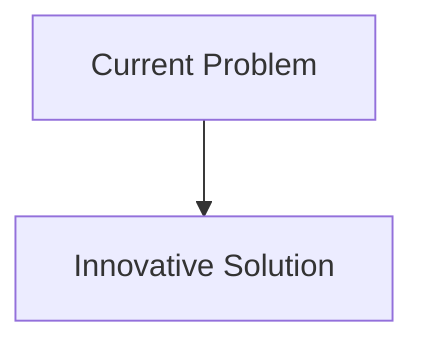
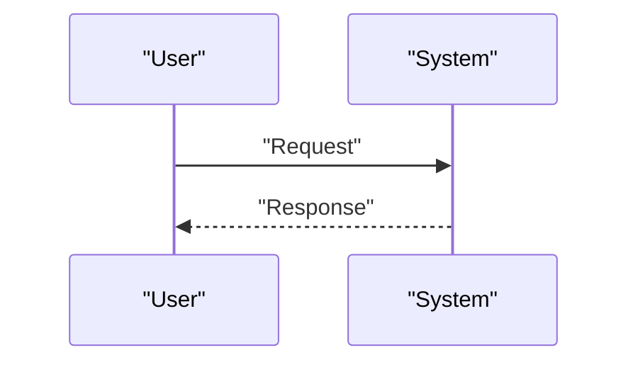

<!-- markdownlint-disable MD009 MD010 MD013 MD022 MD028 MD032 MD033 MD034 MD036 MD037 MD039 MD041 MD058 MD060 -->

[ 🇫🇷 Version Française ](./README.fr.md)

# Nanopore Protein Sequencer

> **Executive Summary:** Direct sequencing of proteins by passing through biological or solid (silicon) nanopores, read by quantum electric current sensors. An AI engine (Transformers/RNN) decodes the electrical signal disrupted by amino acids, including post-translational modifications (PTM), in real time, molecule by molecule.

---

## 1. Visual Overview & Wow Effect

## 2. Contrarian Thesis (Peter Thiel Style)

- **Popular Belief:** Existing solutions are sufficient.
- **Hidden Truth:** In reality, it's an entangled problem of material nanotechnology (creating amino acid-sized pores), chemistry (unfolding and pulling the protein into the pore), and very low-level signal processing (decoding current in real time). Software alone is useless without wet-lab/hardware innovation.

## 3. Problem & Target Market

- **Business Model:** B2B
- **Target Audience:** Pharmaceutical laboratories (drug discovery, antibodies), proteomics research centers, hospitals (precision diagnostics).
- **Urgent Pain Point:** DNA sequencing is fast and cheap (genomics), but DNA is just the blueprint. It is proteins (proteomics) that carry out biological functions and cause disease. Currently, protein sequencing is done by mass spectrometry, a slow, expensive technique that requires massive samples and destroys structural information. There is no high-throughput single-molecule protein sequencer.

## 4. Technical Architecture & Infrastructure

## 5. Business Model & Financial Viability

| Metric                     | Value                        |
| :------------------------- | :--------------------------- |
| **Pricing Structure**      | B2B Subscription             |
| **12-Month Target**        | 100 customers at 1000€/month |
| **Revenue Formula**        | 100 \* 1000 = 100k€          |
| **Estimated Gross Margin** | 80%                          |

## 6. Distribution Engine & Moat

- **Acquisition Strategy:** Direct Sales
- **Moat (Defensibility):** Direct sequencing of proteins by passing through biological or solid (silicon) nanopores, read by quantum electric current sensors. An AI engine (Transformers/RNN) decodes the electrical signal disrupted by amino acids, including post-translational modifications (PTM), in real time, molecule by molecule.(Difficult to copy because of: Extreme complexity of polymer physics (proteins have 20 differently charged amino acids, compared to 4 nucleotides for DNA), massive electrical noise in signal readout, years of R&D required before a viable prototype.)

## 7. Detailed Evaluation Grid

| Criterion                       | VC Score (/100) | Market Score (/100) |
| :------------------------------ | :-------------: | :-----------------: |
| **Thesis & Monopoly / Urgency** |     -- / 25     |       -- / 25       |
| **Moat / LLM Immunity**         |     -- / 25     |       -- / 25       |
| **Scalability / UX Friction**   |     -- / 25     |       -- / 25       |
| **Unit Economics / ROI**        |     -- / 25     |       -- / 25       |
| **TOTAL**                       |  **-- / 100**   |    **-- / 100**     |

> **VC Verdict:** Pending evaluation.
> **Market Verdict:** Pending evaluation.
