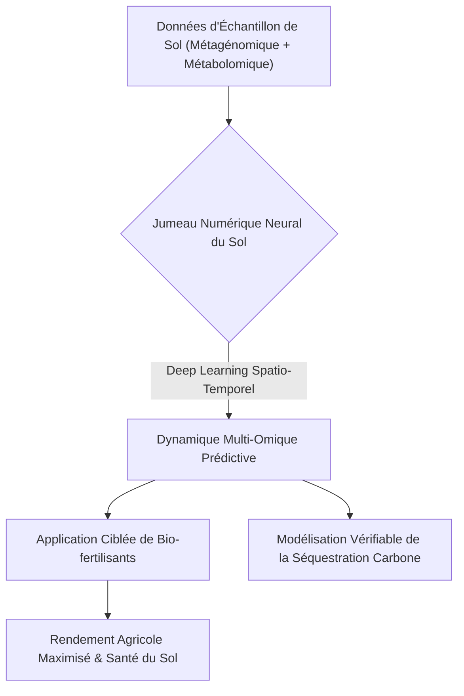
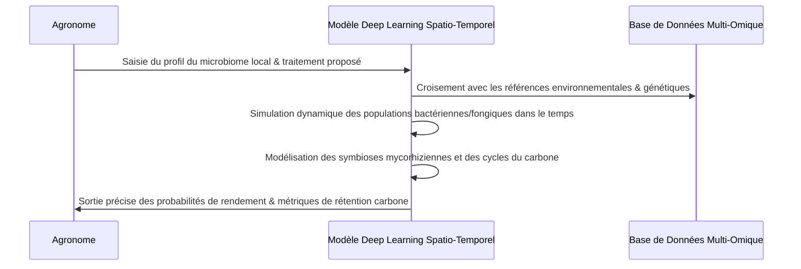

<!-- markdownlint-disable MD009 MD010 MD013 MD022 MD028 MD032 MD033 MD034 MD036 MD037 MD039 MD041 MD058 MD060 -->

[ 🇬🇧 English Version ](./README.md)

# Neural Soil Microbiome Predictor

> **Résumé exécutif :** Un modèle d'apprentissage profond spatio-temporel qui crée des jumeaux numériques des sols agricoles à l'échelle moléculaire, simulant la dynamique du microbiome multi-omique pour prédire avec précision l'efficacité des bio-fertilisants et la capacité de séquestration du carbone.

---

## 1. Aperçu visuel & Effet Wahou

## 2. La thèse contrariante (Peter Thiel Style)

**La croyance populaire :** L'agriculture de précision s'appuie sur des données macroscopiques (climat, imagerie satellite, capteurs NPK) et des intrants biologiques globaux pour améliorer les rendements.
**La vérité cachée :** Les données macroscopiques ignorent la réalité microscopique fondamentale du sol ; les intrants agricoles échouent de manière imprévisible car nous traitons le microbiome, hautement complexe et localisé, comme une variable statique. En modélisant la causalité biochimique exacte via un jumeau neuronal multi-omique, nous pouvons parfaitement prédire et contrôler les relations symbiotiques du sol.

## 3. Le problème & La cible

**Modèle économique :** B2B
**Cible précise :** Entreprises Agritech, producteurs d'engrais biologiques, et plateformes de certification de crédits carbone agricole.
**La douleur urgente :** L'application de traitements biologiques et la mesure de la séquestration du carbone dans le sol sont hautement imprévisibles et échouent fréquemment. Cette imprévisibilité coûte à l'industrie agricole des milliards en intrants gaspillés et empêche la mise à l'échelle de marchés du carbone légitimes et scientifiquement vérifiés.

## 4. Architecture technique & Plomberie

## 5. Modèle économique & Viabilité financière

| Métrique                    | Valeur                                                                  |
| --------------------------- | ----------------------------------------------------------------------- |
| Structure de prix           | Accès API SaaS à plusieurs niveaux + Conseil premium pour R&D d'engrais |
| Objectif 12 mois            | 5 contrats pilotes avec firmes Agritech/Engrais (à 20 000€/contrat)     |
| Calcul du CA (Target 100k€) | 5 \* 20 000€ = 100 000€ de revenus annuels récurrents                   |
| Marge brute estimée         | 85%                                                                     |

## 6. Moteur de distribution & Fossé défensif (Moat)

**Stratégie d'acquisition :** Ventes B2B ciblant les départements R&D des grands producteurs d'intrants agricoles et les registres de crédits carbone.
**Moat (Barrière à l'entrée) :** Les logiciels agricoles standards ou les LLM génériques ne peuvent pas modéliser la causalité biochimique microscopique ou la dynamique des populations. La construction de ce modèle nécessite des ensembles de données massifs de sols séquencés propriétaires et des architectures de deep learning spatio-temporel hautement spécialisées, extrêmement difficiles à reproduire pour les concurrents.

## 7. Grille d'évaluation détaillée

| Critère                           | Score VC (/100) | Score Terrain (/100) |
| --------------------------------- | --------------- | -------------------- |
| Thèse & Monopole / Urgence        | -- / 25         | -- / 25              |
| Moat / Résistance aux LLM natifs  | -- / 25         | -- / 25              |
| Scalabilité / Friction d'adoption | -- / 25         | -- / 25              |
| Unit Economics / ROI direct       | -- / 25         | -- / 25              |
| **TOTAL**                         | **-- / 100**    | **-- / 100**         |

> **Verdict VC :** En attente d'évaluation.
> **Verdict Terrain :** En attente d'évaluation.
