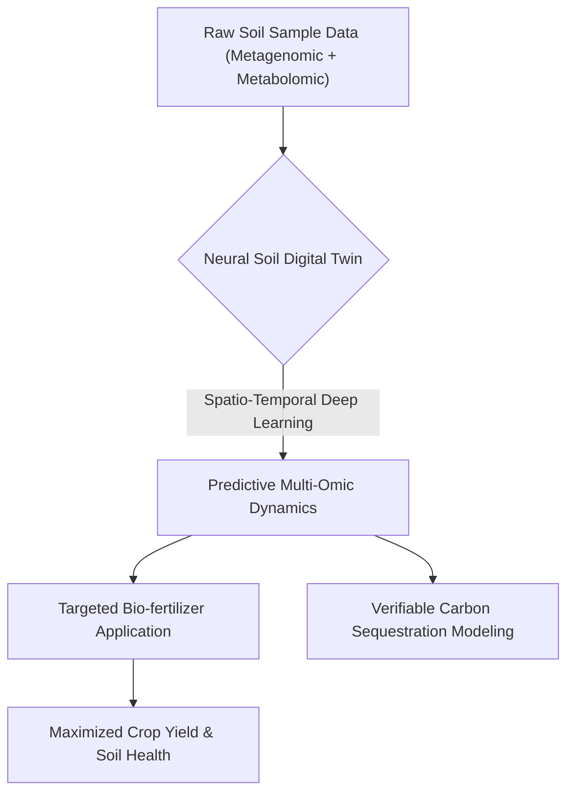
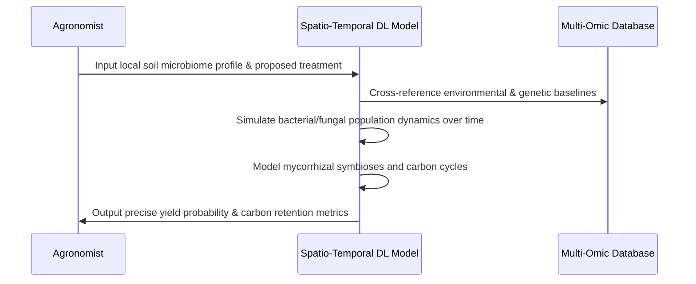

<!-- markdownlint-disable MD009 MD010 MD013 MD022 MD028 MD032 MD033 MD034 MD036 MD037 MD039 MD041 MD058 MD060 -->

[ 🇫🇷 Version Française ](./README.fr.md)

# Neural Soil Microbiome Predictor

> **Executive Summary:** A spatio-temporal deep learning model that creates molecular-level digital twins of agricultural soil, simulating multi-omic microbiome dynamics to accurately predict biological fertilizer efficacy and carbon sequestration capacity.

---

## 1. Visual Overview & Wow Effect

## 2. Contrarian Thesis (Peter Thiel Style)

**Popular Belief:** Precision agriculture relies on macroscopic data (weather, satellite imagery, soil NPK sensors) and broad biological inputs to improve yield.
**Hidden Truth:** Macroscopic data ignores the foundational microscopic reality of soil; agricultural inputs fail unpredictably because we treat the highly complex, localized microbiome as a static variable. By modeling the exact biochemical causality through a multi-omic neural twin, we can perfectly predict and control symbiotic soil relationships.

## 3. Problem & Target Market

**Business Model:** B2B
**Target Audience:** Agritech companies, bio-fertilizer manufacturers, and agricultural carbon credit certification platforms.
**Urgent Pain Point:** The application of biological treatments and the measurement of soil carbon sequestration are highly unpredictable and fail frequently. This unpredictability costs the agriculture industry billions in wasted inputs and prevents the scaling of legitimate, scientifically verified carbon markets.

## 4. Technical Architecture & Infrastructure

## 5. Business Model & Financial Viability

| Metric                 | Value                                                                  |
| ---------------------- | ---------------------------------------------------------------------- |
| Pricing Structure      | Tiered SaaS API access + Premium consulting for fertilizer R&D         |
| 12-Month Target        | 5 pilot contracts with Agritech/Fertilizer firms (at 20,000€/contract) |
| Revenue Formula        | 5 \* 20,000€ = 100,000€ ARR                                            |
| Estimated Gross Margin | 85%                                                                    |

## 6. Distribution Engine & Moat

**Acquisition Strategy:** B2B enterprise sales targeting R&D departments of major agricultural input producers and carbon credit registries.
**Moat (Defensibility):** Standard agricultural software or generic LLMs cannot model microscopic biochemical causality or population dynamics. Building this requires massive, proprietary sequenced soil datasets and highly specialized spatio-temporal deep learning architectures that are extremely difficult for competitors to replicate.

## 7. Detailed Evaluation Grid

| Criterion                   | VC Score (/100) | Market Score (/100) |
| --------------------------- | --------------- | ------------------- |
| Thesis & Monopoly / Urgency | -- / 25         | -- / 25             |
| Moat / LLM Immunity         | -- / 25         | -- / 25             |
| Scalability / UX Friction   | -- / 25         | -- / 25             |
| Unit Economics / ROI        | -- / 25         | -- / 25             |
| **TOTAL**                   | **-- / 100**    | **-- / 100**        |

> **VC Verdict:** Pending evaluation.
> **Market Verdict:** Pending evaluation.
