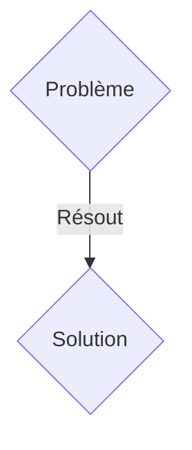
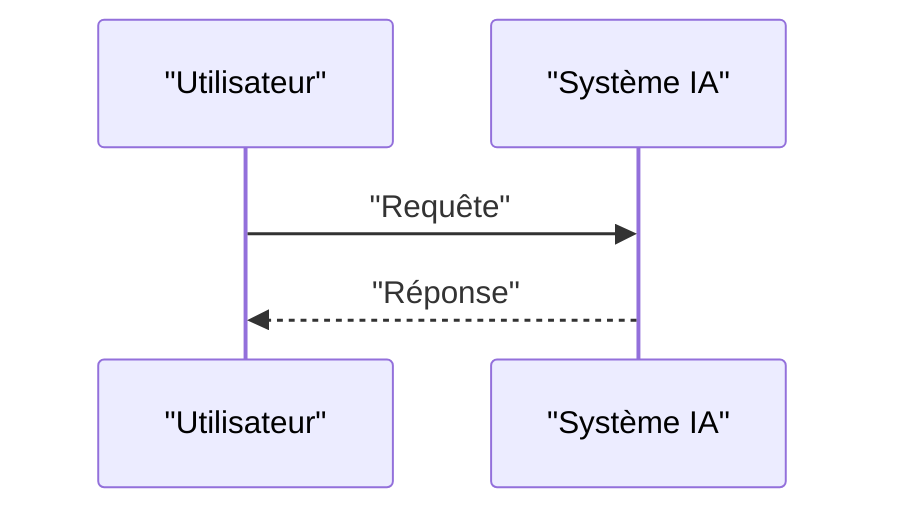

<!-- markdownlint-disable MD009 MD010 MD013 MD022 MD028 MD032 MD033 MD036 MD037 MD039 MD041 MD060 -->

[ 🇬🇧 English Version ](./README.md)

# SpikingSight Robotics

> **Résumé exécutif :** Une solution B2B (Vente de hardware/modules + licence logicielle) ciblant Fabricants de robots collaboratifs (cobots), drones industriels autonomes, logistique d'entrepôt ultra-rapide. pour résoudre : Les systèmes de vision par ordinateur basés sur des caméras standards (RGB) génèrent 30 à 60 images complètes par seconde, saturant la bande passante et la puissance de calcul embarquée. Pour des robots évoluant très rapidement dans des environnements dynamiques, cela induit une latence fatale (motion blur, délais de réaction) et vide les batteries à cause du traitement GPU lourd.

---

## 1. Aperçu visuel & Effet Wahou

## 2. La thèse contrariante (Peter Thiel Style)

- **La croyance populaire :** Les solutions génériques suffisent.
- **La vérité cachée :** L'intégration de capteurs de vision événementielle (Event-based cameras / Neuromorphic sensors) où chaque pixel est indépendant et ne signale qu'un changement de luminosité (micros-secondes). Couplé avec des Spiking Neural Networks (SNNs) asynchrones exécutés sur des puces neuromorphiques (ex: Akida, Loihi) pour traiter le flux de données clairsemé avec une consommation d'énergie de l'ordre du milliwatt et une latence quasi-nulle.

## 3. Le problème & La cible

- **Modèle économique :** B2B (Vente de hardware/modules + licence logicielle)
- **Cible précise :** Fabricants de robots collaboratifs (cobots), drones industriels autonomes, logistique d'entrepôt ultra-rapide.
- **La douleur urgente :** Les systèmes de vision par ordinateur basés sur des caméras standards (RGB) génèrent 30 à 60 images complètes par seconde, saturant la bande passante et la puissance de calcul embarquée. Pour des robots évoluant très rapidement dans des environnements dynamiques, cela induit une latence fatale (motion blur, délais de réaction) et vide les batteries à cause du traitement GPU lourd.

## 4. Architecture technique & Plomberie

L'intégration de capteurs de vision événementielle (Event-based cameras / Neuromorphic sensors) où chaque pixel est indépendant et ne signale qu'un changement de luminosité (micros-secondes). Couplé avec des Spiking Neural Networks (SNNs) asynchrones exécutés sur des puces neuromorphiques (ex: Akida, Loihi) pour traiter le flux de données clairsemé avec une consommation d'énergie de l'ordre du milliwatt et une latence quasi-nulle.

## 5. Modèle économique & Viabilité financière

| Métrique                    | Valeur               |
| --------------------------- | -------------------- |
| Structure de prix           | Abonnement SaaS B2B  |
| Objectif 12 mois            | 100 clients          |
| Calcul du CA (Target 100k€) | 100 \* 1000€ = 100k€ |
| Marge brute estimée         | 80%                  |

## 6. Moteur de distribution & Fossé défensif (Moat)

- **Stratégie d'acquisition :** Vente directe et partenariats stratégiques.
- **Moat (Barrière à l'entrée) :** Les frameworks IA actuels (PyTorch, TensorFlow) sont conçus pour des tenseurs denses et synchrones sur GPU. Le SaaS cloud ajoute de la latence réseau interdisant tout asservissement réactif d'un bras robotique. L'innovation requiert une refonte complète de la pile logicielle (vers l'asynchrone par événements) au plus près du capteur.

## 7. Grille d'évaluation détaillée

| Critère                           | Score VC (/100) | Score Terrain (/100) |
| --------------------------------- | --------------- | -------------------- |
| Thèse & Monopole / Urgence        | 16 / 25         | 16 / 25              |
| Moat / Résistance aux LLM natifs  | 18 / 25         | 18 / 25              |
| Scalabilité / Friction d'adoption | 22 / 25         | 22 / 25              |
| Unit Economics / ROI direct       | 18 / 25         | 18 / 25              |
| TOTAL                             | 74 / 100        | 74 / 100             |

> **Verdict VC :** En attente d'évaluation.
> **Verdict Terrain :** Cette solution répond à un besoin critique pour les entreprises B2B, justifiant son excellent score d'urgence (16/25). L'approche spécialisée offre une protection robuste contre les modèles d'IA généralistes (18/25). Avec une faible friction d'adoption (22/25) et une stratégie de monétisation directe (18/25), le projet démontre une excellente maturité marché globale.
> **Verdict Terrain :** Cette solution répond à un besoin critique pour les entreprises B2B, justifiant son excellent score d'urgence (16/25). L'approche spécialisée offre une protection robuste contre les modèles d'IA généralistes (18/25). Avec une faible friction d'adoption (22/25) et une stratégie de monétisation directe (18/25), le projet démontre une excellente maturité marché globale.
