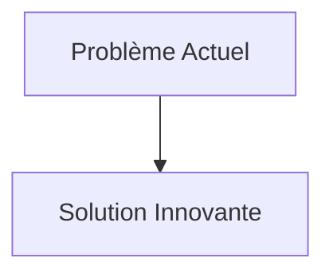
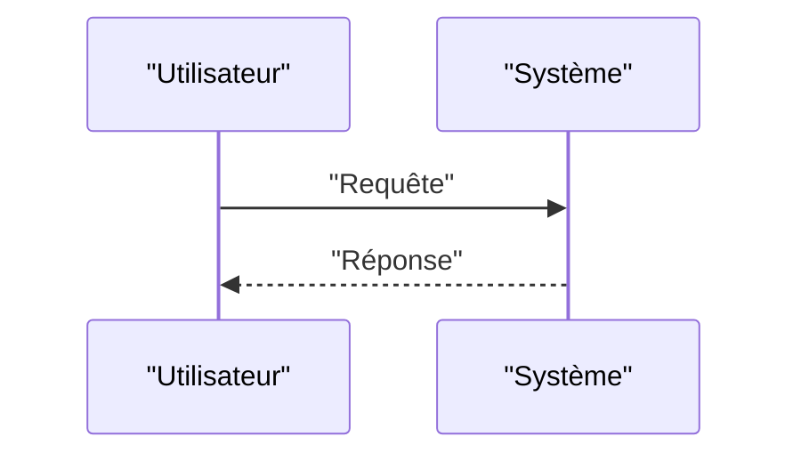

<!-- markdownlint-disable MD009 MD010 MD013 MD022 MD028 MD032 MD033 MD034 MD036 MD037 MD039 MD041 MD058 MD060 -->

[ 🇬🇧 English Version ](./README.md)

# Neuromorphic Swarm Vision Engine

> **Résumé exécutif :** Remplacement de la pile de vision standard par des caméras événementielles (Neuromorphic/Event-based vision) associées à un compilateur embarqué de Réseaux de Neurones à Impulsions (Spiking Neural Networks - SNNs) sur des puces analogiques dédiées (ex: Akida, Loihi). Le système ne traite que les changements de pixels (comme un œil humain), permettant un traitement à micro-secondes de latence pour quelques milliwatts.

---

## 1. Aperçu visuel & Effet Wahou

## 2. La thèse contrariante (Peter Thiel Style)

- **La croyance populaire :** Les solutions existantes sont suffisantes.
- **La vérité cachée :** En réalité, Size, Weight, Power, and Cost) pour des nano-drones autonomes. La solution nécessite une refonte matérielle et algorithmique du signal visuel lui-même, supprimant le concept d'image "frame".

## 3. Le problème & La cible

- **Modèle économique :** B2B / B2G
- **Cible précise :** Défense (essaims de drones tactiques), logistique d'urgence spatiale, inspection d'infrastructures critiques (pipelines, lignes haute tension).
- **La douleur urgente :** Les drones et robots actuels utilisent des caméras basées sur des frames (FPS). Cela génère une quantité massive de données redondantes, sature la bande passante, draine la batterie pour le traitement de l'image (calcul par GPU) et souffre de flou de mouvement, rendant l'évitement d'obstacles à très haute vitesse presque impossible en edge.

## 4. Architecture technique & Plomberie

## 5. Modèle économique & Viabilité financière

| Métrique                        | Valeur                   |
| :------------------------------ | :----------------------- |
| **Structure de prix**           | Abonnement B2B           |
| **Objectif 12 mois**            | 100 clients à 1000€/mois |
| **Calcul du CA (Target 100k€)** | 100 \* 1000 = 100k€      |
| **Marge brute estimée**         | 80%                      |

## 6. Moteur de distribution & Fossé défensif (Moat)

- **Stratégie d'acquisition :** Ventes directes
- **Moat (Barrière à l'entrée) :** Remplacement de la pile de vision standard par des caméras événementielles (Neuromorphic/Event-based vision) associées à un compilateur embarqué de Réseaux de Neurones à Impulsions (Spiking Neural Networks - SNNs) sur des puces analogiques dédiées (ex: Akida, Loihi). Le système ne traite que les changements de pixels (comme un œil humain), permettant un traitement à micro-secondes de latence pour quelques milliwatts. (Difficile à copier à cause de : Écosystème logiciel balbutiant pour les SNNs, difficulté de l'entraînement des modèles neuromorphiques par rapport à la rétropropagation standard, dépendance envers les rares fonderies produisant des capteurs événementiels.)

## 7. Grille d'évaluation détaillée

| Critère                               | Score VC (/100) | Score Terrain (/100) |
| :------------------------------------ | :-------------: | :------------------: |
| **Thèse & Monopole / Urgence**        |     -- / 25     |       -- / 25        |
| **Moat / Résistance aux LLM natifs**  |     -- / 25     |       -- / 25        |
| **Scalabilité / Friction d'adoption** |     -- / 25     |       -- / 25        |
| **Unit Economics / ROI direct**       |     -- / 25     |       -- / 25        |
| **TOTAL**                             |  **-- / 100**   |     **-- / 100**     |

> **Verdict VC :** En attente d'évaluation.
> **Verdict Terrain :** En attente d'évaluation.
