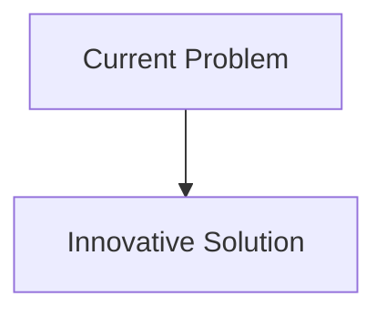
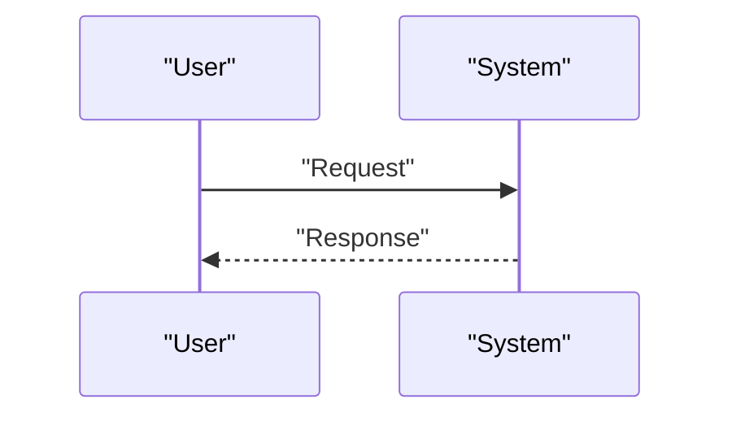

<!-- markdownlint-disable MD009 MD010 MD013 MD022 MD028 MD032 MD033 MD034 MD036 MD037 MD039 MD041 MD058 MD060 -->

[ 🇫🇷 Version Française ](./README.fr.md)

# Neuromorphic Swarm Vision Engine

> **Executive Summary:** Replacement of the standard vision stack with event cameras (Neuromorphic/Event-based vision) associated with an embedded Spiking Neural Networks (SNNs) compiler on dedicated analog chips (e. g. Akida, Loihi). The system only processes pixel changes (like a human eye), allowing processing at micro-seconds of latency for a few milliwatts.

---

## 1. Visual Overview & Wow Effect

## 2. Contrarian Thesis (Peter Thiel Style)

- **Popular Belief:** Existing solutions are sufficient.
- **Hidden Truth:** In reality, Size, Weight, Power, and Cost) for autonomous nano-drones. The solution requires a hardware and algorithmic overhaul of the visual signal itself, removing the concept of an image “frame”.

## 3. Problem & Target Market

- **Business Model:** B2B / B2G
- **Target Audience:** Defense (tactical drone swarms), emergency space logistics, inspection of critical infrastructure (pipelines, high voltage lines).
- **Urgent Pain Point:** Current drones and robots use frame-based cameras (FPS). This generates a massive amount of redundant data, saturates bandwidth, drains battery for image processing (GPU computing) and suffers from motion blur, making obstacle avoidance at very high speeds almost impossible at the edge.

## 4. Technical Architecture & Infrastructure

## 5. Business Model & Financial Viability

| Metric                     | Value                        |
| :------------------------- | :--------------------------- |
| **Pricing Structure**      | B2B Subscription             |
| **12-Month Target**        | 100 customers at 1000€/month |
| **Revenue Formula**        | 100 \* 1000 = 100k€          |
| **Estimated Gross Margin** | 80%                          |

## 6. Distribution Engine & Moat

- **Acquisition Strategy:** Direct Sales
- **Moat (Defensibility):** Replacement of the standard vision stack with event cameras (Neuromorphic/Event-based vision) associated with an embedded Spiking Neural Networks (SNNs) compiler on dedicated analog chips (e. g. Akida, Loihi). The system only processes pixel changes (like a human eye), allowing processing at micro-seconds of latency for a few milliwatts.(Difficult to copy because of: fledgling software ecosystem for SNNs, difficulty in training neuromorphic models compared to standard backpropagation, dependence on the rare foundries producing event sensors.)

## 7. Detailed Evaluation Grid

| Criterion                       | VC Score (/100) | Market Score (/100) |
| :------------------------------ | :-------------: | :-----------------: |
| **Thesis & Monopoly / Urgency** |     -- / 25     |       -- / 25       |
| **Moat / LLM Immunity**         |     -- / 25     |       -- / 25       |
| **Scalability / UX Friction**   |     -- / 25     |       -- / 25       |
| **Unit Economics / ROI**        |     -- / 25     |       -- / 25       |
| **TOTAL**                       |  **-- / 100**   |    **-- / 100**     |

> **VC Verdict:** Pending evaluation.
> **Market Verdict:** Pending evaluation.
