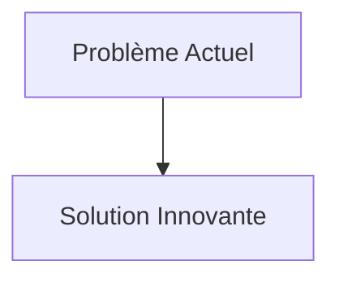
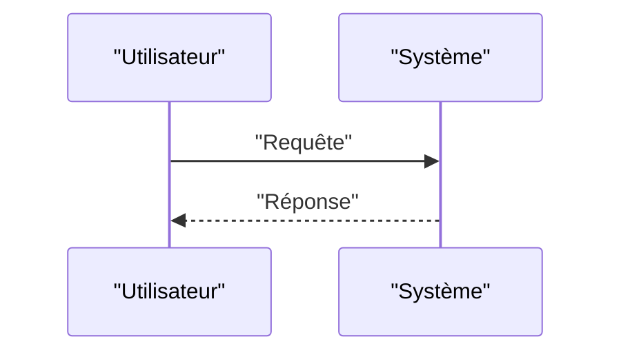

<!-- markdownlint-disable MD009 MD010 MD013 MD022 MD028 MD032 MD033 MD034 MD036 MD037 MD039 MD041 MD058 MD060 -->

[ 🇬🇧 English Version ](./README.md)

# Neuromorphic Proprioception

> **Résumé exécutif :** Une infrastructure complète de perception tactile basée sur des puces neuromorphiques (Spiking Neural Networks - SNN) couplées à des peaux électroniques (e-skin) à haute densité de capteurs. Le système traite l'information sensorielle par événements asynchrones, imitant le système nerveux humain pour une latence ultra-faible (microsecondes) et une consommation énergétique quasi nulle au repos.

---

## 1. Aperçu visuel & Effet Wahou

## 2. La thèse contrariante (Peter Thiel Style)

- **La croyance populaire :** Les solutions existantes sont suffisantes.
- **La vérité cachée :** En réalité, L'approche classique (échantillonnage de milliers de capteurs de pression à 1000 Hz vers un CPU central) sature le bus de données et consomme trop de puissance de calcul et d'énergie pour être embarquée. C'est un goulot d'étranglement strictement matériel et architectural (besoin d'informatique neuromorphique event-based).

## 3. Le problème & La cible

- **Modèle économique :** B2B
- **Cible précise :** Fabricants de robots humanoïdes, de bras robotiques collaboratifs (cobots) et d'exosquelettes.
- **La douleur urgente :** Les robots humanoïdes et manipulateurs avancés actuels ont une "peau" morte. Leur manque de sens du toucher (proprioception fine et perception tactile) les rend maladroits, dangereux pour les humains et incapables de manipuler des objets souples ou fragiles avec la dextérité humaine, limitant leur déploiement hors des usines structurées.

## 4. Architecture technique & Plomberie

## 5. Modèle économique & Viabilité financière

| Métrique                        | Valeur                   |
| :------------------------------ | :----------------------- |
| **Structure de prix**           | Abonnement B2B           |
| **Objectif 12 mois**            | 100 clients à 1000€/mois |
| **Calcul du CA (Target 100k€)** | 100 \* 1000 = 100k€      |
| **Marge brute estimée**         | 80%                      |

## 6. Moteur de distribution & Fossé défensif (Moat)

- **Stratégie d'acquisition :** Ventes directes
- **Moat (Barrière à l'entrée) :** Une infrastructure complète de perception tactile basée sur des puces neuromorphiques (Spiking Neural Networks - SNN) couplées à des peaux électroniques (e-skin) à haute densité de capteurs. Le système traite l'information sensorielle par événements asynchrones, imitant le système nerveux humain pour une latence ultra-faible (microsecondes) et une consommation énergétique quasi nulle au repos. (Difficile à copier à cause de : Immaturité de la fabrication de peaux électroniques durables (résistance mécanique) ; coût de production des ASICs neuromorphiques personnalisés ; difficulté à intégrer les algorithmes SNN avec les contrôleurs cinématiques classiques existants.)

## 7. Grille d'évaluation détaillée

| Critère                               | Score VC (/100) | Score Terrain (/100) |
| :------------------------------------ | :-------------: | :------------------: |
| **Thèse & Monopole / Urgence**        |     -- / 25     |       -- / 25        |
| **Moat / Résistance aux LLM natifs**  |     -- / 25     |       -- / 25        |
| **Scalabilité / Friction d'adoption** |     -- / 25     |       -- / 25        |
| **Unit Economics / ROI direct**       |     -- / 25     |       -- / 25        |
| **TOTAL**                             |  **-- / 100**   |     **-- / 100**     |

> **Verdict VC :** En attente d'évaluation.
> **Verdict Terrain :** En attente d'évaluation.
