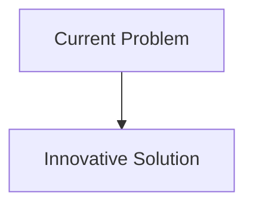
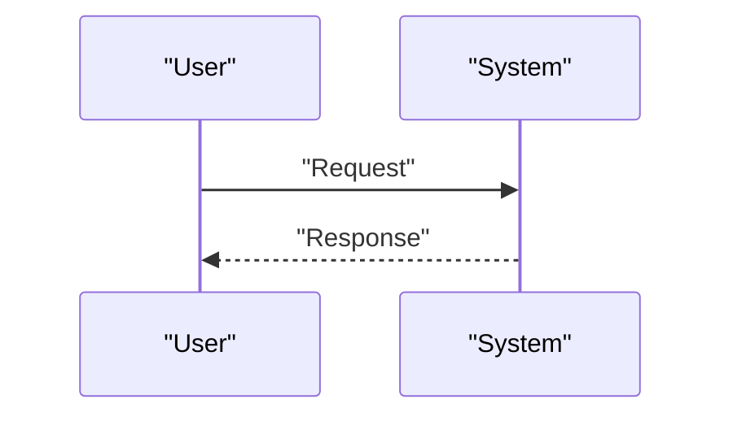

<!-- markdownlint-disable MD009 MD010 MD013 MD022 MD028 MD032 MD033 MD034 MD036 MD037 MD039 MD041 MD058 MD060 -->

[ 🇫🇷 Version Française ](./README.fr.md)

# Neuromorphic Proprioception

> **Executive Summary:** A complete tactile perception infrastructure based on neuromorphic chips (Spiking Neural Networks - SNN) coupled with electronic skins (e-skin) with high sensor density. The system processes sensory information through asynchronous events, mimicking the human nervous system for ultra-low latency (microseconds) and near-zero energy consumption at rest.

---

## 1. Visual Overview & Wow Effect

## 2. Contrarian Thesis (Peter Thiel Style)

- **Popular Belief:** Existing solutions are sufficient.
- **Hidden Truth:** In reality, the classic approach (sampling thousands of pressure sensors at 1000 Hz to a central CPU) saturates the data bus and consumes too much computing power and energy to be embedded. This is a strictly hardware and architectural bottleneck (need for event-based neuromorphic computing).

## 3. Problem & Target Market

- **Business Model:** B2B
- **Target Audience:** Manufacturers of humanoid robots, collaborative robotic arms (cobots) and exoskeletons.
- **Urgent Pain Point:** Today's advanced humanoid robots and manipulators have dead "skin". Their lack of sense of touch (fine proprioception and tactile perception) makes them clumsy, dangerous for humans and incapable of handling soft or fragile objects with human dexterity, limiting their deployment outside structured factories.

## 4. Technical Architecture & Infrastructure

## 5. Business Model & Financial Viability

| Metric                     | Value                        |
| :------------------------- | :--------------------------- |
| **Pricing Structure**      | B2B Subscription             |
| **12-Month Target**        | 100 customers at 1000€/month |
| **Revenue Formula**        | 100 \* 1000 = 100k€          |
| **Estimated Gross Margin** | 80%                          |

## 6. Distribution Engine & Moat

- **Acquisition Strategy:** Direct Sales
- **Moat (Defensibility):** A complete tactile perception infrastructure based on neuromorphic chips (Spiking Neural Networks - SNN) coupled with electronic skins (e-skin) with high sensor density. The system processes sensory information through asynchronous events, mimicking the human nervous system for ultra-low latency (microseconds) and near-zero energy consumption at rest.(Difficult to copy due to: Immaturity of manufacturing durable electronic skins (mechanical strength); cost of producing custom neuromorphic ASICs; difficulty integrating SNN algorithms with existing conventional kinematic controllers.)

## 7. Detailed Evaluation Grid

| Criterion                       | VC Score (/100) | Market Score (/100) |
| :------------------------------ | :-------------: | :-----------------: |
| **Thesis & Monopoly / Urgency** |     -- / 25     |       -- / 25       |
| **Moat / LLM Immunity**         |     -- / 25     |       -- / 25       |
| **Scalability / UX Friction**   |     -- / 25     |       -- / 25       |
| **Unit Economics / ROI**        |     -- / 25     |       -- / 25       |
| **TOTAL**                       |  **-- / 100**   |    **-- / 100**     |

> **VC Verdict:** Pending evaluation.
> **Market Verdict:** Pending evaluation.
