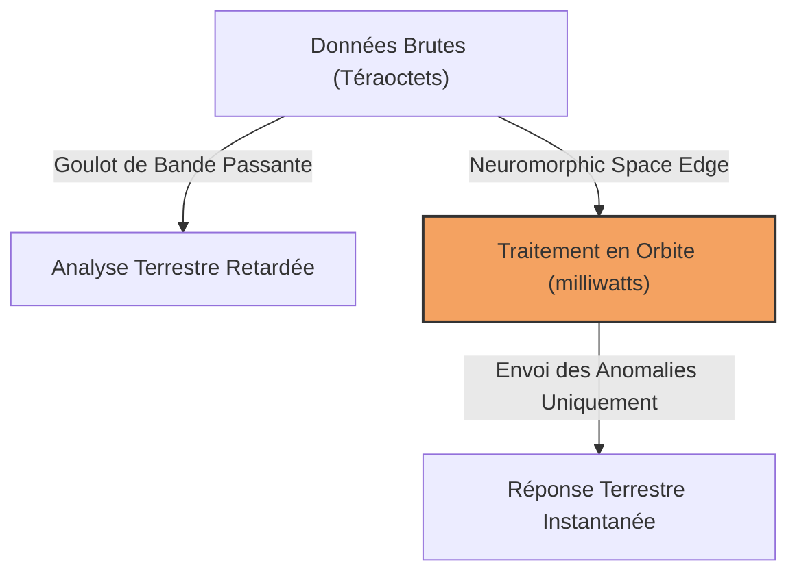
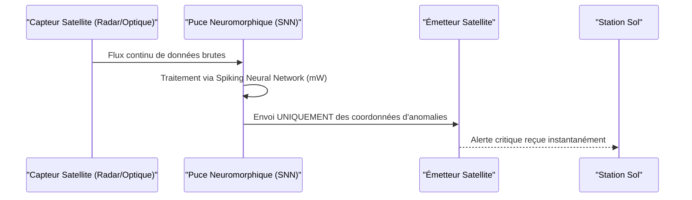

<!-- markdownlint-disable MD009 MD010 MD013 MD022 MD028 MD032 MD033 MD034 MD036 MD037 MD039 MD041 MD058 MD060 -->

[ 🇬🇧 English Version ](./README.md)

# Neuromorphic Space Edge

> **Résumé exécutif :** Des puces neuromorphiques durcies contre les radiations, intégrées directement sur les satellites pour traiter les données optiques et radar en temps réel avec une consommation ultra-faible, réduisant drastiquement les goulots d'étranglement de la bande passante descendante.

---

## 1. Aperçu visuel & Effet Wahou

## 2. La thèse contrariante (Peter Thiel Style)

**La croyance populaire :** L'avenir des données spatiales consiste simplement à construire des antennes plus grandes et des liaisons laser plus rapides pour envoyer toujours plus de données brutes vers d'immenses serveurs cloud terrestres.
**La vérité cachée :** Envoyer des téraoctets d'images d'océans vides ou de nuages est une perte de temps et d'argent. La véritable percée consiste à traiter les données directement en orbite grâce à des puces neuromorphiques bio-inspirées à très faible consommation, contournant ainsi les goulots d'étranglement terrestres.

## 3. Le problème & La cible

**Modèle économique :** B2B
**Cible précise :** Les opérateurs de constellations de satellites (observation de la Terre, défense, télécoms) gérant les budgets matériels et la bande passante.
**La douleur urgente :** Les satellites génèrent des volumes massifs de données brutes, mais la bande passante vers la Terre est limitée et extrêmement coûteuse. Transmettre des données inutiles retarde l'analyse d'images critiques (défense, catastrophes naturelles).

## 4. Architecture technique & Plomberie

## 5. Modèle économique & Viabilité financière

| Métrique                        | Valeur                                               |
| :------------------------------ | :--------------------------------------------------- |
| **Structure de prix**           | Vente de matériel + Licence logicielle par satellite |
| **Objectif 12 mois**            | 2 contrats de déploiement de constellation           |
| **Calcul du CA (Target 100k€)** | 2 contrats \* 60k€ = 120k€ ARR                       |
| **Marge brute estimée**         | 75%                                                  |

## 6. Moteur de distribution & Fossé défensif (Moat)

**Stratégie d'acquisition :** Ventes B2B directes aux fabricants de satellites et acteurs de la défense, avec validation TRL (Technology Readiness Level) via des missions pilotes en orbite.
**Moat (Barrière à l'entrée) :** Ingénierie matérielle extrême combinant le durcissement contre les radiations (rad-hard) et les réseaux de neurones à impulsions (SNN). Les GPU/TPU terrestres standards ne peuvent ni survivre aux radiations spatiales ni fonctionner avec l'énergie très limitée des panneaux solaires des satellites.

## 7. Grille d'évaluation détaillée

| Critère                               | Score VC (/100) | Score Terrain (/100) |
| :------------------------------------ | :-------------- | :------------------- |
| **Thèse & Monopole / Urgence**        | -- / 25         | 24 / 25              |
| **Moat / Résistance aux LLM natifs**  | -- / 25         | 25 / 25              |
| **Scalabilité / Friction d'adoption** | -- / 25         | 12 / 25              |
| **Unit Economics / ROI direct**       | -- / 25         | 19 / 25              |
| **TOTAL**                             | **-- / 100**    | **80 / 100**         |

> **Verdict VC :** Un pari sur un monopole absolu qui résout le goulot d'étranglement critique du rapatriement des données satellitaires. Le fossé technique associant le durcissement spatial et les réseaux de neurones à impulsions est quasi impossible à répliquer. Le marché explose avec le New Space, offrant de superbes contrats B2B.

> **Verdict Terrain :** Neuromorphic-space-edge fournit une infrastructure critique pour l'informatique en orbite où l'énergie et la latence sont des contraintes vitales. Il est entièrement immunisé contre les LLM standards grâce à son architecture matérielle exotique. La friction extrême de la qualification spatiale est compensée par des contrats de défense et d'aérospatiale très lucratifs.
