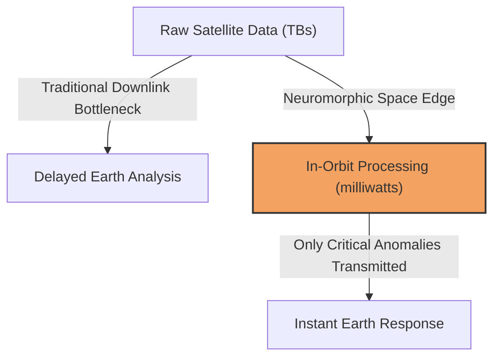
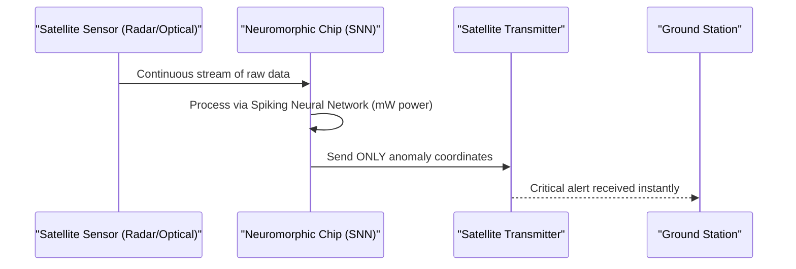

<!-- markdownlint-disable MD009 MD010 MD013 MD022 MD028 MD032 MD033 MD034 MD036 MD037 MD039 MD041 MD058 MD060 -->

[ 🇫🇷 Version Française ](./README.fr.md)

# Neuromorphic Space Edge

> **Executive Summary:** Radiation-hardened neuromorphic chips directly integrated into satellites to perform ultra-low power, real-time edge computing on optical and radar data, drastically reducing downlink bottlenecks.

---

## 1. Visual Overview & Wow Effect

## 2. Contrarian Thesis (Peter Thiel Style)

**Popular Belief:** The future of space data is simply building bigger antennas and faster laser downlinks to send more raw data back to massive terrestrial cloud servers.
**Hidden Truth:** Sending terabytes of empty ocean or cloud images is a waste of money and time. The real breakthrough is processing data directly in orbit using biologically-inspired, ultra-low power neuromorphic chips that bypass terrestrial bottlenecks.

## 3. Problem & Target Market

**Business Model:** B2B
**Target Audience:** Satellite constellation operators (Earth observation, defense, telecom) managing hardware budgets and bandwidth.
**Urgent Pain Point:** Satellites generate massive amounts of raw data, but downlink bandwidth is limited and extremely expensive. Transmitting useless data delays the analysis of critical imagery (defense, natural disasters).

## 4. Technical Architecture & Infrastructure

## 5. Business Model & Financial Viability

| Metric                     | Value                                             |
| :------------------------- | :------------------------------------------------ |
| **Pricing Structure**      | Hardware sales + Software licensing per satellite |
| **12-Month Target**        | 2 constellation deployment contracts              |
| **Revenue Formula**        | 2 contracts \* €60k = €120k ARR                   |
| **Estimated Gross Margin** | 75%                                               |

## 6. Distribution Engine & Moat

**Acquisition Strategy:** Direct B2B sales to satellite manufacturers and defense contractors, validating TRL (Technology Readiness Level) through early orbit pilot missions.
**Moat (Defensibility):** Extreme hardware engineering combining radiation-hardening (rad-hard) with Spiking Neural Networks (SNN). Standard terrestrial GPUs/TPUs cannot survive space radiation or operate within the strict power budgets of satellite solar panels.

## 7. Detailed Evaluation Grid

| Criterion                       | VC Score (/100) | Market Score (/100) |
| :------------------------------ | :-------------- | :------------------ |
| **Thesis & Monopoly / Urgency** | -- / 25         | -- / 25             |
| **Moat / LLM Immunity**         | -- / 25         | -- / 25             |
| **Scalability / UX Friction**   | -- / 25         | -- / 25             |
| **Unit Economics / ROI**        | -- / 25         | -- / 25             |
| **TOTAL**                       | **-- / 100**    | **-- / 100**        |

> **VC Verdict:** Pending evaluation.

> **Market Verdict:** Pending evaluation.
