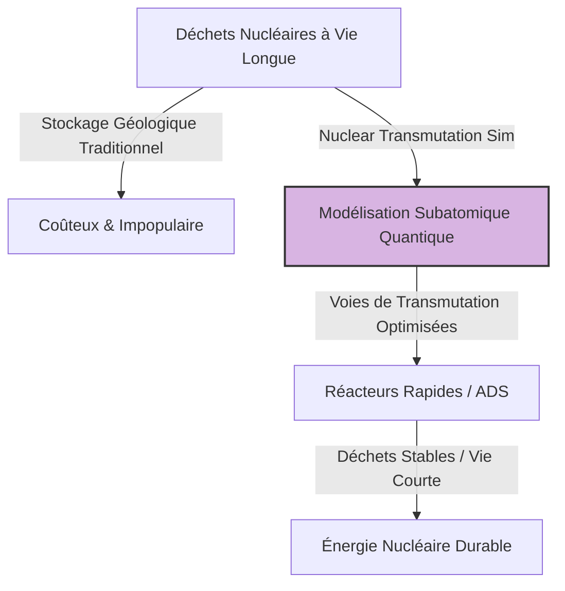
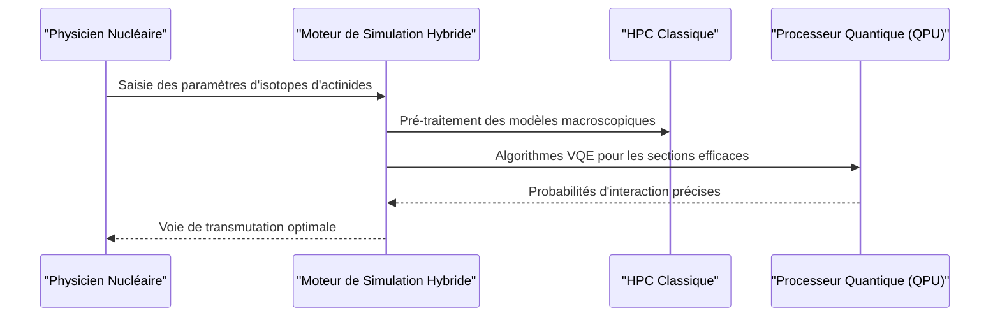

<!-- markdownlint-disable MD009 MD010 MD013 MD022 MD028 MD032 MD033 MD034 MD036 MD037 MD039 MD041 MD058 MD060 -->

[ 🇬🇧 English Version ](./README.md)

# Nuclear Transmutation Sim

> **Résumé exécutif :** Un moteur de simulation hybride quantique-classique modélisant les interactions nucléaires subatomiques pour accélérer la transmutation sécurisée des déchets nucléaires à vie longue en éléments stables.

---

## 1. Aperçu visuel & Effet Wahou

## 2. La thèse contrariante (Peter Thiel Style)

**La croyance populaire :** La seule solution pour les déchets hautement radioactifs est de les enfouir profondément sous terre pendant des centaines de milliers d'années en attendant un consensus politique.
**La vérité cachée :** Nous pouvons neutraliser ces déchets en les transmutant dans des réacteurs rapides, mais le goulot d'étranglement est l'impossibilité computationnelle de simuler la physique nucléaire multiparticulaire sur des supercalculateurs classiques—une barrière que l'informatique quantique est la seule à pouvoir franchir.

## 3. Le problème & La cible

**Modèle économique :** B2B
**Cible précise :** Les agences nationales de gestion des déchets radioactifs, les opérateurs de parcs nucléaires et les laboratoires nationaux.
**La douleur urgente :** Les déchets à vie longue exigent un stockage géologique profond, immensément coûteux et politiquement toxique. Les expériences de transmutation réelles sont trop onéreuses, lentes et dangereuses sans une simulation préalable ultra-précise.

## 4. Architecture technique & Plomberie

## 5. Modèle économique & Viabilité financière

| Métrique                        | Valeur                                                 |
| :------------------------------ | :----------------------------------------------------- |
| **Structure de prix**           | Licence SaaS haute valeur & Calcul à la demande        |
| **Objectif 12 mois**            | 1 à 2 contrats pilotes avec des laboratoires nationaux |
| **Calcul du CA (Target 100k€)** | 1 contrat \* 100k€ = 100k€ ARR                         |
| **Marge brute estimée**         | 70% (Coûts importants de calcul quantique)             |

## 6. Moteur de distribution & Fossé défensif (Moat)

**Stratégie d'acquisition :** Ventes directes B2B/B2G via des partenariats stratégiques avec les agences de l'énergie et les fournisseurs de matériel quantique.
**Moat (Barrière à l'entrée) :** Nécessite des talents hybrides rarissimes (physique nucléaire + calcul quantique). Un SaaS standard n'a ni la propriété intellectuelle, ni les algorithmes, ni l'architecture pour exploiter des QPU en physique nucléaire.

## 7. Grille d'évaluation détaillée

| Critère                               | Score VC (/100) | Score Terrain (/100) |
| :------------------------------------ | :-------------- | :------------------- |
| **Thèse & Monopole / Urgence**        | -- / 25         | -- / 25              |
| **Moat / Résistance aux LLM natifs**  | -- / 25         | -- / 25              |
| **Scalabilité / Friction d'adoption** | -- / 25         | -- / 25              |
| **Unit Economics / ROI direct**       | -- / 25         | -- / 25              |
| **TOTAL**                             | **-- / 100**    | **-- / 100**         |

> **Verdict VC :** En attente d'évaluation.

> **Verdict Terrain :** En attente d'évaluation.
