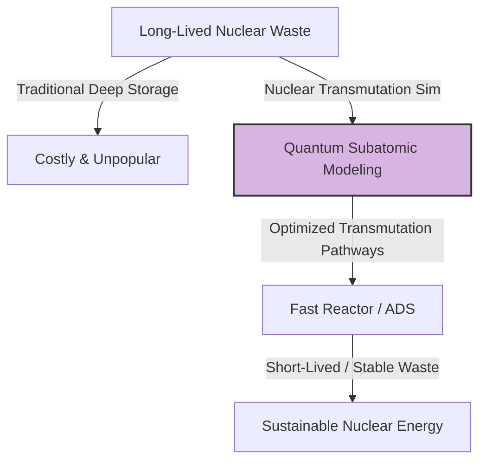
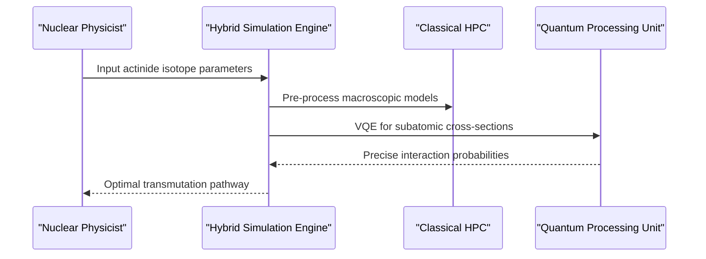

<!-- markdownlint-disable MD009 MD010 MD013 MD022 MD028 MD032 MD033 MD034 MD036 MD037 MD039 MD041 MD058 MD060 -->

[ 🇫🇷 Version Française ](./README.fr.md)

# Nuclear Transmutation Sim

> **Executive Summary:** A hybrid quantum-classical simulation engine that models subatomic nuclear interactions to accelerate the safe transmutation of long-lived nuclear waste into stable elements.

---

## 1. Visual Overview & Wow Effect

## 2. Contrarian Thesis (Peter Thiel Style)

**Popular Belief:** The only solution for highly radioactive nuclear waste is burying it deep underground for hundreds of thousands of years while waiting for political consensus.
**Hidden Truth:** We can actually neutralize this waste by transmuting it in fast reactors, but the bottleneck is the sheer computational impossibility of simulating complex multi-particle nuclear physics on classical supercomputers—a barrier quantum computing is uniquely positioned to break.

## 3. Problem & Target Market

**Business Model:** B2B
**Target Audience:** National radioactive waste management agencies, nuclear fleet operators, and national deep-tech laboratories.
**Urgent Pain Point:** Long-lived nuclear waste requires geological storage that is immensely expensive and politically toxic. Real-world transmutation experiments are too costly, slow, and dangerous to conduct without precise prior simulation.

## 4. Technical Architecture & Infrastructure

## 5. Business Model & Financial Viability

| Metric                     | Value                                          |
| :------------------------- | :--------------------------------------------- |
| **Pricing Structure**      | High-value SaaS license & Compute-as-a-Service |
| **12-Month Target**        | 1 - 2 national lab pilot contracts             |
| **Revenue Formula**        | 1 contract \* €100k = €100k ARR                |
| **Estimated Gross Margin** | 70% (Significant QPU compute costs)            |

## 6. Distribution Engine & Moat

**Acquisition Strategy:** Direct B2B/B2G sales via strategic partnerships with national energy agencies and quantum hardware providers.
**Moat (Defensibility):** Requires exceedingly rare hybrid talent (nuclear physics + quantum computing). Standard SaaS lacks the IP, the algorithms, and the architecture to exploit QPUs for subatomic nuclear physics.

## 7. Detailed Evaluation Grid

| Criterion                       | VC Score (/100) | Market Score (/100) |
| :------------------------------ | :-------------- | :------------------ |
| **Thesis & Monopoly / Urgency** | -- / 25         | -- / 25             |
| **Moat / LLM Immunity**         | -- / 25         | -- / 25             |
| **Scalability / UX Friction**   | -- / 25         | -- / 25             |
| **Unit Economics / ROI**        | -- / 25         | -- / 25             |
| **TOTAL**                       | **-- / 100**    | **-- / 100**        |

> **VC Verdict:** Pending evaluation.

> **Market Verdict:** Pending evaluation.
