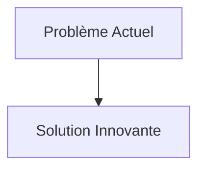
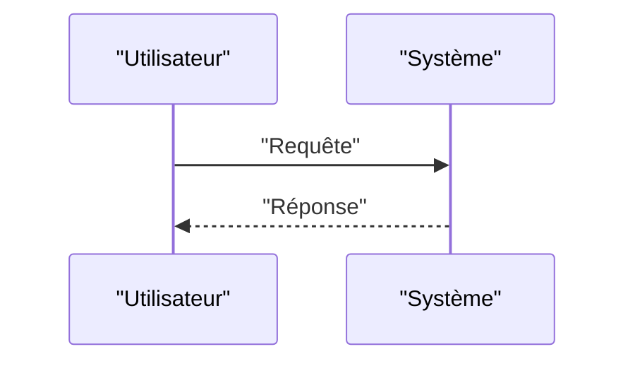

<!-- markdownlint-disable MD009 MD010 MD013 MD022 MD028 MD032 MD033 MD034 MD036 MD037 MD039 MD041 MD058 MD060 -->

[ 🇬🇧 English Version ](./README.md)

# Nuclear Waste Transmutation Simulator

> **Résumé exécutif :** Création d'un jumeau numérique / World Model de cinétique neutronique et de thermohydraulique spécifiquement dédié aux processus de transmutation. Le modèle utilise la physique neuronale (Neural Physics Engines) pour simuler les interactions à l'échelle atomique des neutrons rapides avec les actinides mineurs, prédisant les rendements de transmutation et le comportement corrosif des matériaux.

---

## 1. Aperçu visuel & Effet Wahou

## 2. La thèse contrariante (Peter Thiel Style)

- **La croyance populaire :** Les solutions existantes sont suffisantes.
- **La vérité cachée :** En réalité, Les outils actuels de simulation neutronique (comme MCNP) sont basés sur des méthodes de Monte-Carlo très lentes, empêchant l'optimisation itérative rapide des designs de réacteurs. Un LLM standard est inutile en physique nucléaire; le besoin est un solveur d'équations différentielles partielles (PDE) ultra-rapide entraîné sur des données de section efficace nucléaire.

## 3. Le problème & La cible

- **Modèle économique :** B2B / B2G
- **Cible précise :** Agences nationales de gestion des déchets radioactifs, exploitants de centrales nucléaires (EDF, Westinghouse), startups de réacteurs de 4ème génération / SMR (Small Modular Reactors).
- **La douleur urgente :** Le traitement et le stockage géologique profond des déchets nucléaires à vie longue coûtent des milliards et posent des problèmes d'acceptation sociale. La transmutation (convertir les isotopes à vie longue en isotopes à vie courte ou stables) est une solution, mais concevoir les réacteurs à sels fondus ou les systèmes pilotés par accélérateurs (ADS) requis prend des décennies d'expérimentations réelles dangereuses et hors de prix.

## 4. Architecture technique & Plomberie

## 5. Modèle économique & Viabilité financière

| Métrique                        | Valeur                   |
| :------------------------------ | :----------------------- |
| **Structure de prix**           | Abonnement B2B           |
| **Objectif 12 mois**            | 100 clients à 1000€/mois |
| **Calcul du CA (Target 100k€)** | 100 \* 1000 = 100k€      |
| **Marge brute estimée**         | 80%                      |

## 6. Moteur de distribution & Fossé défensif (Moat)

- **Stratégie d'acquisition :** Ventes directes
- **Moat (Barrière à l'entrée) :** Création d'un jumeau numérique / World Model de cinétique neutronique et de thermohydraulique spécifiquement dédié aux processus de transmutation. Le modèle utilise la physique neuronale (Neural Physics Engines) pour simuler les interactions à l'échelle atomique des neutrons rapides avec les actinides mineurs, prédisant les rendements de transmutation et le comportement corrosif des matériaux. (Difficile à copier à cause de : Besoin massif de puissance de calcul pour l'entraînement initial, accès aux données nucléaires hautement classifiées/restreintes, validation réglementaire des codes de simulation par les autorités de sûreté nucléaire.)

## 7. Grille d'évaluation détaillée

| Critère                               | Score VC (/100) | Score Terrain (/100) |
| :------------------------------------ | :-------------: | :------------------: |
| **Thèse & Monopole / Urgence**        |     -- / 25     |       -- / 25        |
| **Moat / Résistance aux LLM natifs**  |     -- / 25     |       -- / 25        |
| **Scalabilité / Friction d'adoption** |     -- / 25     |       -- / 25        |
| **Unit Economics / ROI direct**       |     -- / 25     |       -- / 25        |
| **TOTAL**                             |  **-- / 100**   |     **-- / 100**     |

> **Verdict VC :** En attente d'évaluation.
> **Verdict Terrain :** En attente d'évaluation.
