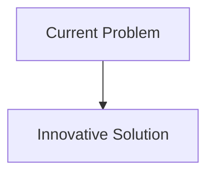
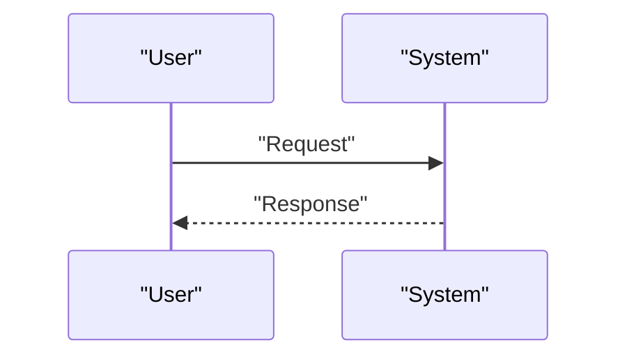

<!-- markdownlint-disable MD009 MD010 MD013 MD022 MD028 MD032 MD033 MD034 MD036 MD037 MD039 MD041 MD058 MD060 -->

[ 🇫🇷 Version Française ](./README.fr.md)

# Nuclear Waste Transmutation Simulator

> **Executive Summary:** Creation of a digital twin / World Model of neutron kinetics and thermohydraulics specifically dedicated to transmutation processes. The model uses Neural Physics Engines to simulate atomic-scale interactions of fast neutrons with minor actinides, predicting transmutation efficiencies and corrosive behavior of materials.

---

## 1. Visual Overview & Wow Effect

## 2. Contrarian Thesis (Peter Thiel Style)

- **Popular Belief:** Existing solutions are sufficient.
- **Hidden Truth:** In reality, current neutron simulation tools (like MCNP) are based on very slow Monte Carlo methods, preventing rapid iterative optimization of reactor designs. A standard LLM is useless in nuclear physics;The requirement is an ultra-fast partial differential equation (PDE) solver trained on nuclear cross section data.

## 3. Problem & Target Market

- **Business Model:** B2B / B2G
- **Target Audience:** National radioactive waste management agencies, nuclear power plant operators (EDF, Westinghouse), 4th generation reactor / SMR (Small Modular Reactors) startups.
- **Urgent Pain Point:** The processing and deep geological storage of long-lived nuclear waste costs billions and poses problems of social acceptance. Transmutation (converting long-lived isotopes to short-lived or stable isotopes) is one solution, but designing the required molten salt reactors or accelerator-driven systems (ADS) takes decades of dangerous and expensive real-world experimentation.

## 4. Technical Architecture & Infrastructure

## 5. Business Model & Financial Viability

| Metric                     | Value                        |
| :------------------------- | :--------------------------- |
| **Pricing Structure**      | B2B Subscription             |
| **12-Month Target**        | 100 customers at 1000€/month |
| **Revenue Formula**        | 100 \* 1000 = 100k€          |
| **Estimated Gross Margin** | 80%                          |

## 6. Distribution Engine & Moat

- **Acquisition Strategy:** Direct Sales
- **Moat (Defensibility):** Creation of a digital twin / World Model of neutron kinetics and thermohydraulics specifically dedicated to transmutation processes. The model uses Neural Physics Engines to simulate atomic-scale interactions of fast neutrons with minor actinides, predicting transmutation efficiencies and corrosive behavior of materials.(Difficult to copy due to: Massive need for computing power for initial training, access to highly classified/restricted nuclear data, regulatory validation of simulation codes by nuclear safety authorities.)

## 7. Detailed Evaluation Grid

| Criterion                       | VC Score (/100) | Market Score (/100) |
| :------------------------------ | :-------------: | :-----------------: |
| **Thesis & Monopoly / Urgency** |     -- / 25     |       -- / 25       |
| **Moat / LLM Immunity**         |     -- / 25     |       -- / 25       |
| **Scalability / UX Friction**   |     -- / 25     |       -- / 25       |
| **Unit Economics / ROI**        |     -- / 25     |       -- / 25       |
| **TOTAL**                       |  **-- / 100**   |    **-- / 100**     |

> **VC Verdict:** Pending evaluation.
> **Market Verdict:** Pending evaluation.
