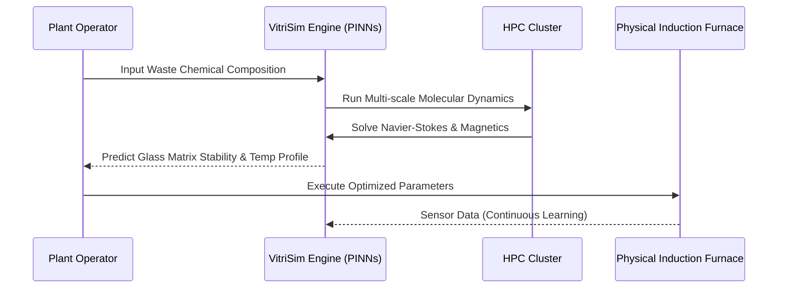

<!-- markdownlint-disable MD009 MD010 MD013 MD022 MD028 MD032 MD033 MD034 MD036 MD037 MD039 MD041 MD058 MD060 -->

[ 🇫🇷 Version Française ](./README.fr.md)

# VitriSim

> **Executive Summary:** A physics-informed Neural Digital Twin that simulates the magneto-hydrodynamics of high-level nuclear waste vitrification, preventing multi-million dollar failures in induction furnaces.


---

## 1. Visual Overview & Wow Effect

```mermaid
graph TD
    %% Problem vs Solution or Architecture Diagram
    subgraph Traditional_Vitrification ["Traditional Vitrification"]
        A[High-Level Nuclear Waste] --> B[Induction Furnace (Trial & Error)]
        B --> C[Unpredicted Crystallization]
        C --> D[Multi-million € Furnace Failure & Delays]
    end
    subgraph VitriSim ["VitriSim Digital Twin"]
        E[High-Level Nuclear Waste] --> F[Physics-Informed Neural Network (PINN)]
        F --> G[Real-time Thermodynamics Simulation]
        G --> H[Optimized Glass Matrix Formulation]
        H --> I[Safe, Efficient & Predictable Vitrification]
    end
```

## 2. Contrarian Thesis (Peter Thiel Style)

**Popular Belief:** The hardest part of nuclear waste management is finding deep geological repositories to bury it.

**Hidden Truth:** The true bottleneck is safely turning highly radioactive liquid waste into stable glass (vitrification) before burying it. Because you cannot safely "trial and error" with highly radioactive materials, only a highly specialized, physics-informed AI simulating the complex thermodynamics of molten glass can unlock faster, safer, and cheaper nuclear decommissioning.

## 3. Problem & Target Market

**Business Model:** B2B / B2G

**Target Audience:** National radioactive waste management agencies, nuclear power plant operators (EDF, Tepco), and specialized decommissioning subcontractors.

**Urgent Pain Point:** The process of vitrifying high-level nuclear waste is extremely complex, expensive, and slow. Errors in chemical formulation or temperature control in induction furnaces lead to parasitic crystallization. A single failed batch costs tens of millions of euros and drastically delays site securing. Physical testing at scale without generating more waste is practically impossible, making iterative optimization a nightmare.

## 4. Technical Architecture & Infrastructure



## 5. Business Model & Financial Viability

| Metric                 | Value                                                                     |
| :--------------------- | :------------------------------------------------------------------------ |
| Pricing Structure      | High-value Annual Software License + Simulation Compute Compute           |
| 12-Month Target        | 1-2 pilot projects with national nuclear agencies or major operators      |
| Revenue Formula        | 1 Pilot R&D contract \* €100k = €100k ARR                                 |
| Estimated Gross Margin | 70% (Accounting for significant HPC compute costs for training/inference) |

## 6. Distribution Engine & Moat

**Acquisition Strategy:** Direct enterprise/government sales. Partner with massive nuclear decommissioning conglomerates (e.g., Orano, Westinghouse) as an optimization plugin for their existing multi-billion dollar contracts.

**Moat (Defensibility):** Standard LLMs or spreadsheets cannot solve partial differential equations (Navier-Stokes) coupled with high-temperature magnetic and chemical effects. The moat consists of the specialized Physics-Informed Neural Networks (PINNs) and the exclusive access to highly classified, proprietary historical vitrification data required to train them.

## 7. Detailed Evaluation Grid

| Criterion                   | VC Score (/100) | Market Score (/100) |
| :-------------------------- | :-------------- | :------------------ |
| Thesis & Monopoly / Urgency | -- / 25         | -- / 25             |
| Moat / LLM Immunity         | -- / 25         | -- / 25             |
| Scalability / UX Friction   | -- / 25         | -- / 25             |
| Unit Economics / ROI        | -- / 25         | -- / 25             |
| **TOTAL**                   | **-- / 100**    | **-- / 100**        |

> **VC Verdict:** Pending evaluation.
> **Market Verdict:** Pending evaluation.
