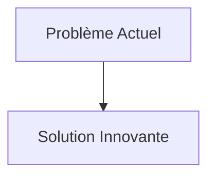
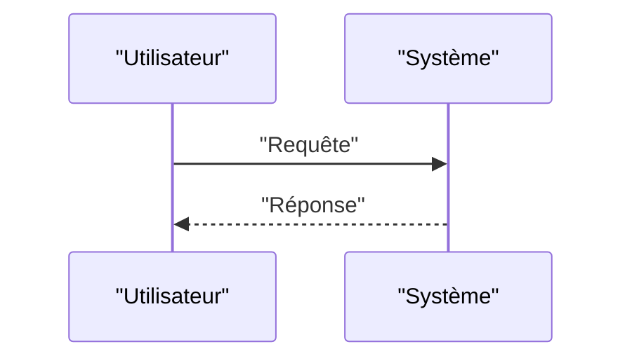

<!-- markdownlint-disable MD009 MD010 MD013 MD022 MD028 MD032 MD033 MD034 MD036 MD037 MD039 MD041 MD058 MD060 -->

[ 🇬🇧 English Version ](./README.md)

# Ocean Thermohaline Circulation Monitor

> **Résumé exécutif :** Déploiement d'une constellation de planeurs sous-marins autonomes bio-inspirés fonctionnant à l'énergie de la stratification thermique (zéro batterie requise), connectés à un jumeau numérique océanique. Le système modélise en temps réel la salinité, la température et les courants profonds (World Model dynamique des fluides géophysiques) pour auditer la santé de l'AMOC.

---

## 1. Aperçu visuel & Effet Wahou

## 2. La thèse contrariante (Peter Thiel Style)

- **La croyance populaire :** Les solutions existantes sont suffisantes.
- **La vérité cachée :** En réalité, Il y a un vide massif de données sous-marines (data void). Les modèles climatiques actuels (SaaS, LLMs) hallucinent car ils manquent de données in situ. Il faut une infrastructure de capteurs physiques endurante capable d'opérer dans des environnements marins hostiles à l'échelle planétaire.

## 3. Le problème & La cible

- **Modèle économique :** B2G / B2B
- **Cible précise :** Systèmes mondiaux d'alerte climatique, gouvernements des pays nordiques/atlantiques, industrie du transport maritime, assurance réassurance.
- **La douleur urgente :** La circulation méridienne de retournement de l'Atlantique (AMOC), qui régule le climat européen et mondial, donne des signes d'effondrement potentiel. Sa mesure actuelle dépend de quelques réseaux de bouées coûteux (comme RAPID) qui sont épars et offrent des données retardées. Prédire le point de bascule de l'AMOC est impossible avec le manque actuel de données sous-marines granulaires.

## 4. Architecture technique & Plomberie

## 5. Modèle économique & Viabilité financière

| Métrique                        | Valeur                   |
| :------------------------------ | :----------------------- |
| **Structure de prix**           | Abonnement B2B           |
| **Objectif 12 mois**            | 100 clients à 1000€/mois |
| **Calcul du CA (Target 100k€)** | 100 \* 1000 = 100k€      |
| **Marge brute estimée**         | 80%                      |

## 6. Moteur de distribution & Fossé défensif (Moat)

- **Stratégie d'acquisition :** Ventes directes
- **Moat (Barrière à l'entrée) :** Déploiement d'une constellation de planeurs sous-marins autonomes bio-inspirés fonctionnant à l'énergie de la stratification thermique (zéro batterie requise), connectés à un jumeau numérique océanique. Le système modélise en temps réel la salinité, la température et les courants profonds (World Model dynamique des fluides géophysiques) pour auditer la santé de l'AMOC. (Difficile à copier à cause de : Biofouling destructeur pour les capteurs sur le long terme, latence de la communication acoustique sous-marine, besoin de validation scientifique par le GIEC, modèle de financement lourd en CAPEX basé sur de la subvention publique initiale.)

## 7. Grille d'évaluation détaillée

| Critère                               | Score VC (/100) | Score Terrain (/100) |
| :------------------------------------ | :-------------: | :------------------: |
| **Thèse & Monopole / Urgence**        |     -- / 25     |       -- / 25        |
| **Moat / Résistance aux LLM natifs**  |     -- / 25     |       -- / 25        |
| **Scalabilité / Friction d'adoption** |     -- / 25     |       -- / 25        |
| **Unit Economics / ROI direct**       |     -- / 25     |       -- / 25        |
| **TOTAL**                             |  **-- / 100**   |     **-- / 100**     |

> **Verdict VC :** En attente d'évaluation.
> **Verdict Terrain :** En attente d'évaluation.
