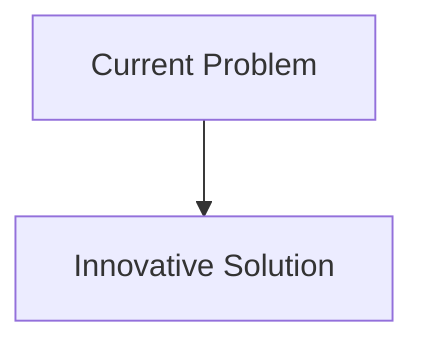
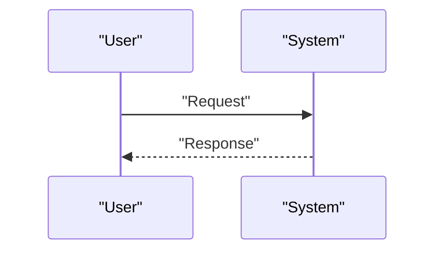

<!-- markdownlint-disable MD009 MD010 MD013 MD022 MD028 MD032 MD033 MD034 MD036 MD037 MD039 MD041 MD058 MD060 -->

[ 🇫🇷 Version Française ](./README.fr.md)

# Ocean Thermohaline Circulation Monitor

> **Executive Summary:** Deployment of a constellation of bio-inspired autonomous underwater gliders powered by thermal stratification energy (zero batteries required), connected to an oceanic digital twin. The system models salinity, temperature and deep currents (World Model geophysical fluid dynamics) in real time to audit the health of the AMOC.

---

## 1. Visual Overview & Wow Effect

## 2. Contrarian Thesis (Peter Thiel Style)

- **Popular Belief:** Existing solutions are sufficient.
- **Hidden Truth:** In reality, there is a massive underwater data void. Current climate models (SaaS, LLMs) are hallucinatory because they lack in situ data. A resilient physical sensor infrastructure capable of operating in hostile marine environments on a global scale is required.

## 3. Problem & Target Market

- **Business Model:** B2G / B2B
- **Target Audience:** Global climate warning systems, Nordic/Atlantic governments, shipping industry, insurance reinsurance.
- **Urgent Pain Point:** The Atlantic Meridional Overturning Circulation (AMOC), which regulates European and global climate, is showing signs of potential collapse. Its current measurement depends on a few expensive buoy networks (like RAPID) that are sparse and offer delayed data. Predicting the AMOC tipping point is impossible with the current lack of granular underwater data.

## 4. Technical Architecture & Infrastructure

## 5. Business Model & Financial Viability

| Metric                     | Value                        |
| :------------------------- | :--------------------------- |
| **Pricing Structure**      | B2B Subscription             |
| **12-Month Target**        | 100 customers at 1000€/month |
| **Revenue Formula**        | 100 \* 1000 = 100k€          |
| **Estimated Gross Margin** | 80%                          |

## 6. Distribution Engine & Moat

- **Acquisition Strategy:** Direct Sales
- **Moat (Defensibility):** Deployment of a constellation of bio-inspired autonomous underwater gliders powered by thermal stratification energy (zero batteries required), connected to an oceanic digital twin. The system models salinity, temperature and deep currents (World Model geophysical fluid dynamics) in real time to audit the health of the AMOC.(Difficult to copy because of: Destructive biofouling for sensors in the long term, latency of underwater acoustic communication, need for scientific validation by the IPCC, CAPEX-heavy financing model based on initial public subsidy.)

## 7. Detailed Evaluation Grid

| Criterion                       | VC Score (/100) | Market Score (/100) |
| :------------------------------ | :-------------: | :-----------------: |
| **Thesis & Monopoly / Urgency** |     -- / 25     |       -- / 25       |
| **Moat / LLM Immunity**         |     -- / 25     |       -- / 25       |
| **Scalability / UX Friction**   |     -- / 25     |       -- / 25       |
| **Unit Economics / ROI**        |     -- / 25     |       -- / 25       |
| **TOTAL**                       |  **-- / 100**   |    **-- / 100**     |

> **VC Verdict:** Pending evaluation.
> **Market Verdict:** Pending evaluation.
