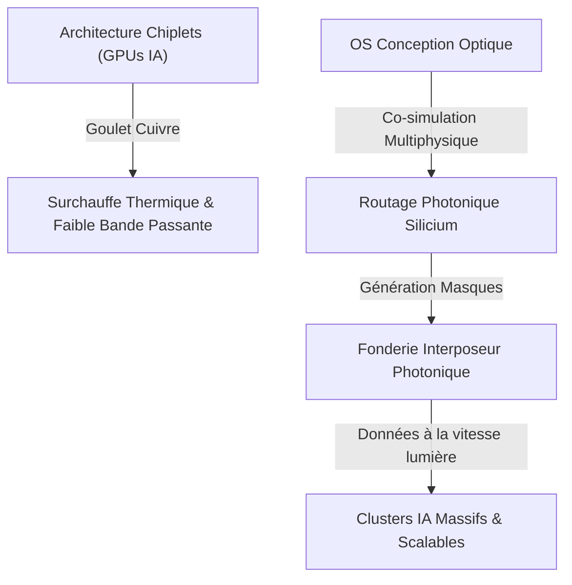
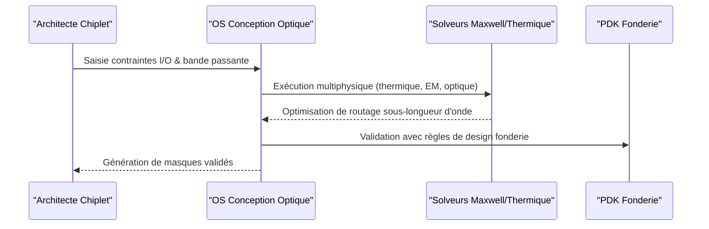

<!-- markdownlint-disable MD009 MD010 MD013 MD022 MD028 MD032 MD033 MD034 MD036 MD037 MD039 MD041 MD060 -->

[ 🇬🇧 English Version ](./README.md)

# Optical Interposer Design OS

> **Résumé exécutif :** Un OS de conception (EDA) dédié au routage et à la co-simulation d'interposeurs photoniques sur silicium pour résoudre le goulet d'étranglement des données dans les clusters d'entraînement LLM.

---

## 1. Aperçu visuel & Effet Wahou

## 2. La thèse contrariante (Peter Thiel Style)

- **La croyance populaire :** L'avenir de la mise à l'échelle du matériel IA repose uniquement sur la miniaturisation des transistors (Loi de Moore) et l'ajout de mémoire à haute bande passante (HBM).
- **La vérité cachée :** Le calcul n'est plus le problème ; c're le déplacement des données entre les chiplets. Les limites physiques des interconnexions en cuivre (densité thermique et bande passante) impliquent que sans un passage total à la photonique silicium au niveau de l'interposeur, les clusters d'entraînement LLM vont littéralement fondre ou manquer de données.

## 3. Le problème & La cible

- **Modèle économique :** B2B
- **Cible précise :** Concepteurs de puces (AMD, NVIDIA, startups d'accélérateurs IA), opérateurs de datacenters hyperscale, fonderies (TSMC, Intel).
- **La douleur urgente :** Le goulet d'étranglement de la bande passante et la surconsommation thermique des interconnexions en cuivre entre les chiplets limitent physiquement la mise à l'échelle des clusters d'entraînement LLM massifs. Les puces chauffent trop et les données ne circulent plus assez vite.

## 4. Architecture technique & Plomberie

## 5. Modèle économique & Viabilité financière

| Métrique                        | Valeur                                                  |
| ------------------------------- | ------------------------------------------------------- |
| **Structure de prix**           | Licence Entreprise EDA Haut de Gamme (Par poste / Cœur) |
| **Objectif 12 mois**            | 2 à 3 startups de puces IA "early adopters"             |
| **Calcul du CA (Target 100k€)** | 3 licences \* 35k€/an                                   |
| **Marge brute estimée**         | ~90%                                                    |

## 6. Moteur de distribution & Fossé défensif (Moat)

- **Stratégie d'acquisition :** Ventes techniques directes B2B et formation d'alliances stratégiques avec les grandes fonderies pour s'intégrer à leurs PDKs photoniques émergents.
- **Moat (Barrière à l'entrée) :** La conception photonique nécessite des solveurs physiques extrêmement lourds, la manipulation de structures géométriques sub-longueur d'onde et une intégration profonde avec les PDKs propriétaires des fonderies. Un LLM ou un SaaS web ne peut résoudre les équations de Maxwell.

## 7. Grille d'évaluation détaillée

| Critère                           | Score VC (/100) | Score Terrain (/100) |
| --------------------------------- | --------------- | -------------------- |
| Thèse & Monopole / Urgence        | 24 / 25         | -- / 25              |
| Moat / Résistance aux LLM natifs  | 25 / 25         | -- / 25              |
| Scalabilité / Friction d'adoption | 24 / 25         | -- / 25              |
| Unit Economics / ROI direct       | 23 / 25         | -- / 25              |
| **TOTAL**                         | **96 / 100**    | **-- / 100**         |

> **Verdict VC :** La photonique est l'avenir inévitable des interconnexions de puces. L'OS qui dicte la conception de l'interposeur optique dominera le prochain paradigme informatique. Un moat technique insurmontable soutenu par une intégration profonde dans la fabrication de semi-conducteurs.

> **Verdict Terrain :** Forte urgence et valeur évidente pour la cible. La résistance aux LLM est élevée grâce à une intégration matérielle ou physique forte. Malgré quelques frictions d'adoption, la monétisation B2B est très claire.
