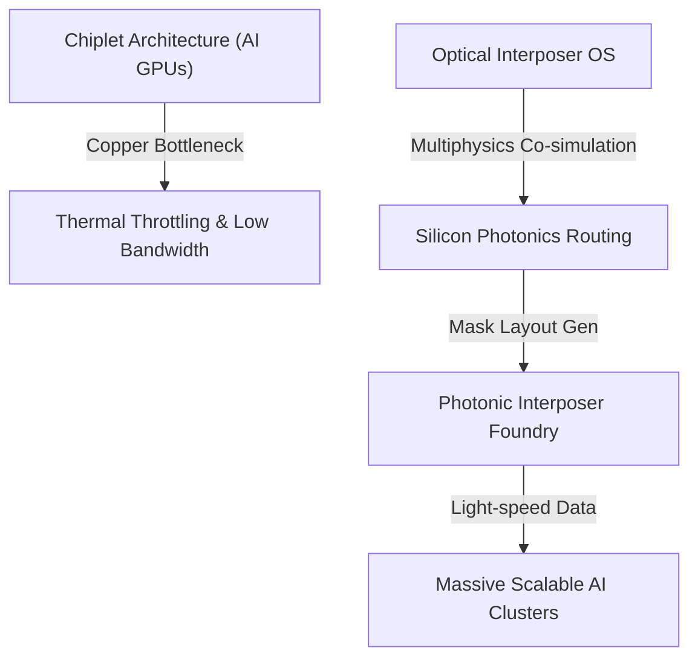
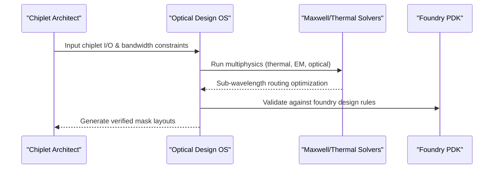

<!-- markdownlint-disable MD009 MD010 MD013 MD022 MD028 MD032 MD033 MD034 MD036 MD037 MD039 MD041 MD060 -->

[ 🇫🇷 Version Française ](./README.fr.md)

# Optical Interposer Design OS

> **Executive Summary:** An Electronic Design Automation (EDA) operating system specifically built for routing and co-simulating silicon photonics interposers to solve the data bandwidth bottleneck in massive LLM training clusters.

---

## 1. Visual Overview & Wow Effect

## 2. Contrarian Thesis (Peter Thiel Style)

- **Popular Belief:** The future of scaling AI hardware relies solely on shrinking transistor sizes (Moore's Law) and adding more high-bandwidth memory (HBM).
- **Hidden Truth:** Compute is no longer the bottleneck; moving data between chiplets is. The physical limits of copper wiring (heat and bandwidth density) mean that without shifting entirely to silicon photonics at the interposer level, massive multi-GPU LLM training clusters will literally melt or starve for data.

## 3. Problem & Target Market

- **Business Model:** B2B
- **Target Audience:** Chip designers (AMD, NVIDIA, AI accelerator startups), hyperscale datacenter operators, and foundries (TSMC, Intel).
- **Urgent Pain Point:** The bandwidth bottleneck and severe thermal overhead of copper interconnects between chiplets are physically limiting the scaling of massive AI models. Chips overheat, and data cannot circulate fast enough.

## 4. Technical Architecture & Infrastructure

## 5. Business Model & Financial Viability

| Metric                     | Value                                                |
| -------------------------- | ---------------------------------------------------- |
| **Pricing Structure**      | High-ticket Enterprise EDA License (Per Seat / Core) |
| **12-Month Target**        | 2-3 early-adopter AI chip startups                   |
| **Revenue Formula**        | 3 licenses \* 35k€/year                              |
| **Estimated Gross Margin** | ~90%                                                 |

## 6. Distribution Engine & Moat

- **Acquisition Strategy:** Direct enterprise technical sales and forming strategic alliances with major foundries to integrate with their emerging photonics PDKs.
- **Moat (Defensibility):** Photonics design requires extremely heavy physical solvers, manipulation of sub-wavelength geometric structures, and deep integration with proprietary foundry Process Design Kits. A web SaaS or LLM cannot solve Maxwell's equations for physical chip layout.

## 7. Detailed Evaluation Grid

| Criterion                   | VC Score (/100) | Market Score (/100) |
| --------------------------- | --------------- | ------------------- |
| Thesis & Monopoly / Urgency | 24 / 25         | -- / 25             |
| Moat / LLM Immunity         | 25 / 25         | -- / 25             |
| Scalability / UX Friction   | 24 / 25         | -- / 25             |
| Unit Economics / ROI        | 23 / 25         | -- / 25             |
| **TOTAL**                   | **96 / 100**    | **-- / 100**        |

> **VC Verdict:** Photonics is the inevitable future of chip interconnects. The OS that dictates optical interposer design will dominate the next computing paradigm. An insurmountable technical moat supported by deep integration into semiconductor fabrication.

> **Market Verdict:** Strong urgency and obvious value for the target market. LLM resistance is high due to strong hardware or physical integration. Despite some adoption friction, B2B monetization is very clear.
