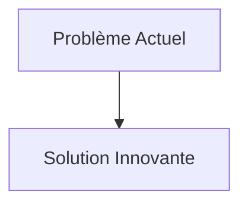
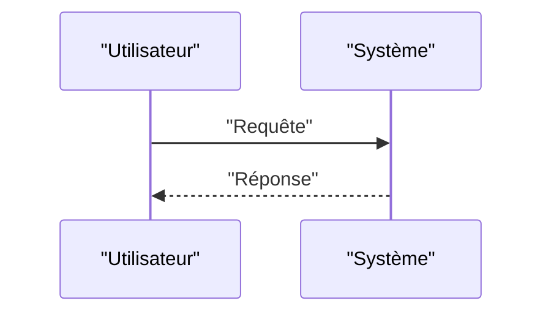

<!-- markdownlint-disable MD009 MD010 MD013 MD022 MD028 MD032 MD033 MD034 MD036 MD037 MD039 MD041 MD058 MD060 -->

[ 🇬🇧 English Version ](./README.md)

# OT Firmware PUF Verifier

> **Résumé exécutif :** Utilisation des Physical Unfocusable Functions (PUF) inhérentes au silicium de chaque composant pour générer une empreinte digitale matérielle unique, non clonable. Un protocole de "Zero-Trust bas niveau" interroge ces PUF à chaque mise à jour de firmware ou cycle d'opération, croisant la signature matérielle avec le hash cryptographique du firmware, garantissant qu'il tourne sur la puce légitime, non falsifiée.

---

## 1. Aperçu visuel & Effet Wahou

## 2. La thèse contrariante (Peter Thiel Style)

- **La croyance populaire :** Les solutions existantes sont suffisantes.
- **La vérité cachée :** En réalité, Un scanner de vulnérabilités réseau ou un EDR (Endpoint Detection and Response) ne peut pas fonctionner sur un microcontrôleur d'automate avec quelques kilo-octets de RAM. La vérification doit lier la cryptographie à la physique de la puce elle-même, ce qu'aucun SaaS de gestion des logs ne peut faire.

## 3. Le problème & La cible

- **Modèle économique :** B2B
- **Cible précise :** Opérateurs d'infrastructures critiques (réseaux électriques, traitement de l'eau, pipelines), fabricants d'équipements industriels (OEM), industries de la défense.
- **La douleur urgente :** Les attaques sur les environnements OT (Operational Technology) et ICS ciblent de plus en plus bas dans la pile, modifiant le firmware des capteurs et automates (PLC) de manière furtive. Les solutions de cybersécurité informatique classiques ne peuvent pas vérifier l'intégrité matérielle de ces appareils sans provoquer d'arrêts de production inacceptables. L'incertitude quant à l'altération physique ou logicielle d'un capteur critique est une vulnérabilité fatale.

## 4. Architecture technique & Plomberie

## 5. Modèle économique & Viabilité financière

| Métrique                        | Valeur                   |
| :------------------------------ | :----------------------- |
| **Structure de prix**           | Abonnement B2B           |
| **Objectif 12 mois**            | 100 clients à 1000€/mois |
| **Calcul du CA (Target 100k€)** | 100 \* 1000 = 100k€      |
| **Marge brute estimée**         | 80%                      |

## 6. Moteur de distribution & Fossé défensif (Moat)

- **Stratégie d'acquisition :** Ventes directes
- **Moat (Barrière à l'entrée) :** Utilisation des Physical Unfocusable Functions (PUF) inhérentes au silicium de chaque composant pour générer une empreinte digitale matérielle unique, non clonable. Un protocole de "Zero-Trust bas niveau" interroge ces PUF à chaque mise à jour de firmware ou cycle d'opération, croisant la signature matérielle avec le hash cryptographique du firmware, garantissant qu'il tourne sur la puce légitime, non falsifiée. (Difficile à copier à cause de : Nécessité d'intégration au niveau du design matériel (fabricants d'équipements devant inclure le support PUF), gestion du cycle de vie des clés cryptographiques en milieu industriel isolé (air-gapped), dérive physique potentielle des PUF sur des décennies.)

## 7. Grille d'évaluation détaillée

| Critère                               | Score VC (/100) | Score Terrain (/100) |
| :------------------------------------ | :-------------: | :------------------: |
| **Thèse & Monopole / Urgence**        |     -- / 25     |       -- / 25        |
| **Moat / Résistance aux LLM natifs**  |     -- / 25     |       -- / 25        |
| **Scalabilité / Friction d'adoption** |     -- / 25     |       -- / 25        |
| **Unit Economics / ROI direct**       |     -- / 25     |       -- / 25        |
| **TOTAL**                             |  **-- / 100**   |     **-- / 100**     |

> **Verdict VC :** En attente d'évaluation.
> **Verdict Terrain :** En attente d'évaluation.
