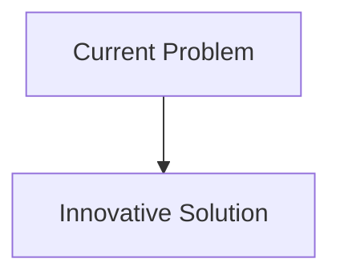
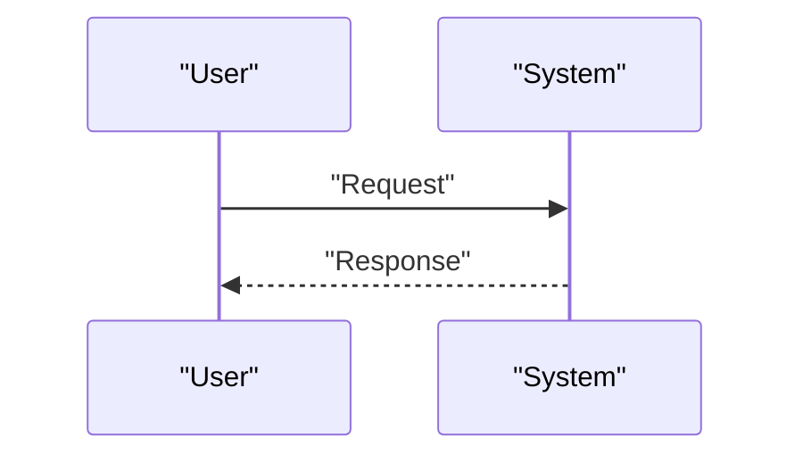

<!-- markdownlint-disable MD009 MD010 MD013 MD022 MD028 MD032 MD033 MD034 MD036 MD037 MD039 MD041 MD058 MD060 -->

[ 🇫🇷 Version Française ](./README.fr.md)

# OT Firmware PUF Verifier

> **Executive Summary:** Use of Physical Unfocusable Functions (PUFs) inherent in the silicon of each component to generate a unique, non-clonable hardware fingerprint. A "low-level Zero-Trust" protocol interrogates these PUFs at each firmware update or operating cycle, cross-referencing the hardware signature with the cryptographic hash of the firmware, ensuring that it is running on the legitimate, untampered chip.

---

## 1. Visual Overview & Wow Effect

## 2. Contrarian Thesis (Peter Thiel Style)

- **Popular Belief:** Existing solutions are sufficient.
- **Hidden Truth:** In reality, A network vulnerability scanner or an EDR (Endpoint Detection and Response) cannot run on a PLC microcontroller with a few kilobytes of RAM. Verification must tie cryptography to the physics of the chip itself, something no log management SaaS can do.

## 3. Problem & Target Market

- **Business Model:** B2B
- **Target Audience:** Critical infrastructure operators (power grids, water treatment, pipelines), industrial equipment manufacturers (OEM), defense industries.
- **Urgent Pain Point:** Attacks on OT (Operational Technology) and ICS environments target increasingly lower in the stack, modifying the firmware of sensors and PLCs in a stealthy manner. Traditional IT cybersecurity solutions cannot verify the hardware integrity of these devices without causing unacceptable production downtime. Uncertainty about whether a critical sensor has been physically or software tampered with is a fatal vulnerability.

## 4. Technical Architecture & Infrastructure

## 5. Business Model & Financial Viability

| Metric                     | Value                        |
| :------------------------- | :--------------------------- |
| **Pricing Structure**      | B2B Subscription             |
| **12-Month Target**        | 100 customers at 1000€/month |
| **Revenue Formula**        | 100 \* 1000 = 100k€          |
| **Estimated Gross Margin** | 80%                          |

## 6. Distribution Engine & Moat

- **Acquisition Strategy:** Direct Sales
- **Moat (Defensibility):** Use of Physical Unfocusable Functions (PUFs) inherent in the silicon of each component to generate a unique, non-clonable hardware fingerprint. A "low-level Zero-Trust" protocol interrogates these PUFs at each firmware update or operating cycle, cross-referencing the hardware signature with the cryptographic hash of the firmware, ensuring that it is running on the legitimate, untampered chip.(Difficult to copy due to: Need for integration at the hardware design level (equipment manufacturers to include PUF support), lifecycle management of cryptographic keys in an isolated industrial environment (air-gapped), potential physical drift of PUFs over decades.)

## 7. Detailed Evaluation Grid

| Criterion                       | VC Score (/100) | Market Score (/100) |
| :------------------------------ | :-------------: | :-----------------: |
| **Thesis & Monopoly / Urgency** |     -- / 25     |       -- / 25       |
| **Moat / LLM Immunity**         |     -- / 25     |       -- / 25       |
| **Scalability / UX Friction**   |     -- / 25     |       -- / 25       |
| **Unit Economics / ROI**        |     -- / 25     |       -- / 25       |
| **TOTAL**                       |  **-- / 100**   |    **-- / 100**     |

> **VC Verdict:** Pending evaluation.
> **Market Verdict:** Pending evaluation.
