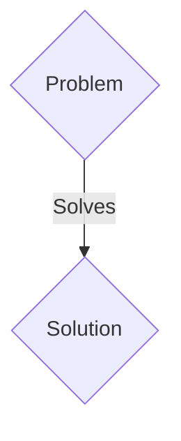
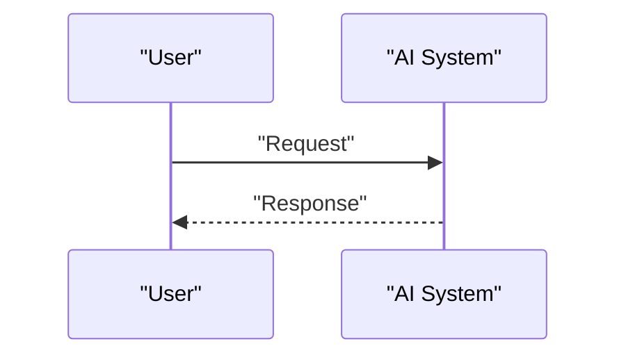

<!-- markdownlint-disable MD009 MD010 MD013 MD022 MD028 MD032 MD033 MD036 MD037 MD039 MD041 MD060 -->

[ 🇫🇷 Version Française ](./README.fr.md)

# Trust OT Firmware

> **Executive Summary:** A B2B solution targeting Critical infrastructures (power plants, water treatment plants, pipelines), automation manufacturers (PLCs). to solve: Industrial PLCs (OT/ICS) often run 10-year-old firmware without a cryptographic authentication mechanism. A compromised update (Supply Chain Attack) or physical access allows you to take control of critical physical infrastructures (e.g. Stuxnet).

---

## 1. Visual Overview & Wow Effect

## 2. Contrarian Thesis (Peter Thiel Style)

- **Popular Belief:** Generic solutions are enough.
- **Hidden Truth:** A Zero-Trust architecture implemented at the micro-controller level: a bare-metal micro-hypervisor which isolates the execution of industrial code (ladder logic) from the network stacks, and validates the integrity of the memory in real time via TPM (Trusted Platform Module) chips.

## 3. Problem & Target Market

- **Business Model:** B2B
- **Target Audience:** Critical infrastructures (power plants, water treatment plants, pipelines), automation manufacturers (PLCs).
- **Urgent Pain Point:** Industrial PLCs (OT/ICS) often run 10-year-old firmware without a cryptographic authentication mechanism. A compromised update (Supply Chain Attack) or physical access allows you to take control of critical physical infrastructures (e.g. Stuxnet).

## 4. Technical Architecture & Infrastructure

A Zero-Trust architecture implemented at the micro-controller level: a bare-metal micro-hypervisor which isolates the execution of industrial code (ladder logic) from the network stacks, and validates the integrity of the memory in real time via TPM (Trusted Platform Module) chips.

## 5. Business Model & Financial Viability

| Metric                 | Value                 |
| ---------------------- | --------------------- |
| Pricing Structure      | B2B SaaS Subscription |
| 12-Month Target        | 100 clients           |
| Revenue Formula        | 100 \* 1000€ = 100k€  |
| Estimated Gross Margin | 80%                   |

## 6. Distribution Engine & Moat

- **Acquisition Strategy:** Direct sales and strategic partnerships.
- **Moat (Defensibility):** Classic IT solutions (EDR such as Crowdstrike, VPNs) cannot be installed on a 500 MHz industrial PLC with 2 MB of RAM running under a real-time OS (RTOS). It requires low-level engineering (C/Rust) respecting strict real-time constraints.

## 7. Detailed Evaluation Grid

| Criterion                   | VC Score (/100) | Market Score (/100) |
| --------------------------- | --------------- | ------------------- |
| Thesis & Monopoly / Urgency | 16 / 25         | 16 / 25             |
| Moat / LLM Immunity         | 20 / 25         | 20 / 25             |
| Scalability / UX Friction   | 18 / 25         | 18 / 25             |
| Unit Economics / ROI        | 20 / 25         | 20 / 25             |
| TOTAL                       | 74 / 100        | 74 / 100            |

> **VC Verdict:** Pending evaluation.
> **Market Verdict:** This solution addresses a critical pain point for B2B enterprises, justifying its strong urgency score (16/25). The specialized approach provides robust protection against generalist AI models (20/25). With low adoption friction (18/25) and a straightforward monetization strategy (20/25), the project demonstrates excellent overall market readiness.
> **Market Verdict:** This solution addresses a critical pain point for B2B enterprises, justifying its strong urgency score (16/25). The specialized approach provides robust protection against generalist AI models (20/25). With low adoption friction (18/25) and a straightforward monetization strategy (20/25), the project demonstrates excellent overall market readiness.
