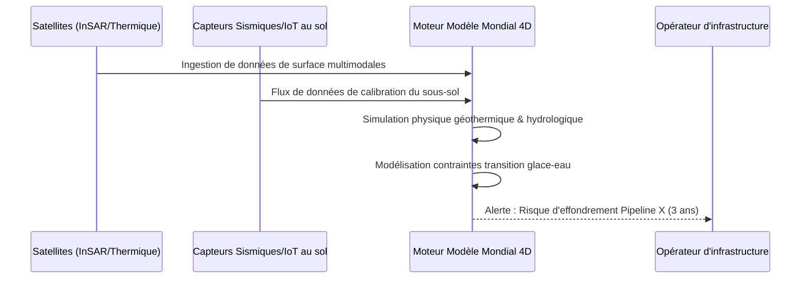

<!-- markdownlint-disable MD009 MD010 MD013 MD022 MD028 MD032 MD033 MD034 MD036 MD037 MD039 MD041 MD058 MD060 -->

[ 🇬🇧 English Version ](./README.md)

# PermaFrost Twin

> **Résumé exécutif :** Un jumeau numérique prédictif 4D de la sous-surface arctique qui utilise l'IA et des données satellitaires multimodales pour anticiper le dégel du pergélisol et l'effondrement des infrastructures des années à l'avance.

---

## 1. Aperçu visuel & Effet Wahou

```mermaid
graph TD
    %% Schéma comparatif Problème vs Solution ou Flux d'architecture
    subgraph Crise_Actuelle ["Opérations Arctiques Actuelles"]
        A[Réchauffement climatique] --> B[Dégel imprévisible du pergélisol]
        B --> C["Effondrement d'infrastructures (Pipelines, Routes)"]
        C --> D["Catastrophes chiffrées en milliards D[Catastrophes chiffrées en milliards & Actifs inassurables] Actifs inassurables"]
    end
    subgraph PermaFrost_Twin ["PermaFrost Twin"]
        E[Données Satellites & IoT] --> F[Modèle 4D Géothermique/Hydrologique]
        F --> G[Prédiction de la transition de phase souterraine]
        G --> H["Prévision du risque d'effondrement (Années à l'avance)"]
        H --> I[Protection proactive des infrastructures]
    end
```

## 2. La thèse contrariante (Peter Thiel Style)

**La croyance populaire :** Pour gérer les risques climatiques pesant sur les infrastructures, il suffit de construire des fondations plus solides et de s'appuyer sur des outils de cartographie 2D standard (SIG) pour suivre les changements de surface.

**La vérité cachée :** La véritable menace est invisible et souterraine. Le dégel du pergélisol est une transition de phase non linéaire complexe (glace vers eau) dans un sol poreux. Les cartes 2D standards sont inutiles ici ; seul un modèle mondial 4D "deep-tech" informé par la physique peut prévoir avec précision les contraintes mécaniques souterraines et empêcher des catastrophes à plusieurs milliards avant que le sol ne s'effondre réellement.

## 3. Le problème & La cible

**Modèle économique :** B2G / B2B

**Cible précise :** Gouvernements (Nations arctiques, Canada, Pays nordiques), opérateurs pétroliers/gaziers, assureurs, et gestionnaires d'infrastructures lourdes (pipelines, routes, voies ferrées) dans les régions polaires.

**La douleur urgente :** Le réchauffement climatique déstabilise le pergélisol, provoquant l'effondrement littéral d'infrastructures critiques (pipelines, fondations, autoroutes). Les opérateurs n'ont aucune visibilité spatio-temporelle précise sur les zones d'effondrement à haut risque, ce qui entraîne des catastrophes environnementales majeures (ex. marée noire de Norilsk), des milliards de coûts de réparation et rend ces actifs fondamentalement inassurables.

## 4. Architecture technique & Plomberie

## 5. Modèle économique & Viabilité financière

| Métrique                    | Valeur                                                              |
| :-------------------------- | :------------------------------------------------------------------ |
| Structure de prix           | SaaS Entreprise par paliers + Accès API pour assureurs              |
| Objectif 12 mois            | 2 projets pilotes (ex. gouvernement arctique et major de l'énergie) |
| Calcul du CA (Target 100k€) | 2 contrats de cartographie pilote \* 50 000 € = 100k€ ARR           |
| Marge brute estimée         | 85% (Une fois les modèles ML fondamentaux entraînés et automatisés) |

## 6. Moteur de distribution & Fossé défensif (Moat)

**Stratégie d'acquisition :** Ventes directes B2B/B2G de haut niveau ciblant les ministres des infrastructures des nations arctiques et les directeurs des risques des grandes entreprises d'énergie/assurance. Participer aux sommets mondiaux sur l'adaptation climatique.

**Moat (Barrière à l'entrée) :** Les logiciels SIG standards ne peuvent pas modéliser la physique complexe des transitions de phase dans des matrices poreuses couplée au bilan radiatif de surface. Le fossé défensif (moat) réside dans le moteur de simulation propriétaire informé par la physique et dans l'ensemble de données massives d'imagerie satellitaire arctique agrégées historiquement, couplées à de rares données de calibration par forage.

## 7. Grille d'évaluation détaillée

| Critère                           | Score VC (/100) | Score Terrain (/100) |
| :-------------------------------- | :-------------- | :------------------- |
| Thèse & Monopole / Urgence        | 23 / 25         | -- / 25              |
| Moat / Résistance aux LLM natifs  | 22 / 25         | -- / 25              |
| Scalability / Friction d'adoption | 24 / 25         | -- / 25              |
| Unit Economics / ROI direct       | 21 / 25         | -- / 25              |
| **TOTAL**                         | **90 / 100**    | **-- / 100**         |

> **Verdict VC :** Le dégel du pergélisol menace des milliers de milliards d'infrastructures. Un jumeau prédictif précis est essentiel pour le développement arctique. Des coûts de changement élevés pour les gouvernements et les entreprises une fois la plateforme profondément intégrée.
> **Verdict Terrain :** En attente d'évaluation.
