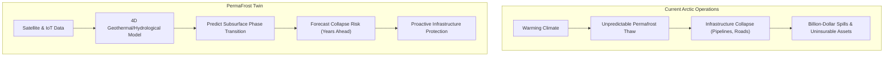
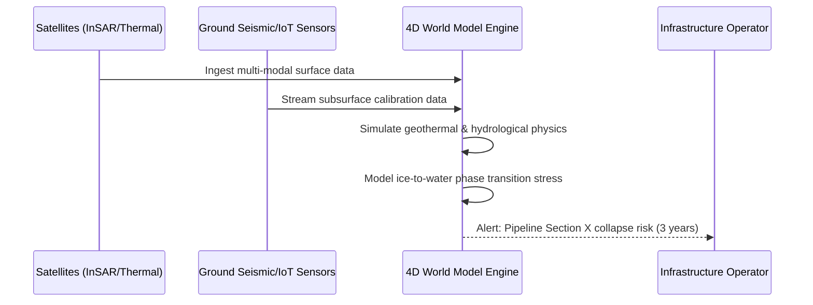

<!-- markdownlint-disable MD009 MD010 MD013 MD022 MD028 MD032 MD033 MD034 MD036 MD037 MD039 MD041 MD058 MD060 -->

[ 🇫🇷 Version Française ](./README.fr.md)

# PermaFrost Twin

> **Executive Summary:** A predictive 4D digital twin of the Arctic subsurface that uses AI and multi-modal satellite data to forecast permafrost thaw and infrastructure collapse years in advance.

---

## 1. Visual Overview & Wow Effect

## 2. Contrarian Thesis (Peter Thiel Style)

**Popular Belief:** To manage climate risks to infrastructure, we just need to build stronger foundations and rely on standard 2D mapping tools (GIS) to track surface changes.

**Hidden Truth:** The real threat is invisible and subterranean. Permafrost thaw is a complex, non-linear phase transition of ice to water within porous soil. Standard 2D maps are useless here; only a deep-tech, physics-informed 4D world model can accurately forecast subsurface mechanical stress and prevent billion-dollar catastrophes before the ground actually caves in.

## 3. Problem & Target Market

**Business Model:** B2G / B2B

**Target Audience:** Governments (Arctic nations, Canada, Nordics), oil & gas operators, insurers, and heavy infrastructure managers (pipelines, roads, railways) in polar regions.

**Urgent Pain Point:** Global warming is destabilizing permafrost, causing critical infrastructure (pipelines, foundations, highways) to literally sink and collapse. Operators have zero precise spatiotemporal visibility into high-risk collapse zones, leading to catastrophic environmental disasters (e.g., the Norilsk oil spill), billions in repair costs, and making these assets fundamentally uninsurable.

## 4. Technical Architecture & Infrastructure

## 5. Business Model & Financial Viability

| Metric                 | Value                                                             |
| :--------------------- | :---------------------------------------------------------------- |
| Pricing Structure      | Tiered Enterprise SaaS + API Access for Insurers                  |
| 12-Month Target        | 2 pilot projects (e.g., an Arctic government and an energy major) |
| Revenue Formula        | 2 pilot mapping contracts \* €50,000 = €100k ARR                  |
| Estimated Gross Margin | 85% (Once foundational ML models are trained and automated)       |

## 6. Distribution Engine & Moat

**Acquisition Strategy:** High-level B2B/B2G direct sales targeting Ministers of Infrastructure in Arctic nations and Chief Risk Officers at major energy/insurance firms. Participate in global climate adaptation summits to showcase predictive accuracy.

**Moat (Defensibility):** Standard GIS software cannot model the complex physics of phase transitions (ice to water) in porous matrices coupled with surface radiative balance. The moat is the proprietary physics-informed simulation engine and the massive, historically aggregated dataset of Arctic satellite imagery and rare borehole calibration data.

## 7. Detailed Evaluation Grid

| Criterion                   | VC Score (/100) | Market Score (/100) |
| :-------------------------- | :-------------- | :------------------ |
| Thesis & Monopoly / Urgency | -- / 25         | -- / 25             |
| Moat / LLM Immunity         | -- / 25         | -- / 25             |
| Scalability / UX Friction   | -- / 25         | -- / 25             |
| Unit Economics / ROI        | -- / 25         | -- / 25             |
| **TOTAL**                   | **-- / 100**    | **-- / 100**        |

> **VC Verdict:** Pending evaluation.
> **Market Verdict:** Pending evaluation.
