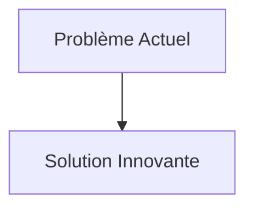
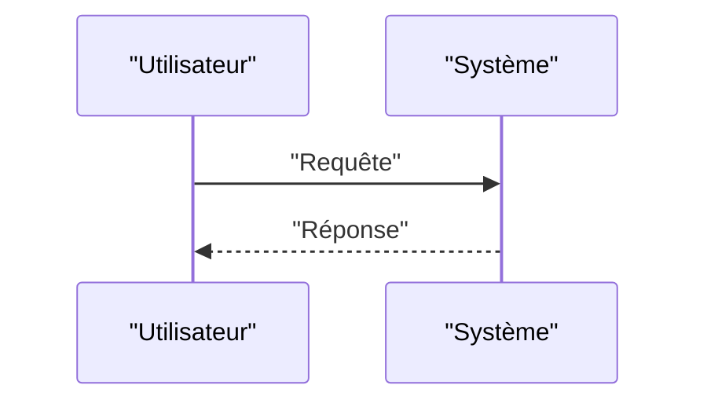

<!-- markdownlint-disable MD009 MD010 MD013 MD022 MD028 MD032 MD033 MD034 MD036 MD037 MD039 MD041 MD058 MD060 -->

[ 🇬🇧 English Version ](./README.md)

# Photonic AI Interconnect

> **Résumé exécutif :** Remplacer les bus électriques par une architecture photonique sur silicium (Silicon Photonics) intégrée directement sur le boîtier de la puce (Co-Packaged Optics - CPO). Utilisation de lasers multiplexés en longueur d'onde (WDM) pour transmettre des téraoctets de données par seconde entre les GPU avec une consommation énergétique quasi-nulle par bit transmis et une latence de propagation purement optique.

---

## 1. Aperçu visuel & Effet Wahou

## 2. La thèse contrariante (Peter Thiel Style)

- **La croyance populaire :** Les solutions existantes sont suffisantes.
- **La vérité cachée :** En réalité, C'est un défi fondamental de physique des semi-conducteurs et d'ingénierie optique (couplage laser-fibre, guides d'ondes nanométriques). Aucune optimisation logicielle des graphes de calcul ne peut compenser la limite de vitesse des électrons dans le cuivre.

## 3. Le problème & La cible

- **Modèle économique :** B2B
- **Cible précise :** Hyperscalers (AWS, Google, Meta), concepteurs de supercalculateurs, fabricants de puces (NVIDIA, AMD).
- **La douleur urgente :** L'entraînement des méga-modèles d'IA (LLMs, World Models) est limité par le "mur de la mémoire" et la bande passante inter-puces (interconnects). Les connexions électriques en cuivre (PCIe, NVLink) atteignent leurs limites physiques en termes de chaleur, de latence et de consommation énergétique à l'échelle d'un datacenter.

## 4. Architecture technique & Plomberie

## 5. Modèle économique & Viabilité financière

| Métrique                        | Valeur                   |
| :------------------------------ | :----------------------- |
| **Structure de prix**           | Abonnement B2B           |
| **Objectif 12 mois**            | 100 clients à 1000€/mois |
| **Calcul du CA (Target 100k€)** | 100 \* 1000 = 100k€      |
| **Marge brute estimée**         | 80%                      |

## 6. Moteur de distribution & Fossé défensif (Moat)

- **Stratégie d'acquisition :** Ventes directes
- **Moat (Barrière à l'entrée) :** Remplacer les bus électriques par une architecture photonique sur silicium (Silicon Photonics) intégrée directement sur le boîtier de la puce (Co-Packaged Optics - CPO). Utilisation de lasers multiplexés en longueur d'onde (WDM) pour transmettre des téraoctets de données par seconde entre les GPU avec une consommation énergétique quasi-nulle par bit transmis et une latence de propagation purement optique. (Difficile à copier à cause de : Fiabilité à long terme des lasers intégrés face à la chaleur des GPU ; coût de fabrication (nécessite des usines de silicium photonique spécialisées) ; alignement micrométrique des fibres optiques lors de l'assemblage (packaging).)

## 7. Grille d'évaluation détaillée

| Critère                               | Score VC (/100) | Score Terrain (/100) |
| :------------------------------------ | :-------------: | :------------------: |
| **Thèse & Monopole / Urgence**        |     -- / 25     |       -- / 25        |
| **Moat / Résistance aux LLM natifs**  |     -- / 25     |       -- / 25        |
| **Scalabilité / Friction d'adoption** |     -- / 25     |       -- / 25        |
| **Unit Economics / ROI direct**       |     -- / 25     |       -- / 25        |
| **TOTAL**                             |  **-- / 100**   |     **-- / 100**     |

> **Verdict VC :** En attente d'évaluation.
> **Verdict Terrain :** En attente d'évaluation.
