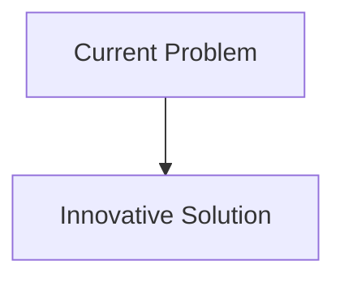
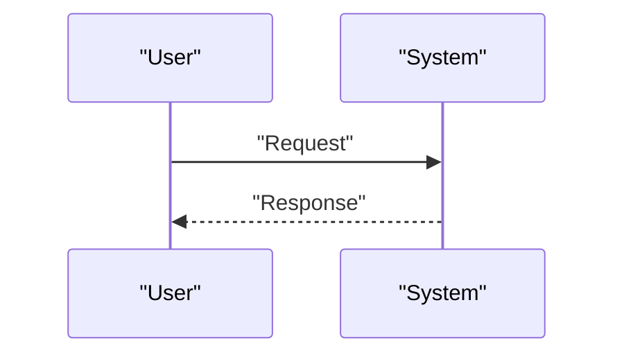

<!-- markdownlint-disable MD009 MD010 MD013 MD022 MD028 MD032 MD033 MD034 MD036 MD037 MD039 MD041 MD058 MD060 -->

[ 🇫🇷 Version Française ](./README.fr.md)

# Photonic AI Interconnect

> **Executive Summary:** Replace the electrical buses with a silicon photonics architecture (Silicon Photonics) integrated directly into the chip package (Co-Packaged Optics - CPO). Using wavelength division multiplexed (WDM) lasers to transmit terabytes of data per second between GPUs with near-zero power consumption per transmitted bit and purely optical propagation latency.

---

## 1. Visual Overview & Wow Effect

## 2. Contrarian Thesis (Peter Thiel Style)

- **Popular Belief:** Existing solutions are sufficient.
- **Hidden Truth:** In reality, it is a fundamental challenge in semiconductor physics and optical engineering (laser-fiber coupling, nanometric waveguides). No software optimization of computational graphs can compensate for the speed limit of electrons in copper.

## 3. Problem & Target Market

- **Business Model:** B2B
- **Target Audience:** Hyperscalers (AWS, Google, Meta), supercomputer designers, chip manufacturers (NVIDIA, AMD).
- **Urgent Pain Point:** Training AI mega-models (LLMs) is limited by the “memory wall” and inter-chip bandwidth (interconnects). Copper electrical connections (PCIe, NVLink) are reaching their physical limits in terms of heat, latency and power consumption at a data center scale.

## 4. Technical Architecture & Infrastructure

## 5. Business Model & Financial Viability

| Metric                     | Value                        |
| :------------------------- | :--------------------------- |
| **Pricing Structure**      | B2B Subscription             |
| **12-Month Target**        | 100 customers at 1000€/month |
| **Revenue Formula**        | 100 \* 1000 = 100k€          |
| **Estimated Gross Margin** | 80%                          |

## 6. Distribution Engine & Moat

- **Acquisition Strategy:** Direct Sales
- **Moat (Defensibility):** Replace the electrical buses with a silicon photonics architecture (Silicon Photonics) integrated directly into the chip package (Co-Packaged Optics - CPO). Using wavelength division multiplexed (WDM) lasers to transmit terabytes of data per second between GPUs with near-zero power consumption per transmitted bit and purely optical propagation latency.(Difficult to copy because of: Long-term reliability of integrated lasers in the face of heat from GPUs; manufacturing cost (requires specialized photonics silicon factories); micrometric alignment of optical fibers during assembly (packaging).)

## 7. Detailed Evaluation Grid

| Criterion                       | VC Score (/100) | Market Score (/100) |
| :------------------------------ | :-------------: | :-----------------: |
| **Thesis & Monopoly / Urgency** |     -- / 25     |       -- / 25       |
| **Moat / LLM Immunity**         |     -- / 25     |       -- / 25       |
| **Scalability / UX Friction**   |     -- / 25     |       -- / 25       |
| **Unit Economics / ROI**        |     -- / 25     |       -- / 25       |
| **TOTAL**                       |  **-- / 100**   |    **-- / 100**     |

> **VC Verdict:** Pending evaluation.
> **Market Verdict:** Pending evaluation.
