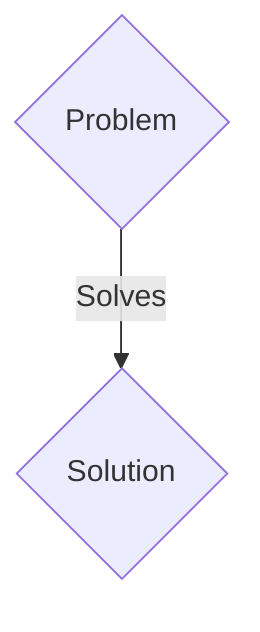
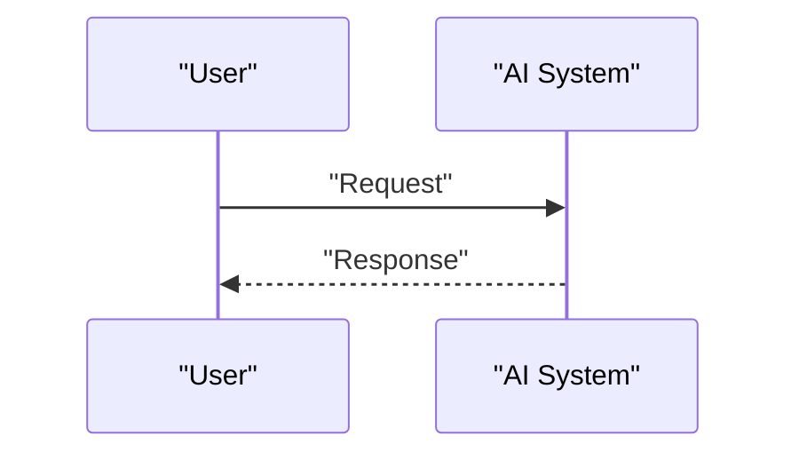

<!-- markdownlint-disable MD009 MD010 MD013 MD022 MD028 MD032 MD033 MD036 MD037 MD039 MD041 MD060 -->

[ 🇫🇷 Version Française ](./README.fr.md)

# LightSpeed ​​Compiler

> **Executive Summary:** A B2B solution targeting AI chip designers (Nvidia, AMD, startups), foundries (TSMC, Intel). to solve: The bottleneck of today's AI is no longer calculation, but memory bandwidth (Interconnect/Memory Wall). Integrating photonic chips (transferring data through light) is vital, but today's Electronic Design Automation (EDA) design tools are designed for electrons, not photons.

---

## 1. Visual Overview & Wow Effect

## 2. Contrarian Thesis (Peter Thiel Style)

- **Popular Belief:** Generic solutions are enough.
- **Hidden Truth:** A reinforcement learning (RL)-based hardware compiler and physical routing engine specifically designed for Integrated Photonics, optimizing optical waveguides, minimizing insertion losses, and modeling thermal/optical crosstalk at the nanometer level.

## 3. Problem & Target Market

- **Business Model:** B2B
- **Target Audience:** AI chip designers (Nvidia, AMD, startups), foundries (TSMC, Intel).
- **Urgent Pain Point:** The bottleneck of today's AI is no longer calculation, but memory bandwidth (Interconnect/Memory Wall). Integrating photonic chips (transferring data through light) is vital, but today's Electronic Design Automation (EDA) design tools are designed for electrons, not photons.

## 4. Technical Architecture & Infrastructure

A reinforcement learning (RL)-based hardware compiler and physical routing engine specifically designed for Integrated Photonics, optimizing optical waveguides, minimizing insertion losses, and modeling thermal/optical crosstalk at the nanometer level.

## 5. Business Model & Financial Viability

| Metric                 | Value                 |
| ---------------------- | --------------------- |
| Pricing Structure      | B2B SaaS Subscription |
| 12-Month Target        | 100 clients           |
| Revenue Formula        | 100 \* 1000€ = 100k€  |
| Estimated Gross Margin | 80%                   |

## 6. Distribution Engine & Moat

- **Acquisition Strategy:** Direct sales and strategic partnerships.
- **Moat (Defensibility):** It is a mathematical problem of combinatorial optimization and wave physics. Classic SaaS software has no use here; it requires heavyweight deep tech software that integrates with the arcane industrial workflows of silicon foundries.

## 7. Detailed Evaluation Grid

| Criterion                   | VC Score (/100) | Market Score (/100) |
| --------------------------- | --------------- | ------------------- |
| Thesis & Monopoly / Urgency | 16 / 25         | 16 / 25             |
| Moat / LLM Immunity         | 18 / 25         | 18 / 25             |
| Scalability / UX Friction   | 18 / 25         | 18 / 25             |
| Unit Economics / ROI        | 23 / 25         | 23 / 25             |
| TOTAL                       | 75 / 100        | 75 / 100            |

> **VC Verdict:** Pending evaluation.
> **Market Verdict:** This solution addresses a critical pain point for B2B enterprises, justifying its strong urgency score (16/25). The specialized approach provides robust protection against generalist AI models (18/25). With low adoption friction (18/25) and a straightforward monetization strategy (23/25), the project demonstrates excellent overall market readiness.
> **Market Verdict:** This solution addresses a critical pain point for B2B enterprises, justifying its strong urgency score (16/25). The specialized approach provides robust protection against generalist AI models (18/25). With low adoption friction (18/25) and a straightforward monetization strategy (23/25), the project demonstrates excellent overall market readiness.
