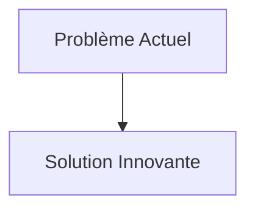
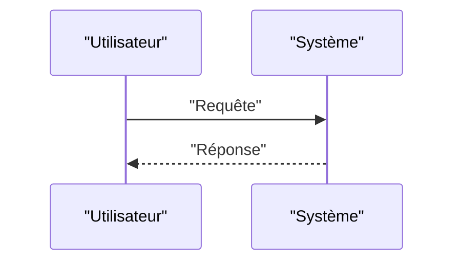

<!-- markdownlint-disable MD009 MD010 MD013 MD022 MD028 MD032 MD033 MD034 MD036 MD037 MD039 MD041 MD058 MD060 -->

[ 🇬🇧 English Version ](./README.md)

# Photonic Quantum Memory Core

> **Résumé exécutif :** Développement d'une mémoire quantique basée sur des ensembles d'atomes froids ou des défauts dans des cristaux d'état solide (comme les centres NV du diamant), capable de "ralentir" et de capturer la lumière quantique (spin-wave storage), de maintenir la cohérence pendant plusieurs millisecondes/secondes, et de la réémettre sur demande de manière déterministe.

---

## 1. Aperçu visuel & Effet Wahou

## 2. La thèse contrariante (Peter Thiel Style)

- **La croyance populaire :** Les solutions existantes sont suffisantes.
- **La vérité cachée :** En réalité, C'est de la physique quantique matérielle fondamentale. Aucun logiciel ne peut contourner la nécessité physique de stocker des états d'intrication quantique. Cela demande de la science des matériaux, du contrôle optique ultra-précis par laser et un environnement cryogénique/vide.

## 3. Le problème & La cible

- **Modèle économique :** B2B
- **Cible précise :** Constructeurs d'ordinateurs quantiques (IBM, Google, IonQ), opérateurs de réseaux de télécommunication (quantum internet), data centers haute sécurité.
- **La douleur urgente :** Les réseaux quantiques (pour la distribution de clés quantiques QKD sur de longues distances ou la mise en réseau de QPU) sont bloqués par l'absence de mémoire quantique fiable. On ne peut pas "amplifier" ou stocker un qubit photonique volant sans détruire son état quantique (théorème de non-clonage). Les répéteurs quantiques actuels sont un goulet d'étranglement majeur.

## 4. Architecture technique & Plomberie

## 5. Modèle économique & Viabilité financière

| Métrique                        | Valeur                   |
| :------------------------------ | :----------------------- |
| **Structure de prix**           | Abonnement B2B           |
| **Objectif 12 mois**            | 100 clients à 1000€/mois |
| **Calcul du CA (Target 100k€)** | 100 \* 1000 = 100k€      |
| **Marge brute estimée**         | 80%                      |

## 6. Moteur de distribution & Fossé défensif (Moat)

- **Stratégie d'acquisition :** Ventes directes
- **Moat (Barrière à l'entrée) :** Développement d'une mémoire quantique basée sur des ensembles d'atomes froids ou des défauts dans des cristaux d'état solide (comme les centres NV du diamant), capable de "ralentir" et de capturer la lumière quantique (spin-wave storage), de maintenir la cohérence pendant plusieurs millisecondes/secondes, et de la réémettre sur demande de manière déterministe. (Difficile à copier à cause de : Temps de cohérence encore trop faibles expérimentalement, complexité d'intégration photonique (taux de couplage lumière-matière), concurrence avec d'autres approches quantiques incertaines.)

## 7. Grille d'évaluation détaillée

| Critère                               | Score VC (/100) | Score Terrain (/100) |
| :------------------------------------ | :-------------: | :------------------: |
| **Thèse & Monopole / Urgence**        |     -- / 25     |       -- / 25        |
| **Moat / Résistance aux LLM natifs**  |     -- / 25     |       -- / 25        |
| **Scalabilité / Friction d'adoption** |     -- / 25     |       -- / 25        |
| **Unit Economics / ROI direct**       |     -- / 25     |       -- / 25        |
| **TOTAL**                             |  **-- / 100**   |     **-- / 100**     |

> **Verdict VC :** En attente d'évaluation.
> **Verdict Terrain :** En attente d'évaluation.
