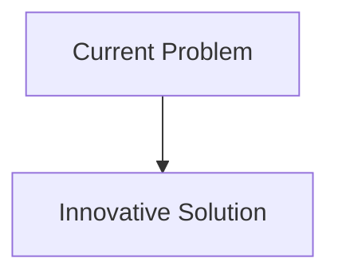
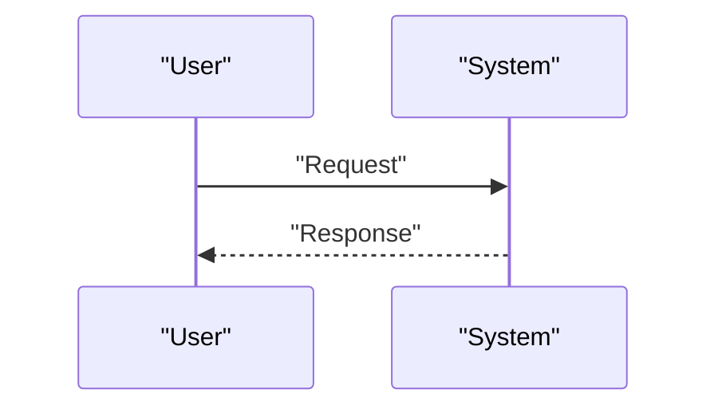

<!-- markdownlint-disable MD009 MD010 MD013 MD022 MD028 MD032 MD033 MD034 MD036 MD037 MD039 MD041 MD058 MD060 -->

[ 🇫🇷 Version Française ](./README.fr.md)

# Photonic Quantum Memory Core

> **Executive Summary:** Development of a quantum memory based on sets of cold atoms or defects in solid state crystals (like the NV centers of diamond), capable of "slowing down" and capturing quantum light (spin-wave storage), maintaining coherence for several milliseconds/seconds, and re-emitting it on demand in a deterministic manner.

---

## 1. Visual Overview & Wow Effect

## 2. Contrarian Thesis (Peter Thiel Style)

- **Popular Belief:** Existing solutions are sufficient.
- **Hidden Truth:** In reality, this is fundamental material quantum physics. No software can circumvent the physical necessity of storing quantum entanglement states. This requires materials science, ultra-precise optical laser control and a cryogenic/vacuum environment.

## 3. Problem & Target Market

- **Business Model:** B2B
- **Target Audience:** Quantum computer manufacturers (IBM, Google, IonQ), telecommunications network operators (quantum internet), high security data centers.
- **Urgent Pain Point:** Quantum networks (for distributing QKD quantum keys over long distances or networking QPUs) are hampered by the lack of reliable quantum memory. We cannot "amplify" or store a flying photonic qubit without destroying its quantum state (no-cloning theorem). Current quantum repeaters are a major bottleneck.

## 4. Technical Architecture & Infrastructure

## 5. Business Model & Financial Viability

| Metric                     | Value                        |
| :------------------------- | :--------------------------- |
| **Pricing Structure**      | B2B Subscription             |
| **12-Month Target**        | 100 customers at 1000€/month |
| **Revenue Formula**        | 100 \* 1000 = 100k€          |
| **Estimated Gross Margin** | 80%                          |

## 6. Distribution Engine & Moat

- **Acquisition Strategy:** Direct Sales
- **Moat (Defensibility):** Development of a quantum memory based on sets of cold atoms or defects in solid state crystals (like the NV centers of diamond), capable of "slowing down" and capturing quantum light (spin-wave storage), maintaining coherence for several milliseconds/seconds, and re-emitting it on demand in a deterministic manner.(Difficult to copy because of: Coherence times still too low experimentally, complexity of photonic integration (light-matter coupling rate), competition with other uncertain quantum approaches.)

## 7. Detailed Evaluation Grid

| Criterion                       | VC Score (/100) | Market Score (/100) |
| :------------------------------ | :-------------: | :-----------------: |
| **Thesis & Monopoly / Urgency** |     -- / 25     |       -- / 25       |
| **Moat / LLM Immunity**         |     -- / 25     |       -- / 25       |
| **Scalability / UX Friction**   |     -- / 25     |       -- / 25       |
| **Unit Economics / ROI**        |     -- / 25     |       -- / 25       |
| **TOTAL**                       |  **-- / 100**   |    **-- / 100**     |

> **VC Verdict:** Pending evaluation.
> **Market Verdict:** Pending evaluation.
