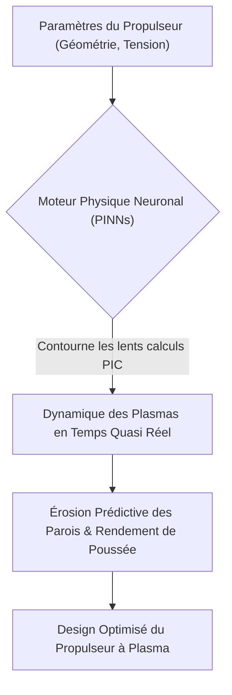
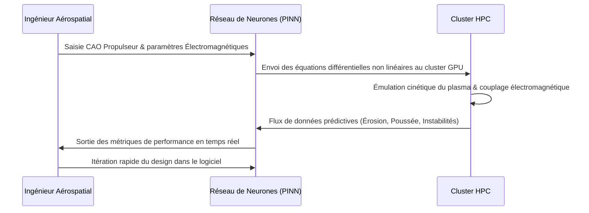

<!-- markdownlint-disable MD009 MD010 MD013 MD022 MD028 MD032 MD033 MD034 MD036 MD037 MD039 MD041 MD058 MD060 -->

[ 🇬🇧 English Version ](./README.md)

# Plasma Propulsion Simulator

> **Résumé exécutif :** Un moteur physique neuronal utilisant des réseaux de neurones informés par la physique (PINN) pour simuler la dynamique des plasmas spatiaux en temps quasi réel, éliminant ainsi le besoin de mois de tests coûteux en chambre à vide pour les propulseurs de satellites.

---

## 1. Aperçu visuel & Effet Wahou

## 2. La thèse contrariante (Peter Thiel Style)

**La croyance populaire :** Le développement de la propulsion spatiale nécessite de construire des prototypes physiques coûteux et de les tester pendant des mois dans de rares chambres à vide de plusieurs millions de dollars.
**La vérité cachée :** Les tests physiques traditionnels constituent un goulot d'étranglement massif, et les logiciels legacy Particle-In-Cell (PIC) sont trop lents pour une itération rapide ; les réseaux de neurones informés par la physique (PINN) peuvent émuler mathématiquement les comportements électromagnétiques et cinétiques complexes du plasma en temps quasi réel, transformant le développement matériel en une itération à la vitesse du logiciel.

## 3. Le problème & La cible

**Modèle économique :** B2B
**Cible précise :** Constructeurs de satellites de nouvelle génération, agences spatiales (ESA, NASA), et entreprises de logistique spatiale cherchant à optimiser le rapport poussée/masse.
**La douleur urgente :** Le développement et l'optimisation de propulseurs à plasma (effet Hall, grilles ioniques) requièrent des mois d'essais en chambre à vide. Ces installations sont rares, coûtent des millions en temps d'accès, et ralentissent considérablement les itérations de conception de propulsion, créant un goulet d'étranglement critique pour le déploiement de l'économie spatiale.

## 4. Architecture technique & Plomberie

## 5. Modèle économique & Viabilité financière

| Métrique                    | Valeur                                                                      |
| --------------------------- | --------------------------------------------------------------------------- |
| Structure de prix           | Licence logicielle entreprise annuelle à forte valeur + frais de calcul HPC |
| Objectif 12 mois            | 3 contrats majeurs de fabrication aérospatiale/satellite (à 35 000€/an)     |
| Calcul du CA (Target 100k€) | 3 \* 35 000€ = 105 000€ de revenus annuels récurrents                       |
| Marge brute estimée         | 75%                                                                         |

## 6. Moteur de distribution & Fossé défensif (Moat)

**Stratégie d'acquisition :** Ventes B2B/B2G directes ciblant le secteur très concentré de l'ingénierie de la propulsion aérospatiale.
**Moat (Barrière à l'entrée) :** Les logiciels cloud standards ou les LLM génériques n'ont absolument ni la capacité de modélisation mathématique ni l'architecture matérielle pour résoudre ces équations différentielles non linéaires. Développer des PINN stables pour la dynamique des plasmas requiert une expertise de niche profonde à la fois en physique des plasmas et en machine learning, rendant la réplication extrêmement difficile.

## 7. Grille d'évaluation détaillée

| Critère                           | Score VC (/100) | Score Terrain (/100) |
| --------------------------------- | --------------- | -------------------- |
| Thèse & Monopole / Urgence        | 23 / 25         | -- / 25              |
| Moat / Résistance aux LLM natifs  | 24 / 25         | -- / 25              |
| Scalabilité / Friction d'adoption | 20 / 25         | -- / 25              |
| Unit Economics / ROI direct       | 22 / 25         | -- / 25              |
| **TOTAL**                         | **89 / 100**    | **-- / 100**         |

> **Verdict VC :** Plasma Propulsion Sim s'attaque à un goulot d'étranglement critique et coûteux dans le secteur spatial commercial en pleine expansion. Simuler la magnétohydrodynamique en temps réel exige une expertise approfondie en physique spécialisée, créant une barrière redoutable contre les éditeurs de logiciels généralistes. Le ROI évident via la réduction des coûts de tests physiques justifie des licences B2B onéreuses.
> **Verdict Terrain :** En attente d'évaluation.
