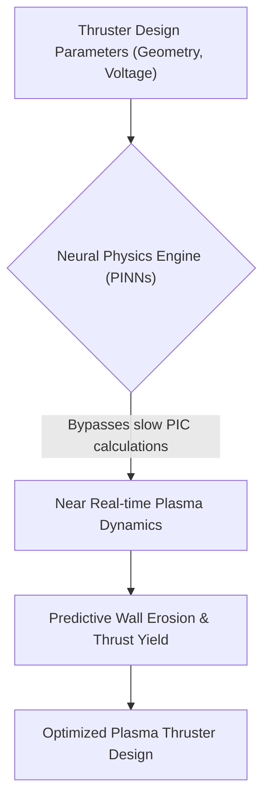
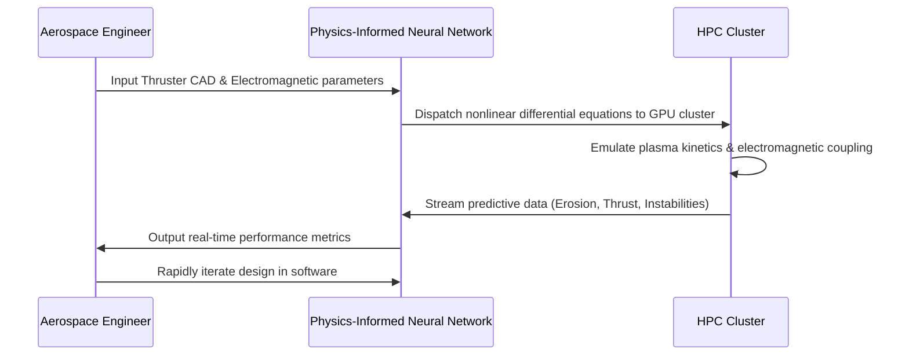

<!-- markdownlint-disable MD009 MD010 MD013 MD022 MD028 MD032 MD033 MD034 MD036 MD037 MD039 MD041 MD058 MD060 -->

[ 🇫🇷 Version Française ](./README.fr.md)

# Plasma Propulsion Simulator

> **Executive Summary:** A neural physics engine using Physics-Informed Neural Networks (PINNs) to simulate space plasma dynamics in near real-time, eliminating the need for months of expensive physical vacuum chamber testing for satellite thrusters.

---

## 1. Visual Overview & Wow Effect

## 2. Contrarian Thesis (Peter Thiel Style)

**Popular Belief:** Developing space propulsion requires building expensive physical prototypes and testing them for months in rare, multimillion-dollar vacuum chambers.
**Hidden Truth:** Traditional physical testing is a massive bottleneck, and legacy particle-in-cell (PIC) software is too slow for rapid iteration; Physics-Informed Neural Networks can mathematically emulate complex electromagnetic and kinetic plasma behaviors in near real-time, turning hardware development into software-speed iteration.

## 3. Problem & Target Market

**Business Model:** B2B
**Target Audience:** Next-generation satellite manufacturers, space agencies (ESA, NASA), and space logistics companies seeking to optimize thrust-to-mass ratios.
**Urgent Pain Point:** Developing and optimizing plasma thrusters (Hall-effect, ion grids) requires months of testing in vacuum chambers. These facilities are rare, cost millions in access time, and severely bottleneck propulsion design iterations, critically slowing down the deployment of the entire space economy.

## 4. Technical Architecture & Infrastructure

## 5. Business Model & Financial Viability

| Metric                 | Value                                                                 |
| ---------------------- | --------------------------------------------------------------------- |
| Pricing Structure      | High-value annual Enterprise Software License + HPC Compute scaling   |
| 12-Month Target        | 3 major aerospace/satellite manufacturing contracts (at 35,000€/year) |
| Revenue Formula        | 3 \* 35,000€ = 105,000€ ARR                                           |
| Estimated Gross Margin | 75%                                                                   |

## 6. Distribution Engine & Moat

**Acquisition Strategy:** Direct B2B/B2G enterprise sales targeting the highly concentrated aerospace propulsion engineering sector.
**Moat (Defensibility):** Standard cloud software or generic LLMs completely lack the mathematical modeling capacity and hardware architecture to solve nonlinear differential equations. Developing stable PINNs for plasma dynamics requires deep, niche expertise in both plasma physics and machine learning, making replication exceedingly difficult.

## 7. Detailed Evaluation Grid

| Criterion                   | VC Score (/100) | Market Score (/100) |
| --------------------------- | --------------- | ------------------- |
| Thesis & Monopoly / Urgency | 23 / 25         | -- / 25             |
| Moat / LLM Immunity         | 24 / 25         | -- / 25             |
| Scalability / UX Friction   | 20 / 25         | -- / 25             |
| Unit Economics / ROI        | 22 / 25         | -- / 25             |
| **TOTAL**                   | **89 / 100**    | **-- / 100**        |

> **VC Verdict:** Plasma Propulsion Sim addresses a highly critical and expensive bottleneck in the rapidly expanding commercial space sector. Simulating magnetohydrodynamics in real-time requires deep, specialized physics expertise, creating a formidable barrier against generalist software companies. The clear ROI in reduced physical testing costs justifies high-ticket B2B licensing.
> **Market Verdict:** Pending evaluation.
