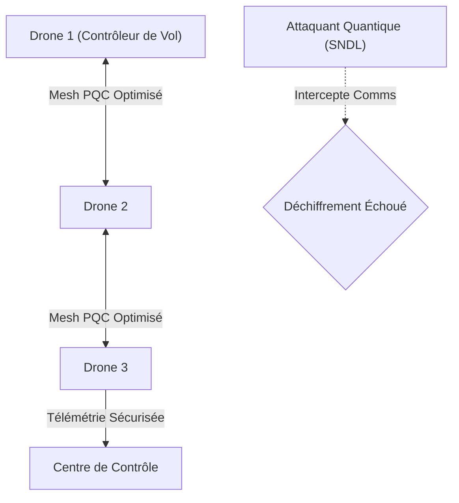
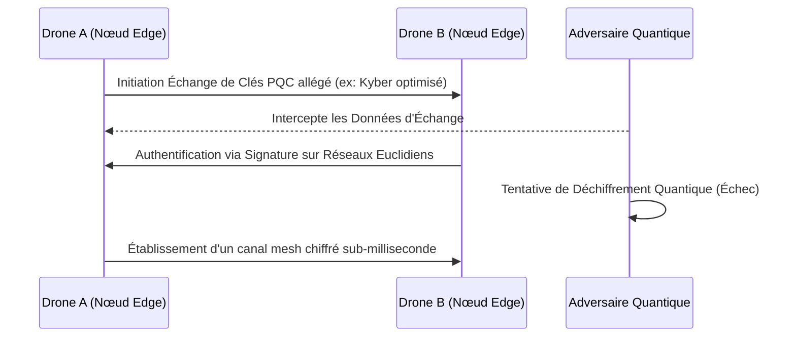

<!-- markdownlint-disable MD009 MD010 MD013 MD022 MD028 MD032 MD033 MD034 MD036 MD037 MD039 MD041 MD058 MD060 -->

[ 🇬🇧 English Version ](./README.md)

# PQC Drone Swarm Comm Mesh

> **Résumé exécutif :** Un protocole de communication mesh bas-niveau intégrant une cryptographie post-quantique (PQC) allégée, conçu spécifiquement pour les contraintes extrêmes de poids, taille et énergie (SWaP) des essaims de drones autonomes.

---

## 1. Aperçu visuel & Effet Wahou

## 2. La thèse contrariante (Peter Thiel Style)

**La croyance populaire :** Les communications des essaims de drones sont suffisamment sécurisées avec la cryptographie standard actuelle (ECC, RSA), et les menaces quantiques sont trop lointaines pour s'en soucier sur des appareils tactiques en périphérie (edge).
**La vérité cachée :** Des acteurs étatiques exécutent activement des attaques "Store Now, Decrypt Later" (SNDL) sur les données tactiques interceptées. Les bibliothèques PQC standards sont trop lourdes pour les microcontrôleurs de drones, ce qui signifie que le piratage d'essaim deviendra une vulnérabilité massive à moins qu'un mesh PQC hautement optimisé au niveau du firmware ne soit déployé immédiatement.

## 3. Le problème & La cible

**Modèle économique :** B2B / B2G
**Cible précise :** Ministères de la Défense, entreprises de surveillance d'infrastructures critiques, flottes logistiques autonomes.
**La douleur urgente :** Les communications en essaim (drone à drone) reposent actuellement sur la cryptographie classique. Avec les progrès de l'informatique quantique, l'interception des canaux de contrôle des essaims devient une menace critique, permettant la prise de contrôle totale ou l'usurpation (spoofing) d'opérations critiques et hautement sensibles.

## 4. Architecture technique & Plomberie

## 5. Modèle économique & Viabilité financière

| Métrique                    | Valeur                                                        |
| --------------------------- | ------------------------------------------------------------- |
| Structure de prix           | Licence firmware par unité déployée + SLA de maintenance      |
| Objectif 12 mois            | 2 contrats majeurs OEM défense/logistique (à 50 000€/contrat) |
| Calcul du CA (Target 100k€) | 2 \* 50 000€ = 100 000€ de revenus annuels récurrents         |
| Marge brute estimée         | 90% (Licence Logiciel/Firmware)                               |

## 6. Moteur de distribution & Fossé défensif (Moat)

**Stratégie d'acquisition :** Ventes directes B2G et B2B ciblant les fabricants de drones et les sous-traitants de la défense nécessitant une conformité de sécurité quantique immédiate.
**Moat (Barrière à l'entrée) :** Les bibliothèques PQC standards causent une latence inacceptable et une surcharge mémoire sur les microcontrôleurs de vol, provoquant le crash de l'essaim. Concevoir une implémentation PQC sur-mesure qui équilibre l'intégrité cryptographique avec des contraintes SWaP strictes (Taille, Poids, Énergie) constitue une barrière technique sévère à l'entrée.

## 7. Grille d'évaluation détaillée

| Critère                           | Score VC (/100) | Score Terrain (/100) |
| --------------------------------- | --------------- | -------------------- |
| Thèse & Monopole / Urgence        | 24 / 25         | -- / 25              |
| Moat / Résistance aux LLM natifs  | 24 / 25         | -- / 25              |
| Scalabilité / Friction d'adoption | 21 / 25         | -- / 25              |
| Unit Economics / ROI direct       | 23 / 25         | -- / 25              |
| **TOTAL**                         | **92 / 100**    | **-- / 100**         |

> **Verdict VC :** PQC Drone Swarm Comm fournit une couche de sécurité vitale pour l'avenir de la logistique autonome militaire et industrielle. Alors que les adversaires développent des capacités quantiques, sécuriser les réseaux maillés M2M décentralisés devient une nécessité absolue. Vendre un protocole de firmware post-quantique aux équipementiers de drones crée un monopole défendable et hautement scalable, indépendant du matériel.
> **Verdict Terrain :** En attente d'évaluation.
