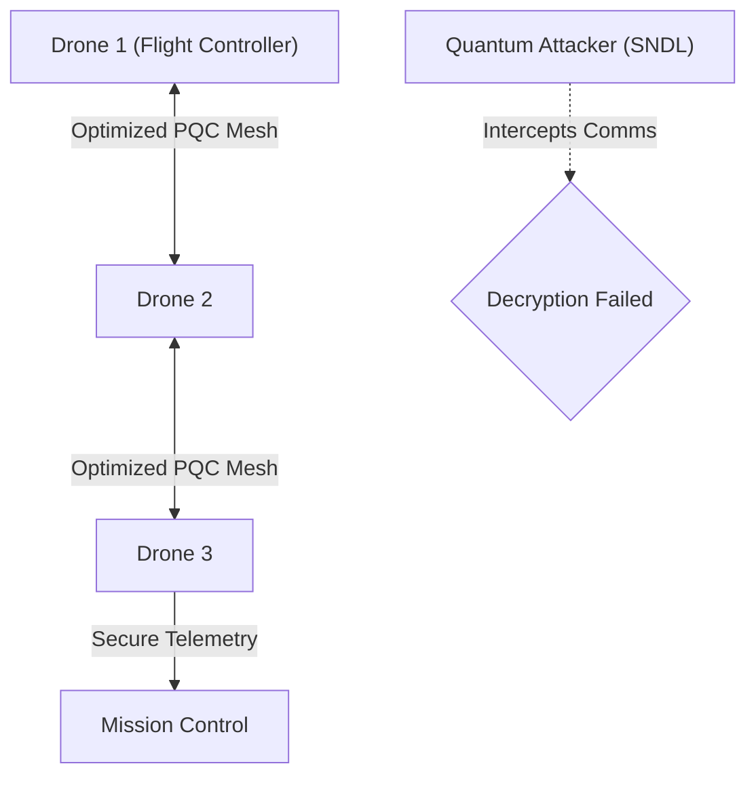
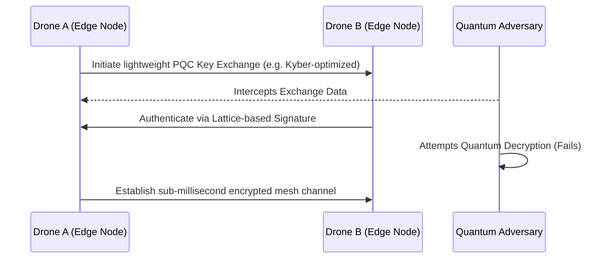

<!-- markdownlint-disable MD009 MD010 MD013 MD022 MD028 MD032 MD033 MD034 MD036 MD037 MD039 MD041 MD058 MD060 -->

[ 🇫🇷 Version Française ](./README.fr.md)

# PQC Drone Swarm Comm Mesh

> **Executive Summary:** A low-level mesh communication protocol integrating lightweight Post-Quantum Cryptography (PQC) designed specifically for the extreme SWaP constraints of autonomous drone swarms.

---

## 1. Visual Overview & Wow Effect

## 2. Contrarian Thesis (Peter Thiel Style)

**Popular Belief:** Drone swarm communications are sufficiently secure using current standard cryptography (ECC, RSA), and quantum threats are too far off to worry about for tactical edge devices.
**Hidden Truth:** State actors are actively executing "Store Now, Decrypt Later" (SNDL) attacks on intercepted tactical data. Standard PQC libraries are too heavy for drone microcontrollers, meaning swarm hijacking will become a massive vulnerability unless a highly optimized, firmware-level PQC mesh is deployed immediately.

## 3. Problem & Target Market

**Business Model:** B2B / B2G
**Target Audience:** Defense Ministries, critical infrastructure surveillance companies, autonomous logistics fleets.
**Urgent Pain Point:** Swarm communications (drone-to-drone) currently rely on classical cryptography. As quantum computing advances, the interception of swarm control channels becomes a critical threat, enabling total hijacking or spoofing of mission-critical and highly sensitive operations.

## 4. Technical Architecture & Infrastructure

## 5. Business Model & Financial Viability

| Metric                 | Value                                                         |
| ---------------------- | ------------------------------------------------------------- |
| Pricing Structure      | Firmware licensing per deployed unit + Maintenance SLA        |
| 12-Month Target        | 2 major defense/logistics OEM contracts (at 50,000€/contract) |
| Revenue Formula        | 2 \* 50,000€ = 100,000€ ARR                                   |
| Estimated Gross Margin | 90% (Software/Firmware Licensing)                             |

## 6. Distribution Engine & Moat

**Acquisition Strategy:** Direct B2G and B2B sales targeting drone manufacturers and defense contractors requiring immediate quantum-secure compliance.
**Moat (Defensibility):** Standard PQC libraries cause unacceptable latency and memory bloat on flight microcontrollers, crashing the swarm. Engineering a bespoke PQC implementation that balances cryptographic integrity with strict SWaP (Size, Weight, and Power) constraints is a severe technical barrier to entry.

## 7. Detailed Evaluation Grid

| Criterion                   | VC Score (/100) | Market Score (/100) |
| --------------------------- | --------------- | ------------------- |
| Thesis & Monopoly / Urgency | 24 / 25         | -- / 25             |
| Moat / LLM Immunity         | 24 / 25         | -- / 25             |
| Scalability / UX Friction   | 21 / 25         | -- / 25             |
| Unit Economics / ROI        | 23 / 25         | -- / 25             |
| **TOTAL**                   | **92 / 100**    | **-- / 100**        |

> **VC Verdict:** PQC Drone Swarm Comm provides a vital security layer for the future of autonomous military and industrial logistics. As adversaries develop quantum computing capabilities, securing decentralized M2M mesh networks becomes an absolute necessity. Selling a post-quantum firmware protocol to drone OEMs creates a defensible, highly scalable hardware-agnostic monopoly.
> **Market Verdict:** Pending evaluation.
