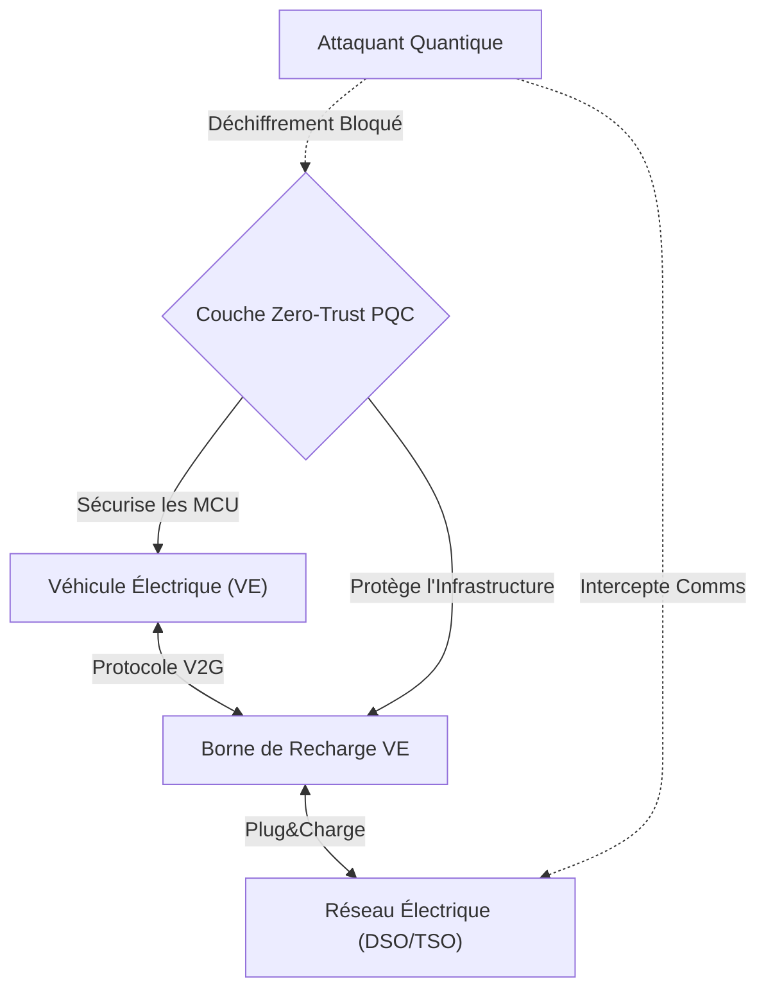
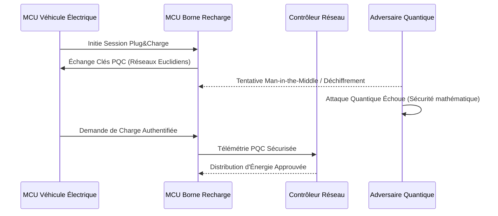

<!-- markdownlint-disable MD009 MD010 MD013 MD022 MD028 MD032 MD033 MD034 MD036 MD037 MD039 MD041 MD058 MD060 -->

[ 🇬🇧 English Version ](./README.md)

# PQC EV Charging Grid

> **Résumé exécutif :** Une couche réseau spécialisée en cryptographie post-quantique (PQC) sécurisant les infrastructures de recharge de VE pour empêcher les blackouts systémiques causés par des attaques de déchiffrement quantique coordonnées sur les protocoles V2G.

---

## 1. Aperçu visuel & Effet Wahou

## 2. La thèse contrariante (Peter Thiel Style)

**La croyance populaire :** La transition vers les véhicules électriques nécessite des mesures de cybersécurité standards, comme les VPN et pare-feux actuels, pour sécuriser le réseau de recharge.
**La vérité cachée :** Des millions de VE et de bornes connectées agissent comme un botnet distribué massif prêt à être déclenché. La cryptographie standard ne résistera pas aux attaques quantiques imminentes (Harvest Now, Decrypt Later) ; sans un PQC spécialisé s'exécutant nativement sur du matériel de recharge limité, une attaque quantique coordonnée pourrait manipuler la demande de charge et faire s'effondrer instantanément les réseaux électriques nationaux.

## 3. Le problème & La cible

**Modèle économique :** B2B
**Cible précise :** Opérateurs de réseaux de recharge de véhicules électriques (CPO), gestionnaires de réseaux électriques (DSO/TSO) et constructeurs automobiles.
**La douleur urgente :** L'infrastructure de recharge pour véhicules électriques (VE) est un vecteur d'attaque massif. Avec l'avènement de l'informatique quantique, les protocoles cryptographiques actuels sécurisant les communications (V2G/Plug&Charge) seront obsolètes, risquant des blackouts systémiques catastrophiques par la manipulation coordonnée de la charge par des acteurs malveillants.

## 4. Architecture technique & Plomberie

## 5. Modèle économique & Viabilité financière

| Métrique                    | Valeur                                                          |
| --------------------------- | --------------------------------------------------------------- |
| Structure de prix           | Licence firmware par borne + Frais d'API de surveillance réseau |
| Objectif 12 mois            | 2 programmes pilotes CPO (à 50 000€/programme)                  |
| Calcul du CA (Target 100k€) | 2 \* 50 000€ = 100 000€ de revenus annuels récurrents           |
| Marge brute estimée         | 85%                                                             |

## 6. Moteur de distribution & Fossé défensif (Moat)

**Stratégie d'acquisition :** Ventes B2B directes ciblant les CPO et les fournisseurs d'infrastructures devant se conformer aux futures réglementations gouvernementales de sécurité quantique.
**Moat (Barrière à l'entrée) :** Les algorithmes PQC standards exigent trop de mémoire et de calcul pour les microcontrôleurs (MCU) vieillissants utilisés dans les bornes de recharge et les VE. Développer une couche PQC hautement optimisée qui respecte les contraintes temps réel strictes du réseau électrique sur un matériel limité crée une barrière d'ingénierie redoutable.

## 7. Grille d'évaluation détaillée

| Critère                           | Score VC (/100) | Score Terrain (/100) |
| --------------------------------- | --------------- | -------------------- |
| Thèse & Monopole / Urgence        | 23 / 25         | -- / 25              |
| Moat / Résistance aux LLM natifs  | 24 / 25         | -- / 25              |
| Scalabilité / Friction d'adoption | 21 / 25         | -- / 25              |
| Unit Economics / ROI direct       | 23 / 25         | -- / 25              |
| **TOTAL**                         | **91 / 100**    | **-- / 100**         |

> **Verdict VC :** PQC EV Charging Grid intercepte de manière proactive la menace dévastatrice d'attaques quantiques sur les réseaux énergétiques critiques interconnectés. Alors que les véhicules électriques dominent la consommation d'énergie mondiale, standardiser la cryptographie post-quantique à l'interface matérielle crée un point de contrôle obligatoire et défendable. Vendre une couche de sécurité embarquée garantit une licence par unité très lucrative sur un marché OEM en pleine expansion.
> **Verdict Terrain :** En attente d'évaluation.
