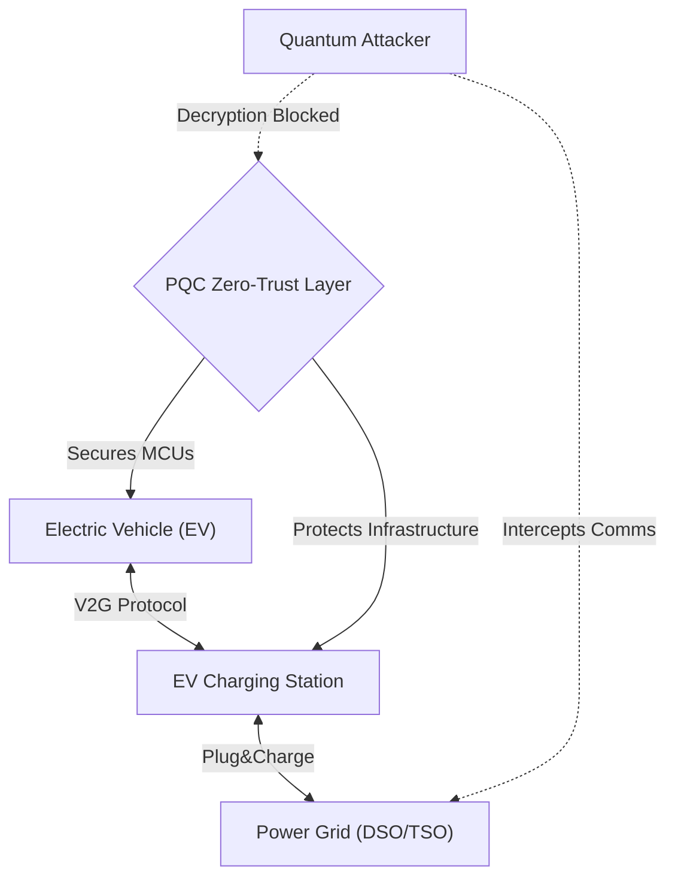
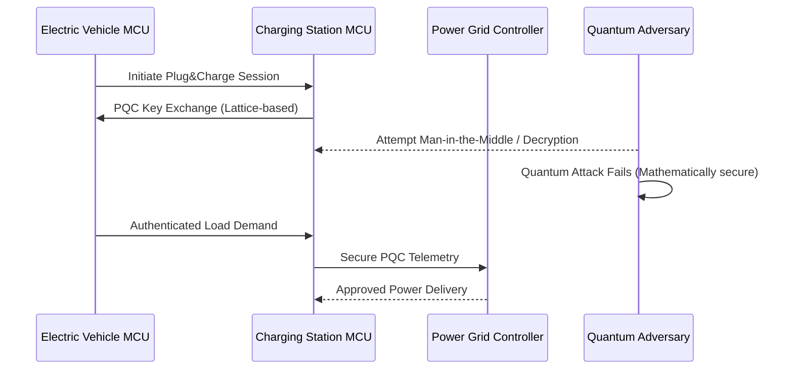

<!-- markdownlint-disable MD009 MD010 MD013 MD022 MD028 MD032 MD033 MD034 MD036 MD037 MD039 MD041 MD058 MD060 -->

[ 🇫🇷 Version Française ](./README.fr.md)

# PQC EV Charging Grid

> **Executive Summary:** A specialized Post-Quantum Cryptography (PQC) network layer securing EV charging infrastructure to prevent systemic power grid blackouts caused by coordinated quantum decryption attacks on V2G protocols.

---

## 1. Visual Overview & Wow Effect

## 2. Contrarian Thesis (Peter Thiel Style)

**Popular Belief:** The transition to electric vehicles requires standard cybersecurity measures like current VPNs and firewalls to secure the charging grid.
**Hidden Truth:** Millions of connected EVs and charging stations act as a massive distributed botnet waiting to be triggered. Standard cryptography cannot withstand impending quantum attacks (Harvest Now, Decrypt Later); without specialized PQC running natively on constrained charging hardware, a coordinated quantum attack could manipulate load demands and crash national power grids instantly.

## 3. Problem & Target Market

**Business Model:** B2B
**Target Audience:** Charge Point Operators (CPOs), Distribution/Transmission System Operators (DSO/TSO), and automotive OEMs.
**Urgent Pain Point:** The EV charging infrastructure (V2G/Plug&Charge) is a massive attack vector. As quantum computing advances, current cryptographic protocols will become obsolete, risking catastrophic systemic blackouts through the coordinated manipulation of charging loads by malicious actors.

## 4. Technical Architecture & Infrastructure

## 5. Business Model & Financial Viability

| Metric                 | Value                                                     |
| ---------------------- | --------------------------------------------------------- |
| Pricing Structure      | Per-charger firmware license + Network monitoring API fee |
| 12-Month Target        | 2 CPO pilot programs (at 50,000€/program)                 |
| Revenue Formula        | 2 \* 50,000€ = 100,000€ ARR                               |
| Estimated Gross Margin | 85%                                                       |

## 6. Distribution Engine & Moat

**Acquisition Strategy:** Direct B2B sales targeting CPOs and infrastructure providers needing to comply with upcoming quantum-safe government regulations.
**Moat (Defensibility):** Standard PQC algorithms require too much memory and compute for the legacy Microcontroller Units (MCUs) used in charging stations and EVs. Developing a highly optimized PQC layer that meets the strict real-time constraints of the power grid on limited hardware creates a formidable engineering moat.

## 7. Detailed Evaluation Grid

| Criterion                   | VC Score (/100) | Market Score (/100) |
| --------------------------- | --------------- | ------------------- |
| Thesis & Monopoly / Urgency | -- / 25         | -- / 25             |
| Moat / LLM Immunity         | -- / 25         | -- / 25             |
| Scalability / UX Friction   | -- / 25         | -- / 25             |
| Unit Economics / ROI        | -- / 25         | -- / 25             |
| **TOTAL**                   | **-- / 100**    | **-- / 100**        |

> **VC Verdict:** Pending evaluation.
> **Market Verdict:** Pending evaluation.
