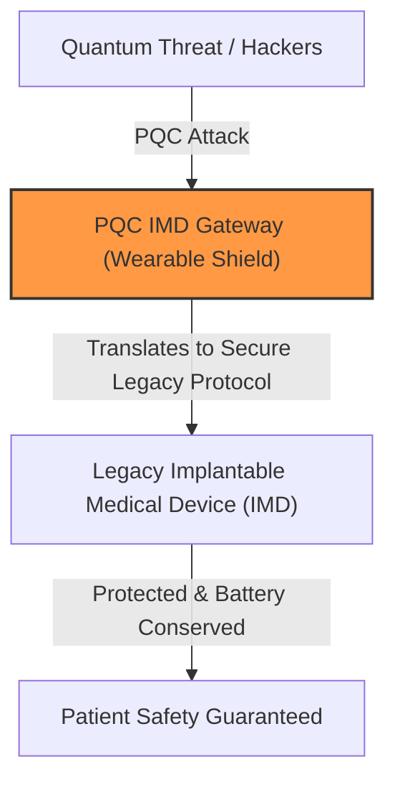
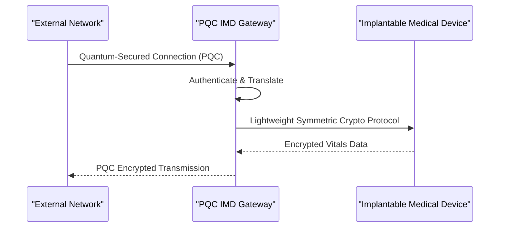

<!-- markdownlint-disable MD009 MD010 MD013 MD022 MD028 MD032 MD033 MD034 MD036 MD037 MD039 MD041 MD058 MD060 -->

[ 🇫🇷 Version Française ](./README.fr.md)

# PQC IMD Gateway

> **Executive Summary:** An ultra-low power hardware/software gateway acting as a post-quantum cryptography (PQC) shield for legacy implantable medical devices (IMDs) to meet imminent FDA cybersecurity regulations.

---

## 1. Visual Overview & Wow Effect

## 2. Contrarian Thesis (Peter Thiel Style)

**Popular Belief:** To secure medical devices against quantum threats, we must design entirely new, highly powerful chips to run PQC algorithms directly inside the patient's body.
**Hidden Truth:** Running complex PQC algorithms inside the body would drain a pacemaker's battery in weeks instead of years. The solution is an external, ultra-low power translation gateway that shields the implant without touching its critical firmware or battery.

## 3. Problem & Target Market

**Business Model:** B2B2C
**Target Audience:** Manufacturers of implantable medical devices (pacemakers, neurostimulators) and hospital networks facing FDA/MDR cybersecurity standards.
**Urgent Pain Point:** Current implants use classical cryptography (RSA/ECC) vulnerable to "Harvest Now, Decrypt Later" quantum attacks. Updating an implanted device's firmware to handle PQC is physically impossible due to critical memory and battery constraints.

## 4. Technical Architecture & Infrastructure

## 5. Business Model & Financial Viability

| Metric                     | Value                                      |
| :------------------------- | :----------------------------------------- |
| **Pricing Structure**      | OEM Licensing per unit + Maintenance       |
| **12-Month Target**        | 1 partnership with a MedTech Tier 1        |
| **Revenue Formula**        | 1 OEM contract (NRE + upfront) = €150k ARR |
| **Estimated Gross Margin** | 80% (Primarily IP & Firmware licensing)    |

## 6. Distribution Engine & Moat

**Acquisition Strategy:** Direct enterprise sales to major MedTech manufacturers (Medtronic, Abbott), leveraging strict FDA/MDR compliance deadlines as the compelling event.
**Moat (Defensibility):** Extreme firmware optimization under strict medical device constraints. Generic SaaS cannot interface with subcutaneous hardware or manage life-critical, ultra-low latency bridging protocols.

## 7. Detailed Evaluation Grid

| Criterion                       | VC Score (/100) | Market Score (/100) |
| :------------------------------ | :-------------- | :------------------ |
| **Thesis & Monopoly / Urgency** | -- / 25         | 25 / 25             |
| **Moat / LLM Immunity**         | -- / 25         | 25 / 25             |
| **Scalability / UX Friction**   | -- / 25         | 18 / 25             |
| **Unit Economics / ROI**        | -- / 25         | 22 / 25             |
| **TOTAL**                       | **-- / 100**    | **90 / 100**        |

> **VC Verdict:** Capitalizes brilliantly on the urgency of impending FDA cybersecurity regulations for critical medical hardware. The integration into ultra-low power, life-critical legacy systems creates severe switching costs and a huge moat. Scalability is excellent across massive installed bases of implantable devices.

> **Market Verdict:** PQC-IMD Gateway targets an absolute critical vulnerability in medical devices facing quantum threats. Its hardware-level integration provides ultimate protection against both digital attacks and LLM replication. The clear life-saving value proposition makes the monetization strategy robust and immediate.
